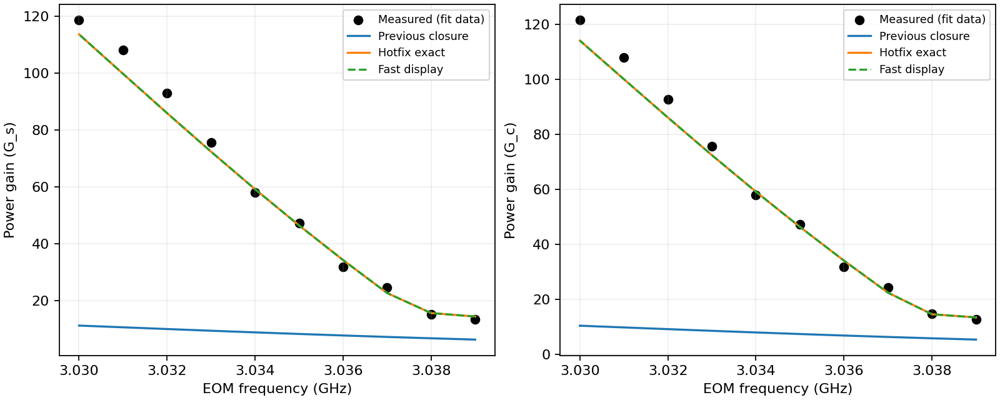

# 2026-10-01 TPD Gain 핫픽스

Fast/Balanced의 기존 준경험적 보정 스위치에 출력 Gain 보정 추가.
프론트엔드 새 조절기·신뢰 구간·원모델 Gain 표시 없음.
물리 교체 과제: `docs/checklist.json` → `fwm-tpd-gain-physical-replacement`,
난이도 `grand_challenge`, 상태 `ready`. 이번 작업에서 연구 과제 자체를 수행한 뜻 아님.

## 입력·측정 정의

- OPD **+1.06 GHz**, 온도 **118 °C**, Pump **380 mW**, 셀 입사 Seed **3.7 µW**.
- 기타 현 기본 조건: 셀 12.5 mm, Pump/Probe waist 530/330 µm
  (**1/e² intensity radius**), 교차각 0.32°, transit/(2π) 100 kHz,
  기존 residual 0.74, 상대 overlap/polarization/Zeeman penalty 각 1.
- 순수 ⁸⁵Rb D1, minus branch, finite-seed Floquet N=3, PHASE_ULTRA의 64구간 전파.
  Fast/Balanced 계산 tier와 PHASE_ULTRA 전파 수준은 별개.
- 기본 설정 자체는 변경 없음. 명시한 실험 조건에서 보정 적용.
- 직접 측정은 10점 광파워 표. Gain은 동일 검출 위치의 pump-on 출력 / pump-off Seed.
  두 점의 측정 분모 3.8 µW 보존. 시뮬레이션 셀 입사 Seed는 모두 3.7 µW.
  셀 입사→출구 비와 측정 비가 물리적으로 동일하다고 인증한 보정 아님.
- 별도 4.7→4.6 µW 투과 측정은 모든 detuning의 투과율이 아님.
  미측정 T_off나 검출효율을 추정·조절해서 Gain 적합하지 않음.
- 공통 축 EOM 3.039→3.030 GHz.
  δ_GABES/MHz = (3.035732439 − f_EOM/GHz) × 1000.
  이번 표는 −3.267561→+5.732439 MHz. 문헌 Gold의 TPD 부호 의심은 미확정.

## 보정식·적용 범위

기존 C_mix=0.5594938027 및 0.74 residual 유지.
기존 Maxwell 교차 결합 보정 후 전파·soft pump saturation을 수행하고,
그 결과의 두 power gain에 각각 아래 연속 두 구간 affine 적용.
열 점 전체에 대한 최대 상대잔차 최소화. 점별 lookup·점별 배율 아님.
꺾임 위치는 데이터 범위 내 고정 gain 좌표이며 물리적 Raman 임계값 아님.

```text
F(G) = a G + b + c max(G − k, 0)

Probe:     a=2.64335782913486,   b=−2.320649165812068,
           c=20.159921713415237, k=7.0
Conjugate: a=2.4715192372459183, b=0,
           c=19.933702770307566, k=6.1

r = abs(OPD − 1.06 GHz) / 0.16 GHz
w = (1 − r²)², 0.90 < OPD/GHz < 1.22; 그 외 w=0
G_out = G + w (F(G) − G)
```

분기·scope: 준경험적 보정 ON + Fast/Balanced + minus branch.
OPD 1.06 GHz에서 w=1. 0.9 GHz Gold와 범위 밖 w=0.
경계에서 값·1차 미분 연속. **±0.16 GHz는 구현상 전이 폭**.
측정된 허용오차·신뢰 구간·검증된 OPD 범위 아님.
다른 물리 조건은 기존 원자 계산의 영향을 계속 받지만 보정 정확도 미검증.

출력은 Probe≥1, Conjugate≥0 및 기존 Pump/2 에너지 envelope 제한.
추가 soft saturation으로 두 번 감쇠하지 않음. 전이 비활성 구간은 원래 배열 그대로 반환.
이 guard는 조건부 보정의 수치 제한이며 측정면 간 에너지 정규화의 독립 증거 아님.
Ultra·untiered API·스위치 OFF에 새 보정 없음.
`cache_version` 변경으로 예전 계산 캐시 무효화. 기본 설정·조절기 변경 없음.

## 적합 오차와 신뢰 한계

| 항목 | Probe | Conjugate |
|---|---:|---:|
| 직접 계산 최대 상대잔차 | 7.7018% | 7.3580% |
| Gain 단위 RMSE | 4.0697 | 4.2935 |
| EOM 3.039 GHz 보정 예측 | 14.4670 | 13.5375 |
| EOM 3.030 GHz 보정 예측 | 113.6611 | 114.1861 |
| 해당 양끝 실측 | 13.4324 / 118.6486 | 12.8378 / 121.6216 |

**위 수치는 적합 데이터 자체의 잔차. 통계적 신뢰 구간 아님.**
반복·측정 불확도·독립 holdout 없음. 따라서 95% 신뢰 구간, 다른 조건의 정확도,
시간 drift의 분산은 현재 산출 불가. 향후 개선 여지 큼.
단일 affine의 약 21.3% 최악 상대잔차를 피하려고 한 개 꺾임 사용.
꺾임 좌표 선택도 같은 데이터의 영향을 받았으므로 독립 검증으로 세지 않음.

명목 모델의 피크는 EOM 약 3.022 GHz.
이번 단조 Gain 보정은 피크 위치를 옮기지 않음. 3.030–3.039 GHz 바깥의
크기·피크 위치·폭 및 OPD/온도/Pump/Seed/waist/angle 외삽 정확도 미확인.
온도 불확실성만으로 크기·형태를 함께 설명하지 못한 기존 진단도 보존.

원자 χ·canonical transfer·small-signal transfer audit는 출력 affine를 적용하지 않은
기존 값 유지. Gain을 이용하는 기존 algebraic noise indicator는 표시 Gain을 따라 계산.
이는 microscopic covariance 유도나 물리 squeezing 보정 아님.
`physical_squeezing_dB=None`, `quantitative_gain_supported=False` 유지.
출력 보정 기록은 내부 `gain_closure.output_calibration` ledger에서 추적.

## 표시 보간·검출 설정

기존 401점/±550 MHz 표시 격자는 2.75 MHz 간격.
출력 affine만 추가하면 표시 보간 최대오차 약 25.2% 발생.
활성 calibration scope에서는 스캔 범위 안의 측정 주파수 열 점을 계산 격자에 추가.
이미 1 MHz 이하 간격인 직접 계산 격자는 유지. 명목 표시 격자 411점.
Fast adaptive 채점에도 같은 보정식·Pump guard 사용.

활성 calibration scope의 Fast 채점은 고정 η=1 및 기본 noise 구성 사용.
실제 noise readout은 사용자가 지정한 η/noise 사용. 채점에 검출 설정이 섞여
Gain까지 바뀌는 기존 문제를 이 scope에서 차단. 두 모드의 표시 Gain/격자는
η=0.8694→0.5에서 정확히 동일하고 noise indicator는 변경.
보정 OFF·다른 OPD의 기존 adaptive 문제는 보존된 별도 수치 후속 과제
`fwm-fast-detector-independent-sampling`에서 전 범위 수정 예정.

## 재현·증거

```powershell
$env:OPENBLAS_NUM_THREADS='1'
python analysis/fwm_gain_hotfix/tpd_affine_20261001/validate.py --fit
python analysis/fwm_gain_hotfix/tpd_affine_20261001/validate.py
python -m pytest -q tests/test_fwm_tpd_gain_hotfix.py tests/test_fwm_gain_hotfix.py tests/test_fwm_fast_tiers.py
python -m pytest -q
```

`--capture-before`는 코드 변경 전 한 번 실행한 기준 캡처용.
현재 코드로 다시 실행하면 기존 기준을 덮어쓰므로 재검증에는 사용하지 말 것.
Production은 고정 계수만 사용하며 runtime fit 없음.

- [fit.json](fit.json): 원래 optical power 표·측정 분모·baseline·전체 정밀도 계수·잔차.
- [before.json](before.json): 작업 전 동일 환경 ON/OFF/Ultra/Gold/표시 배열·source hash.
- [before_parent.json](before_parent.json): 미커밋 연구 변경을 제외한 parent의 별도 기준.
  absorption/noise 정규화 규약에 따라 기준 선택. 기존 증거·허용오차 변경 없음.
- [validation.json](validation.json): 직접·표시 10점 오차, detector 독립성, 정확한 bypass 확인.
- [comparison.csv](comparison.csv): EOM 공통 축의 점별 측정·예측.
- [historical_manifest.json](historical_manifest.json): 기존 진단·핫픽스 증거 54파일 SHA-256.
  통합 DEVLOG 추가를 제외한 53파일 byte 그대로 검증.
- [pytest_targeted.log](pytest_targeted.log), [pytest_full.log](pytest_full.log): 실행 로그.



## 개선 순서

1. 검출면·pump-off transmission·EOM/TPD 부호 및 측정 drift 정리.
2. 최종 Gain까지 수치 수렴, 전체 domain의 detector 독립 Fast 채점 검증.
3. Zeeman/polarization·finite-seed 비공선 Doppler·독립 Raman/transit·공간 전파·고갈 검증.
4. 두 Gain과 피크를 동시에 평가하고 반복·시간 교차 측정 및 독립 조건 holdout 확보.
5. 검증된 물리적 reduced model로 affine·인공 OPD 전이 제거.

실측을 사용한 이번 적합은 Grand Challenge no-fit 관문 완료 아님.
기존 thermal 연구의 상태·frozen evidence 변경 없음.


## 검증 완료

전체 pytest **2,091 passed, 3 skipped**, 827.54 s.
관련 검사 **74 passed**, 22.72 s. 실행 전후 production 소스65파일 동일.
기존 Gold·Ultra·보정 OFF 배열 동일 환경에서 정확히 유지.
실제 표시 열 점 최대 상대잔차: Fast **7.7030% / 7.3592%**,
Balanced **7.7018% / 7.3580%** (Probe / Conjugate).

[pytest_summary.json](pytest_summary.json), [environment.json](environment.json),
[source_sha256_after.json](source_sha256_after.json)에서 상세 확인.

## 2026-10-02 커밋 범위 확인

진단 기록의 현재 위치는 `analysis/fwm_gain_hotfix/tpd_gain_diagnostic_20261001/`.
이동 전 manifest의 경로·SHA-256와 원문은 유지. 검증기가 이전 경로를 현재 위치로 해석.
진단 script·보고서 자체는 당시 코드·경로의 기록이므로 재작성하지 않음.

핫픽스와 직접 필요한 체크리스트·진단 증거만 분리. 다른 staged/unstaged 연구 변경 보존.
Shared worktree의 **2,091 passed** 결과와 커밋할 코드의 검증 결과는 별도 기록.


커밋할 소스 별도 검증: 관련71개 통과. 전체검사1,556 passed / 1 skipped /
11 failed / 25 errors. 남은36건은 수정 전 main에서도 동일하게 실패하는 연구 source-hash 검사.
[commit_validation_20261002.json](commit_validation_20261002.json)과
[commit_parent_failure_comparison_20261002.json](commit_parent_failure_comparison_20261002.json)에 기록.
생성 pytest cache4파일은 Git에 포함하지 않고, 기존 manifest는 원문 그대로 유지.
