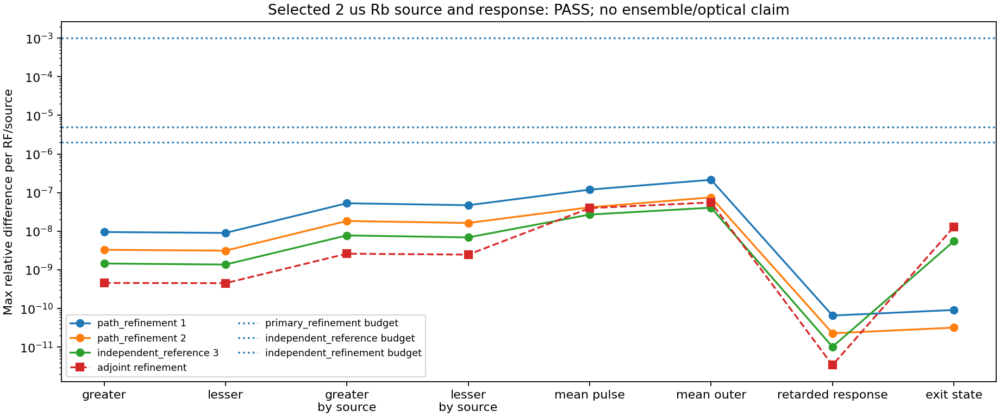

# Rb 경로: 잡음원·응답 독립 검증

2026-09-14.

목표: [연속 Gaussian 검증](smooth_transport_derivation.md)의 누락 coverage 보완.
기존 독립 QRT: 총 공분산·평균·출구 상태. 이번 추가: **각 jump source·경계 source·복소 retarded response**.

코드:

- `analysis/grand_challenge/reference/adjoint_transport.py`: full-density 전방 + 관측자 역방향.
- `analysis/grand_challenge/adjoint_transport_audit.py`: 실제 2 µs Rb 경로 비교·경로 evidence.
- `tests/quantum/test_adjoint_transport*.py`: 해석해·전방/QRT 비교·evidence 거부.

## 고정 가정

Prescribed path, $H(t)=H_0+f(t)H_1$, 실제 jump $L_r$, 입사 상태 ρ₀.
동일 Markov/Lindblad 모델. Jump 연산자에 이미 √γ 포함.
Readout $O_j$, drive $V_k$, ρ₀, jump, 체류시간은 perturbation과 독립.
입사 원자·bath 초기 상관 없음. Reduced pump-only Rb; finite seed 없음.

물리 입력·Doppler·공간 위상·radiative rates 유지. 잡음 계수·손실 fitting 없음.

## 역방향 관측자

Φ(s,t): density propagator. Φ†(s,t): operator adjoint.

\[
Y_j=\int_0^T e^{iw_jt}O_j(t)dt,\qquad
A_j(t)=\int_t^T\Phi^\dagger(s,t)O_j e^{iw_js}ds.
\]

\[
\dot A_j=-\mathcal L_t^\dagger A_j-e^{iw_jt}O_j,
\qquad A_j(T)=0,
\qquad \mu_j=\operatorname{Tr}\rho_0 A_j(0).
\]

$A_j$: 역방향 관측자. 기존 전방 atomic drift와 구분.
전체 operator 공간 사용. Identity 성분 유지 → 평균 보존.
Row-major vec에서 adjoint는 `L.conj().T`. 단순 transpose 금지.
감쇠 propagator 역행렬 사용 없음. Terminal-zero 초기값 문제를 역방향 적분.

## Source 분해: 직접 Lindblad product

\[
\Gamma_r(X,Y)=[L_r^\dagger,X][Y,L_r],
\]
\[
\mathcal L^\dagger(XY)
 -(\mathcal L^\dagger X)Y-X(\mathcal L^\dagger Y)
 =\sum_r\Gamma_r(X,Y).
\]

Hamiltonian은 Leibniz rule 만족. Jump dissipator 전개 → 위 항등식.
QRT 두 시간 적분에 대입; $A_j(T)=0$ 적용 → 아래 경계·bath 합.
표준 quantum Itô·Langevin 규약: [Gough–James, §2 식 (2), (10)–(12)](https://arxiv.org/html/1602.01991v2#S2). 아래 유한 경로 표현은 해당 규약에서 직접 도출.

\[
C^>_{0,jk}=\operatorname{Tr}\rho_0A_j(0)A_k^\dagger(0)-\mu_j\mu_k^*,
\quad
C^<_{0,jk}=\operatorname{Tr}\rho_0A_k^\dagger(0)A_j(0)-\mu_j\mu_k^*.
\]
\[
C^>_{r,jk}=\int_0^T\operatorname{Tr}\rho(t)
 [L_r^\dagger,A_j(t)][A_k^\dagger(t),L_r]dt,
\]
\[
C^<_{r,jk}=\int_0^T\operatorname{Tr}\rho(t)
 [L_r^\dagger,A_k^\dagger(t)][A_j(t),L_r]dt.
\]

총 connected covariance = 경계 + 모든 jump.
평균 outer 차감: 경계에서 한 번. Bath 추가 차감·triangle 두 배 합산 없음.
일반 복소 readout에서 lesser ≠ greater transpose.

**독립성:** 기존 전방 $D,A,C$ 입력 없음. Full-density·역방향 operator·직접 commutator products만 사용.
물리 jump 정의 공유는 필수. 모든 source에 전체 jump가 켜진 같은 ρ,A 사용.
Jump 제거 후 결과 차이는 source 기여와 다름. Jump 혼합 시 개별 attribution 변경 가능; 고정된 실제 jump/name이 검증 조건.

## 복소 retarded response

Drive perturbation: $V_k\epsilon_k e^{-iv_kt}$.

\[
\delta\dot\rho=\mathcal L_t\delta\rho
 -i[V_k,\rho(t)]\epsilon_k e^{-iv_kt},
\]
\[
R_{jk}=-i\int_0^T\operatorname{Tr}\rho(t)[A_j(t),V_k]e^{-iv_kt}dt.
\]

Complex Nambu column 그대로. `real`, Hermitian 대칭화, 임의 1/2 없음.
Global weak drive에 대한 유한 경로 응답. 위치별 Maxwell $M(\Omega)$ 아님.

## 정확한 수치 좌표·중복 solve 제거

\[
u=t/T,\quad \eta_j=1+|w_j|T,\quad
K_j(u)=\eta_j e^{-iw_jt}A_j(t)/T.
\]
\[
K'_j=-T\mathcal L_t^\dagger K_j-iw_jTK_j-\eta_jO_j.
\]

각 ordering의 직접 jump product를 $g^{\gtrless}_{r,jk}(u)$로 표기.

\[
(Q^{\gtrless}_{r,jk})'
 =-Tg^{\gtrless}_{r,jk}-i(w_j-w_k)TQ^{\gtrless}_{r,jk},
\]
\[
Z'_{jk}=+i\operatorname{Tr}\rho[K_j,V_k]
 -i(w_j-v_k)TZ_{jk}.
\]

K,Q,Z 모두 u=1에서 0. 복원점 u=0:

\[
\mu_j=\frac{T}{\eta_j}\operatorname{Tr}\rho_0K_j(0),\quad
C^{\gtrless}_{r,jk}=\frac{T^2Q^{\gtrless}_{r,jk}(0)}{\eta_j\eta_k},\quad
R_{jk}=\frac{T^2Z_{jk}(0)}{\eta_j}.
\]

종료 carrier phase 추가 없음. η는 정확한 좌표변환; physics coefficient 아님.
ρ(t)는 RF·source 독립 → 전방 한 번. 수학적 재사용 근거 주석 유지.
역방향 terminal 결과만 저장; 전방 density는 dense interpolation.
양쪽 ODE tolerance 함께 정밀화. 보간 정확도도 이 비교에 포함.

실제 fixture: forward density 16개 + backward 624개 complex variables.
기존 forward microscopic-D lift: 5,461개. **변수 수 비교; 실행시간 배수 주장 아님.**

## Evidence 규약

Parent: [smooth v2](smooth_transport_report_v2.json). 원래 source/test 28개 hash·물리 입력·metadata 검증 후 primary 3해 재사용.
이전 계산 재실행 없음. 새 source별·RF별 norm으로 primary 두 successive error 다시 산출.

| 비교 | 기준 |
| --- | ---: |
| Primary 3e-9 → 1e-9 → 3e-10, 각 successive | 1e-3 |
| Primary vs independent adjoint | 5e-6 |
| Adjoint 1e-9/1e-12 → 3e-10/3e-13 | 2e-6 |

대상: greater, lesser, 각 by_source, mean, mean_outer, retarded_response, exit_state.
각 RF·각 source마다 상대 Frobenius norm. Mean은 row Euclidean norm.
Dark floor: 128ε × SI 단위 척도; covariance $T^2\max\|O\|^2$, mean $T\max\|O\|$, response $T^2\max\|O\|\max\|V\|$, state 1.
큰 source가 작은 source 오차를 가리지 않음. Floor는 tolerance용; 출력 잡음에 더하지 않음.

Typed evidence는 실제 packet digest에 연결. 총 QRT만 제출하거나 response를 바꾼 뒤 옛 digest 제출 → 거부.
경로 evidence 승인과 reference 자체 수렴을 모두 통과해야 이번 검증 완료.
**단일 경로 승인 ≠ thermal ensemble 승인.** 미계산 경로에 증거 재사용 금지.

## 재현

```powershell
python -m analysis.grand_challenge.adjoint_transport_audit --output NEW.json --plot NEW.png
python -m pytest -q tests/quantum/test_adjoint_transport.py tests/quantum/test_adjoint_transport_audit.py
python -m pytest -q
```

기존 output 거부. Parent 변경 시 primary audit 재실행 요구.
수치 결과·source hashes·최종 테스트: 아래 결과 절 및 [연구 기록](research_log.md).
다음 범위: 실제 thermal Rb integrand, 오차 보존 가속, nonlocal Maxwell, finite seed.


## 실제 결과

[Immutable report](adjoint_transport_report_v1.json), [figure](adjoint_transport_v1.png).
`complete_path_evidence_accepted=true`, `all_declared_controls_passed=true`.
Source34개·parent report SHA-256 일치. 실행 전후 source 안정.

조건: 기존2 µs 경로 그대로. Entry(−100,20,0) µm, v=(150,10,100) m/s.
P=.6W, waist530µm, Δ=2π×.9GHz, δ=−2π×8MHz, angles .006/−.005rad.
Lab RF .1/1/4MHz. Finite seed·density·cell length는 단일 경로 계산에 사용 안 함.

| 측정량 | Primary vs adjoint | Adjoint 자체 refinement |
| --- | ---: | ---: |
| Greater 총합 | 1.463e-9 | 4.584e-10 |
| Lesser 총합 | 1.371e-9 | 4.526e-10 |
| Greater source별 | 7.804e-9 | 2.623e-9 |
| Lesser source별 | 6.928e-9 | 2.484e-9 |
| Mean pulse | 2.703e-8 | 3.965e-8 |
| Mean outer | 4.069e-8 | 5.562e-8 |
| Retarded response | 1.022e-11 | 3.424e-12 |
| Exit state | 5.528e-9 | 1.299e-8 |

Primary 두 successive 최대2.146e-7/7.526e-8 <1e-3.
Independent 최대4.069e-8 <5e-6. Adjoint 자체 최대5.562e-8 <2e-6.
큰 source가 작은 source를 가리지 않는 norm 기준 모두 통과.

추가 signed PSD 확인: fine greater/lesser source 최소 eigenvalue
2.29358e-22/2.29649e-22 s². 최대 anti-Hermitian residual1.488e-34 s².
Roundoff floor3.790e-26 s². Clipping·대칭화로 출력 수정 없음.
이는 atomic covariance 확인; optical canonical commutator 검증과 구분.

Reference coarse478.85s, fine553.92s. Fine: density1,161,104 RHS,
backward2,016,269 RHS; density mesh77,403점.
동시 작업 환경 wall time. 검증 reference 용도; 실제 열적 대규모 계산은 가속 필요.

신규28tests. 병렬refinement51 포함 이번79tests 추가.
전체 `python -m pytest -q`: **1264 passed, 1 failed, 232.46s**.
실패1개: 기존 삭제 `FWM_physics.tex`를 읽는 문서 consistency test. 기존 삭제·테스트 보존.



병렬 [동일 상수 원자 ensemble](transport_ensemble_refinement.md): 최근두격자 최대2.3116%,
독립seed 최대0.88354% <기존5%. 실제 Rb에 toy factorization 적용 안 함.
현재 완료: 선택한 한 Rb 경로의 source/response 독립 검증 + 상수 모델 ensemble 수렴.
다음: 오차 보존 가속 → 실제 Rb thermal integrand → nonlocal Maxwell·finite seed.
