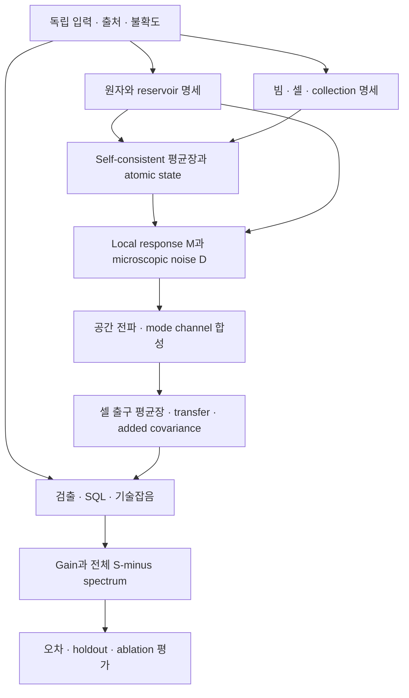

# GABES Grand Challenge — 연구·구현 청사진

작성일: 2026-09-09. 상태: 설계 초안. 대상: `gabes-grand-challenge-parameter-free-hot-vapor-fwm`.

**중심 설계: 독립 측정 입력과 명시한 원자·reservoir 모델을 받아, 평균장과 주파수별 quantum channel을 함께 만드는 계산 체계를 구축한다.** 각 결과에는 유도 근거, 수치 오차, 적용 범위와 실험 검증 범위가 따라붙는다. 먼저 작은 물리 모델에서 입력부터 검출 spectrum까지 전 경로를 닫고, 같은 인터페이스를 유지하면서 실제 hot-vapor physics를 추가한다.

2026-09-09 S0 foundations에 이어 S1의 atomic diffusion/QRT, conditional field M/D·main/companion·prescribed propagation과 four-sideband Gaussian channel, normalized temporal mode, bright-carrier gain/intensity-difference/SQL까지 연결했다. 이어 pump/weak dipole 불일치와 manifold 평균을 독립 계산으로 감사하고, 같은 dipole에서 power→state→gain/S₋를 계산하는 조건부 경로 및 실제 소비한 입력의 evidence gate를 추가했다. Atomic 유도는 `derivation.md`, field는 `field_derivation.md`, readout은 `readout_derivation.md`, 정규화 감사는 `normalization_derivation.md`, 검증 기록은 `research_log.md`에 있다. 강한 pump의 full-Zeeman reduction, 독립 입력·불확도, bright/weak-seed validity, angular-Doppler, self-consistent depletion과 experimental validation은 남아 있다. Grand Challenge의 완료 조건과 체크리스트 상태는 계속 유지한다.

후속 seed-validity 단계에서 finite optical-band spontaneous mean/SQL, Gaussian quadratic photocurrent와 국소 finite-seed Floquet mean 진단을 연결했다. [seed_validity_derivation.md](seed_validity_derivation.md)에 수렴과 적용 범위를 기록했다. 이어 [periodic_noise_derivation.md](periodic_noise_derivation.md)에서 periodic atomic A/D와 harmonic noise correlations를 구현하고 독립 시간영역 QRT와 검산했다. 8 μW에서 작은 평균 polarization 변화가 특정 atomic-noise 성분의 작은 변화를 보장하지 않음을 확인했다. 다음 연결점은 full Nambu·harmonic field elimination과 finite-seed propagation/readout이다. Unfiltered fluorescence/비-Gaussian cumulant 상한도 남아 있다.

2026-09-10에는 [periodic_field_derivation.md](periodic_field_derivation.md)의 두-band full Nambu field elimination, nonlinear probe/conjugate mean, adaptive quantum propagation과 bright readout을 연결했다. Pump는 고정되어 있고 추가 physical optical ports는 아직 전파하지 않는다. 8 μW의 finite-seed S₋ 보정은 약 10⁻⁴ dB지만 sector 간 correlation을 제거하면 0.1 MHz에서 약 0.039 dB가 달라진다. 다음 물리 확장은 spatial/mode selection 및 angular-Doppler noise 합산이며 full Zeeman·pump depletion·독립 실측/held-out 검증도 남아 있다.

2026-09-11에는 [kinetic_derivation.md](kinetic_derivation.md)의 velocity별 finite-seed 국소 mean/M/D와 독립 covariance 합산을 추가했다. Thermal cell gain/S₋는 pump-state weak-field 한계로 연결했다. 일반 비공선 geometry에서 Δk·v가 남으면 기존 단일 space-time phase가 닫히지 않는다는 제약을 식과 자동 거부 검사로 명시했다. 현재 angular-Doppler 계산은 명시한 synthetic closed-wavevector fixture이며 실측 dispersion의 대체물이 아니다. General spatial/convective phase와 finite-seed thermal propagation이 다음 연결점이다.

**1. 첫 번째 설계 결정: 물리 모델과 수치 방법을 별도 축으로 둔다**

| 축 | 예시 | 변경의 의미 |
|---|---|---|
| 물리 모델 | 4-level / full D1 Zeeman; collision law; finite-seed state; spatial transport | 예측하는 시스템과 가정이 바뀜 |
| 수치 해상도 | Floquet order, velocity grid, RF grid, z steps, mode basis cutoff | 같은 모델의 근사 오차를 줄임 |
| 실험 입력 | temperature profile, powers, polarization, detector transfer | 독립 측정으로 정한 조건이 바뀜 |
| 검출 정의 | balancing weight, SQL, RBW, electronics subtraction | 비교할 observable이 바뀜 |

모든 실행에서 이 네 축을 각각 저장한다. 해상도를 높인 결과를 더 많은 physics를 포함한 결과와 혼동하지 않는다. 높은 fidelity preset 하나에 네 축을 숨기지 않는다.

**2. 현재 기초와 먼저 보강할 부분**

| 현재 자산 | 재사용할 역할 | 확장 전에 확인할 경계 |
|---|---|---|
| `gabes/atoms.py:AtomModel` | level/transition data, dissipator assembly | 직접 coherence 감쇠를 넣는 항까지 GKSL 허용성 및 reservoir provenance 확인 |
| `gabes/core.py:trace_zero_liouvillian_response` | trace-zero response와 DC conserved-mode 처리 | atomic operator convention 및 noise source의 동일 기준 확인 |
| `pump_only_weak_response_reference` | standard minus branch의 정적 pump-state 기준 해 | finite-seed production이나 microscopic diffusion의 완료를 뜻하지 않음 |
| `pump_only_weak_response_noncollinear_reference` | 독립 `(v_z,v_x)` 평균 및 geometry limit | response amplitude와 noise covariance의 평균 규칙이 다름 |
| `gabes/observables.py`의 photon-flux 변환 | field amplitude, power, canonical normalization 연결 | 일반 mode basis와 full sideband covariance에 대한 확장 필요 |
| report v7의 `gaussian_channel` | constant gain/loss와 covariance propagation의 analytic fixture | 실측 output으로 맞춘 파라미터를 strict no-fit 입력으로 사용하지 않음 |
| `sabes/calibration.py` | 기존 calibration 기록을 읽는 adapter | 현재 `fitted`도 verified이므로 독립 측정 여부를 판정하는 별도 contract 필요 |

특히 현재 `_build_lindblad`에는 `dephasing`을 coherence matrix diagonal에서 직접 빼는 경로가 있다. 이 표현만으로 유효한 Lindblad generator임을 보장할 수 없다. 2026-09-09 작업 트리에 대해 dissipative generator를 간단히 검사한 결과는 다음과 같다.

| 설정 | conditional Choi 최소 고유값 / generator norm | `exp(L × 1 ns)`의 Choi 최소 고유값 | 이번 검사 해석 |
|---|---:|---:|---|
| radiative-only, `gamma_gg=0` | −2.13×10⁻¹⁷ | −1.57×10⁻¹⁶ | 반올림 오차 수준 |
| `double_lambda_rb85()` 기본값 | −6.07×10⁻³ | −3.084×10⁻⁴ | 이 설정의 complete positivity 위반 |
| `collisional_atom(394.15)` | −1.83×10⁻¹⁷ | −2.17×10⁻¹⁹ | 이 한 설정은 검사 통과 |

기본값의 실패를 현재 121 °C production 설정 전체의 실패로 확대하지 않는다. 반대로 121 °C 한 점의 통과를 모든 온도·개별 relaxation channel의 정당성으로 확대하지 않는다. 총 generator가 물리적으로 허용되어도 임의로 나눈 각 항이 독립 reservoir인 것은 아니다. Hamiltonian 추가는 projected Choi의 dissipative CCP 조건을 바꾸지 않는다.

수치·입력·코드 해시는 같은 폴더의 `foundation_probe.json`에 보존한다. 이 검사는 설계 우선순위를 정하는 재현 가능한 조사이며, formal proof 또는 production test suite를 대체하지 않는다. 사용한 conditional complete positivity 기준은 [Dinc, Eckardt, Schnell, Eq. (2)](https://arxiv.org/html/2409.17072v2)에 정리되어 있다.

따라서 최초 구현 작업은 **모든 사용 dissipator를 출처가 명시된 collapse operators 또는 PSD Kossakowski matrix로 표현하고, 적용 영역에서 확인하는 것**이다. 기존 generator와 동등한 표현이 가능하면 assembly parity를 보인다. 불가능하면 변경된 coherence/population dynamics를 명시하는 새 physical model version으로 다룬다. Noise만 뒤에 추가하거나 고유값을 잘라내어 수선하지 않는다.

**3. 먼저 고정할 다섯 가지 수학적 계약**

| 계약 | 반드시 명시할 내용 | 잘못되었을 때 나타나는 문제 |
|---|---|---|
| 주파수 | optical carrier, Δ, δ, RF Ω; internal rad/s; Fourier sign; rotating frame | detuning curve를 RF spectrum으로 오인, conjugate 부호 오류 |
| 장과 원자 정규화 | electric field, Rabi frequency, photon flux, mode area, density/volume, collective operator | gain과 noise에 서로 다른 원자수·mode area 인자 적용 |
| 연산자와 covariance | operator ordering, basis order, ±Ω pairing, commutator metric, vacuum normalization | commutator는 맞아도 실제 photocurrent PSD가 틀림 |
| reference state | pump-only / finite-seed periodic state, 안정성, seed·pump fluctuation approximation | mean-field gain과 quantum response가 서로 다른 상태를 기술 |
| 측정 | 두 output gain 정의, detector current units, balancing, SQL, one/two-sided PSD, RBW/VBW | −7.8 dB 비교와 bandwidth 정의가 실행마다 바뀜 |

`conventions.md` 한 곳에 식과 작은 수치 예제를 정하고 버전을 붙인다. API는 `omega_rad_s`, `delta_rad_s`, `density_m3`, `waist_1e2_radius_m`처럼 의미·단위를 드러낸 이름을 쓴다. 두 입력의 단위가 모두 rad/s라도 optical detuning과 analysis frequency는 서로 바꿔 넣을 수 없게 구분한다.

초기 해는 검증된 standard minus Raman branch를 사용한다. inherited plus branch는 frame 검증이 완료된 별도 모델로만 편입한다. 양 branch susceptibility를 한 쌍의 광장에 합산하지 않는다.

**4. 계산 흐름과 공통 인터페이스**



주요 객체는 처음에는 작은 immutable dataclass로 충분하다. 데이터 모델보다 큰 plugin framework나 분산 작업 시스템을 먼저 만들 필요는 없다.

| 제안 객체 | 내용 | 의존하거나 내보내는 계층 |
|---|---|---|
| `ExperimentSpec` | units, independent input records, geometry, temperature/density, input optical covariance, calibration IDs | 모든 계산의 입력 |
| `AtomicModelSpec` | H construction, explicit collapse/Kossakowski channels, atomic basis, provenance, applicability | quantum physics core |
| `MeanFieldSolution` | z/velocity/mode별 field와 atomic state, convergence, stability, approximation | response와 noise가 함께 사용 |
| `LocalQuantumResponse` | M, reservoir coupling, ordered/symmetrized noise 및 commutator blocks, basis/frequency axes, validity | ensemble와 propagation |
| `GaussianChannel` | transfer X, added covariance Y, input/output basis와 commutator, approximation/validation metadata | cell segments, collection, detector composition |
| `PredictionBundle` | nonlinear mean fields, input covariance, channel, output PSD/gains, uncertainties, claim status, hashes | batch result, SABES, GABES UI |

공통 field channel은 형식상 `δa_out = T δa_in + ξ`이다. 실제 평균장은 별도로 저장한다. Pump depletion이나 saturation이 있으면 평균장에 `α_out = T α_in`을 적용할 수 없으며, T는 비선형 해 주변의 요동 응답이다.

지정한 실제 quadrature basis에서 `[r_i,r_j]=iJ_ij`, `V_vac=I/2`를 채택한 finite temporal-mode channel은 다음을 따른다.

```text
V_out = X V_in Xᵀ + Y
compose(channel_2, channel_1):
    X = X2 X1
    Y = X2 Y1 X2ᵀ + Y2
CP check: Y + (i/2)(J_out − X J_in Xᵀ) >= 0
```

이 조건과 covariance uncertainty는 Gaussian-channel 검증에 사용한다. [Gaussian quantum information의 channel formalism](https://arxiv.org/abs/1110.3234)을 사용할 때도 이 문서의 vacuum convention으로 변환해야 한다. RF-domain에서는 복소 transfer와 dagger, conjugate-frequency 관계를 사용하고, 위 실수 quadrature 식을 한 개의 complex 2×2 Nambu block에 직접 적용하지 않는다. ±Ω 및 필요한 Floquet sidebands를 포함한 physical temporal modes로의 매핑을 검증한다.

정상 2-mode 예제로 시작하더라도 모드 수나 배열 차원을 2×2/4×4로 API에 고정하지 않는다. Floquet sideband의 추가 상관은 block space로 표현한다. Periodic 상태의 noise는 cyclostationary일 수 있으므로 대각 frequency PSD만으로 조기 축약하지 않는다.

**5. Microscopic core를 닫는 유도 순서**

1. **Generator:** H와 각 reservoir를 정의하고 trace/Hermiticity/GKSL 조건을 감사한다. transit reset은 입자 교체 모델의 가정까지 기록한다. 기존 `rate × (rho_th Tr rho − rho)`와 explicit jump construction의 동등성을 검사하되 실제 beam transport의 증명으로 부르지 않는다.
2. **Pumped state:** ρ̄를 계산하고 유일성·stability·conserved modes를 확인한다. 입력에 무관한 고정 ground population을 밖에서 다시 곱하지 않는다.
3. **Linear response:** 완전한 독립 atomic operator basis에서 field perturbation에 대한 response를 만든다. DC에서는 conserved subspace를 투영해 singular inverse를 피한다.
4. **Atomic noise:** 각 operator pair의 ordered correlation에서 diffusion을 얻는다. adjoint generator를 `L†`로 쓰면, delta-correlated Markov-noise convention에서 `C_ij = ⟨L†(X_i X_j) − (L†X_i)X_j − X_i(L†X_j)⟩`가 출발식이다. factor-of-two, adjoint pairing 및 symmetrization은 conventions에 고정한다.
5. **Elimination:** 동일 pumped state와 atom-field coupling을 통해 field M과 D를 얻는다. Atomic Markov diffusion은 white여도 effective field noise는 atomic resolvent를 거치며 Ω에 의존할 수 있다.
6. **Independent reference:** 유도한 D를 호출하지 않는 direct atomic two-time correlation/quantum-regression reference로 projected polarization spectra를 비교한다. 재사용한 물리 입력·가정은 동일하되 계산 경로를 공유하여 같은 오류를 두 번 확인하지 않는다.

단순한 stationary/local model의 구조는 다음처럼 정리할 수 있다. 아래 식은 인터페이스를 설명하는 설계식이며 아직 GABES에 대한 완성된 유도가 아니다.

```text
d(δs)/dt = A δs + U δa + F
d(δa)/dz = K0 δa + V δs + f_direct
R(Ω) = (−iΩ I − A)^−1          [conserved modes projected]
M(Ω) = K0 + V R(Ω) U
f_eff(Ω) = V R(Ω) F + f_direct
```

D는 `f_eff`의 microscopic correlations에서 계산한다. Direct noise와 atomic noise가 상관되면 cross terms를 포함한다. M의 commutator defect는 검산 조건이며 D의 대칭 상관까지 결정하지 않는다. [Jiang–Mei–Du의 macroscopic construction](https://journals.aps.org/pra/abstract/10.1103/PhysRevA.107.053703)과 비교할 때 이 차이를 유지하고 2025 erratum을 함께 검토한다.

Explicitly retained optical modes와 제거한 electromagnetic reservoir의 경계도 선언한다. Spontaneous emission의 원자 damping, Langevin forcing과 관측 모드로의 radiation을 같은 mode normalization으로 연결하고 중복 계상 여부를 검사한다.

정리의 범위를 세 층으로 나눈다: **선언한 Markov atomic model 안에서의 항등식**, **field linearization/ensemble closure의 근사 정당화**, **실제 hot-vapor apparatus에 대한 실험 검증**. Reduced four-level model이 full atom의 정확한 projection이라고 미리 가정하지 않는다. Full atom과 비교하여 coarse-graining의 오차를 측정한다.

**6. Hot-vapor 확장을 받아들일 공간 구조**

초기 구현은 independent velocity classes, local-in-z reservoir, undepleted pump라는 명시된 가정에서 출발한다. 평균 polarization은 amplitude로 더하고 독립 atomic noise는 covariance로 더한다. Collective average의 정의에 따라 weight·density·volume factor가 달라지므로 단순히 weight를 넣거나 제곱하는 규칙을 하드코딩하지 않는다. Velocity cell을 잘게 나누어도 continuum 예측이 같아야 한다.

후속 collision/transport에서 atom이 velocity class나 z segment 사이를 이동하면 noise가 class/position 사이에 상관될 수 있다. 이때 independent-segment Y 합성을 계속 강제하지 않는다. `ReservoirCorrelationModel`에서 local/independent 가정을 표시하고, 필요하면 velocity/transport 상태를 확대한 Markov model 또는 nonlocal kernel `C(z,z′;Ω)`로 전파한다. 처음부터 nonlocal solver까지 구현할 필요는 없지만 독립성 가정은 API 밖에 숨기지 않는다.

Transverse basis는 pump/seed Gaussian profile, collected modes, aperture/fiber/filter projection을 연결한다. 동일 원자 ensemble을 여러 collection modes가 공유할 때 cross-mode covariance를 보존한다. Overlap penalty 하나로 gain과 covariance를 각각 줄이지 않는다.

각 z segment는 local fields → atomic state → local M,D → next fields/channel 순으로 풀고 수렴을 확인한다. 양자 요동을 위한 tangent response는 이 평균장 해를 따라 계산한다. Strong depletion이 pump fluctuation의 동적 coupling까지 중요하게 만들면 pump mode를 포함한 joint fluctuation system으로 확장하거나 그 생략 오차를 정량적으로 제한한다. Pump mean만 줄인 채 undepleted 2-mode noise 식을 유지하지 않는다.

**7. 패키지와 기록 구조 제안**

아래 경로는 저장소 root 기준의 향후 배치안이다. 현재 원자·선종 데이터와 검증된 core solver를 재사용하고, 중복 물리 상수나 별도의 monolithic FWM engine을 만들지 않는다.

```text
gabes/quantum/                       # first implementation에서 필요한 모듈부터 생성
    contracts.py                    # basis, units, axes, channel/result types
    reservoirs.py                   # explicit channels, generator and noise audit
    diffusion.py                    # ordered Einstein diffusion and transformations
    channels.py                     # covariance/channel composition and checks
    propagation.py                  # constant and segmentwise quantum propagation
gabes/fwm_quantum/
    model.py                        # D1 double-Lambda assembly; existing atomic data reuse
    background.py                   # nonlinear mean state / boundary conditions
    response.py                     # microscopic local response and noise elimination
    ensemble.py                     # velocity/mode integration; independence assumptions
    pipeline.py                     # ExperimentSpec -> PredictionBundle
sabes/
    ...                             # measured detector/SQL/technical-noise adapter
analysis/grand_challenge/
    reference/                      # independent QRT / direct integration implementations
    configs/                        # versioned model, numerics, apparatus definitions
    data/                           # input manifest and dataset references, access policy
    run.py                          # future batch entry point
    runs/<run_id>/                  # immutable config + hashes + results + gate reports
tests/quantum/                      # invariant, physical-limit, parity and convergence tests
docs/grand_challenge/
    blueprint.md                    # this document
    foundation_probe.json           # current-code evidence for phase 0
    conventions.md                  # future signed-off notation and normalization
    derivation.md                   # future theorem, assumptions and open proof obligations
    decisions.md                    # future design choices, evidence and reversals
    research_log.md                 # future session handoffs and failed approaches
```

`gabes/schemes/fwm.py`는 마지막에 새 pipeline을 호출하는 adapter를 갖는다. Generic SFWM/biphoton은 이 seeded D1 과제의 검증 범위에 자동 포함하지 않는다. Mode/species 확장 가능성은 data contracts에서 열어 두고, 첫 구현의 물리 범위는 좁게 고정한다.

GABES와 SABES는 같은 `PredictionBundle`을 소비한다. Detector efficiency를 atomic susceptibility에 넣지 않는다. In-cell absorption과 post-cell losses를 별도 단계로 한 번씩 적용한다. Input pump/seed technical-noise PSD는 원자 응답을 통해 전파하고 electronics noise는 검출 계층에서 더한다. Technical-noise transfer가 비선형이면 그에 맞는 처리 범위를 선언한다.

**8. 공정 순서: 각 공정은 관측 가능한 결과로 끝낸다**

| 공정 | 만드는 것 | 완료 관문 | 실험 데이터 의존 |
|---|---|---|---|
| S0 기초 계약 | conventions, no-fit input schema, generator audit, canonical channel composition | unit/ordering tests; GKSL/CCP; vacuum/passive fixtures; provenance rejection | 없음 |
| S1 최소 quantum core | 4-level, single velocity, constant medium, strong classical pump와 bounded weak seed; M,D 독립 경로 | QRT/direct parity; commutator·uncertainty; no-atom/passive/ideal limits | 없음 |
| S2 열원자 기하 | 1D → non-collinear 2D velocity average; RF spectrum과 ensemble normalization | cold/collinear limits; grid/cutoff와 covariance convergence | 독립 T, angle, beam 입력은 최종 예측에 필요 |
| S3 실제 입력과 전파 | finite-seed validity, self-consistent mean propagation, collection, measured detection | seed-limit consistency; z convergence; energy/noise ledger; no-fit nominal prediction | apparatus calibration |
| S4 외삽 시험 | 조건별 gain + RF spectra, split/metrics freeze, uncertainty propagation | Δ,δ,T,P_pump의 untouched conditions를 no-refit 검증 | raw measurements 필수 |
| S5 full physics 설명 | Zeeman, collisions/transport, transverse modes와 pump coupling 확장 | add-one와 leave-one-out, interaction checks, 새로운 holdout에서 잔차 감소 | 원인 식별용 독립 측정 |
| S6 제품 편입 | opt-in scheme adapter, reporting/export, performance/caching | 검증 domain 밖의 명시적 상태; regression 및 전체 pytest | 검증 domain 확보 |

S3의 기본 self-consistent depletion은 과장된 gain을 막는 mean-field 기반이다. S5에서는 full atom과 modes를 포함한 local state/M/D를 매 segment에서 다시 계산하고 depletion의 중요도를 제거 실험으로 검증한다. 이 구분으로 기존 네 번째 완료 조건의 full-physics ablation을 유지한다.

S0/S1과 병행하여 독립 실험 입력과 holdout data의 명세를 준비한다. S2부터는 full-Zeeman 작은 benchmark를 탐색하여 계산량·coarse-graining 문제를 일찍 드러낼 수 있다. 실험 검증이 끝나기 전에도 이론과 수치 구현은 진행할 수 있다. S4가 실패하면 실패 조건을 development set으로 옮기고 S5의 physics 가설을 시험한 뒤 새 holdout으로 돌아온다.

공정별 일정은 최초 benchmark와 실험 자료의 가용성을 확인한 후 정한다. 연구상 해결되지 않은 유도를 확정된 며칠짜리 구현으로 약속하지 않는다.

**9. 첫 번째 end-to-end 결과의 범위**

최초 목표는 **명시적 radiative reservoirs를 가진 4-level, 한 velocity class, 일정한 pump와 균일 매질**에서 아래 묶음을 한 번에 내보내는 것이다. 이전 단계의 coherent passive channel도 동일한 결과 형식으로 통과해야 한다.

```text
independent physical input + declared idealization
    -> rho_bar
    -> M(Omega), atomic diffusion, effective field diffusion
    -> transfer, added covariance, output covariance
    -> mean gains, source S_minus(Omega), ideal-detector readout
    -> invariants + independent-reference comparison + error report
```

초기 RF grid는 광학 detuning과 별도로 두고 DC·낮은 Ω·atomic response scale을 포함한다. Spectrum 형식과 test fixtures는 0.1–4 MHz 및 추후 전체 측정 대역에 대응한다. 이 단계에서 −7.8 dB를 요구하지 않는다. 검증된 작은 모델의 예측을 만들어 다음 physics의 효과를 판별하는 기준으로 삼는다. [Glorieux et al.의 cold-atom microscopic model](https://arxiv.org/abs/1007.1610)은 가정을 맞춘 비교 대상으로 사용한다.

이 작은 경로를 끝내기 전에는 full Zeeman scan, 거대한 parameter optimization, UI slider 확장, GPU 이식이 주 공정이 되지 않도록 한다. 첫 번째 축적 자산은 완성된 derivation과 독립 비교 결과다.

**10. 검증 체계: 단일 PASS 대신 별도의 판정표**

| 검증 층 | 대표 검사 | 이 검사만으로 주장할 수 없는 것 |
|---|---|---|
| 원자 generator | TP, Hermiticity, CCP/GKSL; 각 reservoir provenance | 실제 collision/transport law가 정확함 |
| 계산 조립 | basis transforms, trace-zero response, signs, units | 누락된 microscopic noise가 없음 |
| 양자 일관성 | field commutator, Y positivity, total uncertainty, channel CP | 올바른 reservoir의 실제 noise magnitude |
| 독립 구현 | operator algebra/QRT vs diffusion elimination, direct integration vs propagator | 두 구현이 공유한 model assumption의 진실성 |
| 수치 수렴 | Floquet, velocity, mode, z, RF resolution 각각의 error | 실험 정확도 |
| 물리적 limit | no atoms, passive loss, ideal amplifier, cold/collinear, weak seed | hot finite-seed regime의 정량적 유효성 |
| 실험 검증 | independent inputs, joint gain/noise residual, untouched conditions | 검증 영역 밖의 보편적 예측 |

초기 well-conditioned fixtures의 dimensionless algebra residual 목표는 대략 10⁻¹⁰로 두되, 실제 허용치는 scale·condition number·machine precision과 함께 정의한다. 고차원·큰 gain에서 이 수치를 맹목적으로 강제하지 않는다. 수치 오차 예산은 실험 오차의 사전 선언한 일부보다 작게 설정한다. 측정 전이라면 임시 수치 목표와 그 근거를 별도로 기록한다.

검사 대상은 dB만이 아니라 linear noise ratio, individual output PSD, cross spectrum, gain, transfer norm이다. S₋가 작거나 gain이 큰 곳에서는 작은 covariance subtraction error가 큰 dB 오차를 낼 수 있다. 음의 eigenvalue를 clipping하거나 큰 gain을 cap한 뒤 PASS 처리하지 않는다.

**11. No-fit을 코드와 데이터 구조에 넣는다**

각 물리 입력 기록은 최소 다음을 갖는다.

```text
parameter_id, value, unit, uncertainty, covariance_group
source_type, source_id, acquisition_conditions, applicability
estimation_method, observables_used, dataset_ids_used
independent_of_target_gain_and_squeezing
status = independent | assumed | target_fitted | unknown
```

Calibration에서 fit이라는 계산법 자체를 금지하지 않는다. 별도 beam-profile 측정에서 waist를 fit하거나 detector calibration에서 transfer를 fit하는 것은 가능하다. 금지하는 것은 목표 FWM gain/S₋를 사용해 입력을 조정하는 것이다. `fitted`라는 기존 tag만으로 독립성을 승인하거나 거부하지 않고 어떤 데이터를 사용했는지 추적한다. Published target spectrum을 보고 고른 상수도 독립 입력이 아니다.

Strict prediction에서 gain/noise가 의존하는 assumed/target-fitted/unknown 입력이 있으면 `conditional_prediction`으로 명시한다. 모든 관련 입력이 독립이어야 `no_fit_prediction`이 가능하다. 후자는 `experimentally_validated`와 별도 상태다. Nominal point가 맞아도 untouched dataset의 성공으로 간주하지 않는다.

실험 데이터 계약은 한 operating condition에 raw probe/conjugate powers, frequency-resolved individual/cross/IDS spectra의 가능한 측정, matched SQL와 electronics traces, detector response, analysis settings, acquisition time, drift monitor와 uncertainty를 연결한다. 원자 density와 Doppler motion에 다른 온도가 필요하면 별도 변수로 둔다. 충분하지 않은 자료에서는 식별 가능한 parameter combination과 예측 범위를 보고한다.

공개 reference의 −7.8 dB와 이미 열람한 spectrum은 development/reference data로 표시한다. Blind holdout은 새로운 실험 조건 전체를 기준으로 나눈다. RF bin 일부만 숨겨서 independent test라고 부르지 않는다. Input uncertainty의 임의 최적 조합을 골라 target을 맞추지 않고, 사전에 정의한 joint uncertainty distribution을 전파한다.

**12. Full-physics ablation의 설계**

각 physical variant는 `(Hamiltonian, reservoirs, mean-state solver, transport assumptions, collection model)`을 함께 정의한다. Spin collision을 끌 때 noise만 끄거나 gain만 바꾸지 않는다. Explicit Zeeman model은 averaged line-strength/participation factor를 대체한다. 모든 variant에서 독립 입력과 검출 정의를 고정한다.

| 비교 | 목적 |
|---|---|
| reduced baseline + 한 physics | 각 확장의 가장 직접적인 효과 |
| full model − 한 physics | 다른 physics가 있을 때 그 요소의 필요성 |
| 강하게 결합된 두 physics의 2×2 비교 | Zeeman×polarization, collision×transit, depletion×transverse 등의 상호작용 |
| 동일 variant의 수치 refinement | physics 효과와 solver error 구분 |

Gain 오차, 전체 RF residual, 최소 noise, bandwidth, 각 reservoir contribution, runtime과 uncertainty를 표로 남긴다. Reservoir noise budget과 physics ablation은 다르다. 전자는 고정된 background에서의 noise 기여이며, 후자는 background와 response까지 다시 계산한 결과다. 상관된 reservoir는 cross contribution을 별도로 표시하고 모두 독립 양수 항으로 분해하려 하지 않는다.

서로 다른 물리 모델이 관측 불확도 안에서 동일한 spectrum을 내면 원인을 유일하게 식별했다고 주장하지 않는다. Polarization/field, beam waist, temperature 또는 pump power를 독립적으로 바꾸는 추가 조건을 설계해 가설을 구분한다.

[Florez의 multi-pump Floquet model](https://arxiv.org/html/2512.15051v1)은 multimode 및 harmonic block 구조의 비교 출발점이다. 본 장치의 full-Zeeman, independent-input absolute prediction과 동일한 검증 범위를 가졌다고 전제하지 않는다.

**13. 계산량을 관리하는 틀**

처음에는 dense 4-level reference를 투명하게 구현하고 baseline timing/memory를 측정한다. 24-level에서는 density matrix가 16에서 576 성분으로 커지며 Floquet·velocity·mode·z 축이 더해진다. 모든 축을 하나의 거대 dense tensor로 동시에 저장하지 않는다.

Atomic state, local response, noise contraction, propagation을 단계별로 cache한다. Cache key는 H와 reservoirs, physical input hashes, basis/convention version, numerical resolution을 포함한다. Temperature-dependent dissipator를 다른 T에서 재사용하지 않는다. 동일 atomic resolvent의 여러 source columns를 함께 solve하고, 큰 경우 sparse/block solve 또는 matrix-free action을 benchmark한다. 수치 이득은 독립 reference parity를 유지할 때만 채택한다.

RF/mode/velocity batching과 z streaming을 사용하고 필요한 출력 block만 보존한다. Constant-medium Y 적분은 matrix exponential과 direct quadrature로 교차 확인한다. Van Loan 방식이면 d-dimensional covariance에 2d-dimensional augmented system을 사용한다. 큰 gain에서 conditioning 문제가 생기면 안정적 적분/분해와 precision 검사를 먼저 시행한다.

작은 fixture → 몇 operating points → 넓은 scan의 세 실행 규모를 둔다. Full-physics exploration은 batch로 수행하고 GUI는 검증된 결과를 읽거나 허용된 계산 규모를 실행한다. SciPy 등 새 의존성이 필요하면 현재 production requirements와 reference 환경을 명확히 나누어 버전·설치·CI 재현성을 함께 정한다.

**14. 장기 AI 연구를 이어갈 기록과 역할**

연구 역할은 수학·원자 모델, solver·전파, 독립 검증, 실험 입력·평가의 네 갈래로 나눈다. 순차 작업에서도 같은 분리를 유지한다. 병렬 에이전트를 실제로 사용할 때에는 별도 승인된 실행 범위에 따라 파일 소유와 검증 책임을 나누며, 이 청사진 자체는 에이전트 실행을 예약하지 않는다.

각 연구 세션은 해결한 명제, 사용한 가정, 반례, 변경된 model/convention version, 실행 명령, 결과 위치, 다음에 확인할 명제를 남긴다. 실패한 접근은 실패가 드러난 입력과 수치 잔차까지 보존한다. 유도자와 검증자는 가능한 한 다른 표현·계산 경로를 사용한다. 수정할 때마다 알려진 실험 dB를 보면서 식을 선택하지 않는다.

각 `run_id`의 manifest에는 code revision과 dirty-source hashes, environment/dependency versions, input/data hashes, model variant, numerics, convergence/gate reports, time/memory, prediction arrays와 permitted claims를 저장한다. 결과를 덮어쓰지 않는다. 대화 기록을 유일한 연구 노트로 삼지 않는다.

**15. 바로 다음 착수 단위**

| 순서 | 구체적 산출물 | 기존 checklist 연결 |
|---|---|---|
| 1 | basis/Fourier/normalization/readout conventions와 independently measured input schema | normalization audit, parameter provenance, SABES calibration trust |
| 2 | radiative-only 및 실제 temperature/transit 설정의 explicit reservoir/CCP audit; 실패 설정의 versioned model decision | microscopic core의 선행 관문 |
| 3 | lossless/attenuating Gaussian-channel composition과 canonical normalization의 작은 reference fixtures | balanced readout, microscopic core |
| 4 | 한 velocity의 reduced four-level M/D 및 독립 QRT 비교 | pump-state response reference, microscopic core |
| 5 | 같은 출력 묶음으로 finite-RF source/ideal-detector spectrum 생성 | RF squeezing spectrum and bandwidth |
| 병행 | 장치 입력 목록, 무엇이 이미 target fitting인지의 감사, raw-data/holdout acquisition 명세 | parameter provenance, calibration campaign, heldout validation |

1–5가 첫 번째 연구 패키지다. 제출물은 유도, 실행 가능한 작은 reference, 실패를 숨기지 않는 validation report와 다음 physics가 들어갈 안정된 인터페이스다. 이 패키지가 검증되면 2D hot-vapor → finite-seed/전파 → 실험 no-fit → full-physics 설명으로 확장한다.

**기초 감사 재현 방법**

저장소 root의 Python 환경에서 아래 코드를 실행한다. `foundation_probe.json`은 이 계산의 수치, 입력 및 source hashes를 저장한 snapshot이다. Choi 행렬은 normalized entangled-state channel Choi의 n배 convention을 사용한다.

```python
import numpy as np
from scipy.linalg import expm
from gabes import atoms
from gabes.schemes.fwm import collisional_atom

def choi(superoperator, n):
    out = np.zeros((n*n, n*n), complex)
    for i in range(n):
        for j in range(n):
            e = np.zeros((n, n), complex)
            e[i, j] = 1
            out[i*n:(i+1)*n, j*n:(j+1)*n] = (
                superoperator @ e.reshape(-1)
            ).reshape(n, n)
    return (out + out.conj().T) / 2

for label, atom in [
    ("radiative_only", atoms.double_lambda_rb85(gamma_gg=0)),
    ("registry_default", atoms.double_lambda_rb85()),
    ("current_121C", collisional_atom(394.15)),
]:
    n, generator = atom.n_levels, atom.lindblad
    entangled = np.eye(n).reshape(-1) / np.sqrt(n)
    p = np.eye(n*n) - np.outer(entangled, entangled.conj())
    ccp = np.linalg.eigvalsh(p @ choi(generator, n) @ p)
    finite = np.linalg.eigvalsh(choi(expm(generator * 1e-9), n))
    print(label, ccp[0] / np.linalg.norm(generator, 2), finite[0])
```
