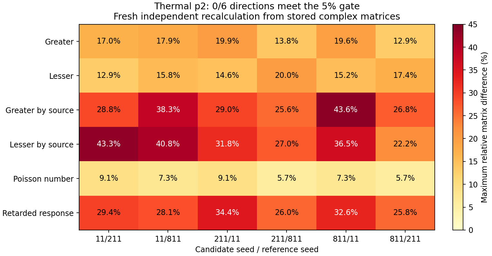

# Grand Challenge 중간 점검 — 2026-09-18

**종합: 전체 목표 대비 약 20–30% 진행으로 평가. 선언한 축소 모델의 계산·검증 기반은 유의미. 실제 hot-vapor 장치의 절대 gain·squeezing 예측은 아직 미검증.**

20–30%는 아래 네 milestone에 같은 가중치를 둔 **검토자 추정**. 시간·코드량·성공확률 아님. 공식 완료 milestone은 0/4. “물리 정확도 몇 %”는 검증 실험 자료 부족으로 산출 불가.

현재 작업트리 대상으로 전체 회귀 검사, 새 독립 물리 probe, 기존 실제 계산의 복소 행렬 재분석 수행. 기존 소스·캠페인·판정 수정 없음. 이번 열적 검사는 저장된 실제 계산의 재검증이며 새 thermal ODE 계산은 0회.

| 질문 | 판정 | 근거 |
|---|---|---|
| 얼마나 진행? | 전체 약 20–30%; 공식 milestone 0/4 | 축소 quantum core 상당 부분 구현. no-fit 실험 예측·holdout·full atom 미완료 |
| 물리와 일치? | 선언한 GKSL·Gaussian 모델 내부 검증 강함. 실제 장치 정확도 미확립 | 독립 QRT·해석해·극한 검사 통과. 열적 적분 미수렴, 입력·경계·원자 축소 가정 미검증 |
| 쓸 만한가? | 연구·오류 진단·조건부 민감도 계산에 사용 가능 | 국소 API의 gain→covariance→SQL 연결 확인. 열적 장치 최적화·절대 dB 예측에는 부족 |
| 코딩 결과 유의미? | 예. 정규화 오류와 부적절한 근사를 가려내는 구체적 결과 확보 | dipole 불일치, manifold 평균 문제, 경로 정밀도와 앙상블 수렴의 차이를 정량화 |

**진행률의 분모**

[공식 목표](../checklist.json)의 acceptance criteria 기준. 부분 점수는 산출물의 범위를 비교하기 위한 대략적 평가이며 저장소 공식 상태를 변경하지 않음.

| Milestone | 공식 상태 | 부분 진척 추정 | 주요 미완료 |
|---|---|---:|---|
| 1. Reduced four-level microscopic model | in_progress | 65–80% | 열적 수렴, 일반 transport/field 연결, 근사 오차 |
| 2. 독립 입력 기반 no-fit 절대 예측 | parked | 10–25% | 독립 실측 ledger·불확도와 장치 전체 예측 묶음 |
| 3. 다른 실험 조건의 untouched holdout | blocked_external | 0% | gain·전체 RF spectrum·SQL·검출 응답의 공동 자료 |
| 4. Full atom 및 physics ablation | parked | 0–10% | full Zeeman, self-consistent depletion, 검증된 원인 분해 |

등가중 평균 18.75–28.75% → 약 20–30%. 1단계가 나머지보다 쉽다는 가정 없음. 남은 개발시간 추정에 사용 불가.

현재 **thermal v2 계산 캠페인**은 별도 지표. 실제 캐시 360개와 source ZIP 108파일 무결성 직접 확인.

| 계산 지표 | 현재 |
|---|---:|
| 고유 원자 계산 확보 | 360/1,440 = 25% |
| 고유 물리 경로 확보 | 72/288 = 25% |
| 격자·독립 seed 조합 확보 | 3/9 = 33.3% |
| 확보한 경로의 수치 gate | 72/72 통과 |
| 독립 seed 방향 비교, 5% 기준 | 0/6 통과 |
| v2 p2→p3·p3→p4 refinement | 아직 검증 0개 |
| 전체 thermal / optical 인증 | false / false |

25%는 계산 요청 수의 수행률. 실행 시간 비율·Grand Challenge 완료율 아님. 미수행 1,080회 계산을 채워도 물리 모델 또는 수렴 통과 보장 없음.

**이번에 새로 실행한 검증**

| 검사 | 범위 | 결과 |
|---|---|---|
| 독립 atomic QRT | 2·3·4준위 무작위 GKSL 모델30개, 모델별 generator 주파수5점, 총150회 대조 | 최대 상대차 9.985×10⁻¹⁶; GKSL 모두 통과 |
| Commutator | 위 무작위 원자 모델 | 최대 잔차 6.571×10⁻¹⁶ |
| 해석적 Gaussian channel | squeeze r=0–2, 검출 효율 η=0–1, 323조합 | EPR variance 최대 절대차 2.540×10⁻¹⁵ |
| 잘못된 loss noise | 진공 noise가 누락된 양의 covariance | CP 위반으로 거부 |
| 국소 readout API | 기준·길이0·밀도0·검출효율1·0.5 | 5조건 CP 통과; null limit gain1, conjugate0 |
| SQL·검출 loss | 같은 평균 전류·같은 출력 상태 | null SQL 오차 1.110×10⁻¹⁶; loss 법칙 오차 3.331×10⁻¹⁶ |
| No-fit 입력 gate | assumed 입력38개·독립 beam fit·target 누출 | assumed 거부, 독립 fit 허용, target 누출 거부 |
| Thermal 비교 독립 재산술 | 저장된 복소 행렬, 6방향×6metric | 기록값과 최대차 5.551×10⁻¹⁷; 0/6 통과 재확인 |
| 실제 증거 무결성 | 캐시360개·격자3개·계획·공동감사·ZIP108소스 | seal·참조 hash·ZIP 원시 source hash 통과 |

해석 비교식: 진공 covariance I/2에서 `Var(xp−xc)=1−η+η exp(−2r)`. Gaussian CP와 uncertainty는 [Weedbrook 등의 Gaussian quantum information 정식화](https://arxiv.org/html/1110.3234)를 저장소의 I/2 규약으로 적용. 이 해석 검사는 원자 vapor의 microscopic noise를 대신하지 않음.

원자 noise 두 계산은 물리 generator와 상태를 공유하고, diffusion/resolvent와 full-Liouville QRT의 대수 경로를 달리함. 합성 generator 주파수는 −13/−3/0/2/11 rad/s이며 실제 장치의 RF 대역 검사와 구분. 따라서 잘못된 실제 장치 가정을 두 해법이 함께 재현할 가능성까지 제거한 것은 아님.

전체 `python -m pytest -q`: **1,942 passed / 3 skipped / 1 failed, 721.66초(12분02초)**. 실패는 `tests/test_docs_consistency.py::test_repository_visibility_wording_is_consistently_public`에서 기존 삭제된 `docs/FWM physics and analytic reconstruction/FWM_physics.tex`를 읽는 `FileNotFoundError`. 작업 시작 때 이미 삭제 상태였고 과거 보고서와 같은 실패. Skip3건은 Windows symlink 권한 관련. 따라서 전체 suite를 완전 통과로 기록하지 않음.

Grand Challenge 전용 `tests/quantum` 수집은1,157개. 전체 결과의 유일 실패는 전용 경로 밖의 위 문서 검사이며, 전용 검사 결과는1,154통과·3skip. 새 probe323 Gaussian 조합·30원자 모델·5readout 조건·36행렬 비교는 pytest 집계에 더하지 않음. 세 probe가 기록한 source63개를 사후 대조한 결과 불일치·변경0개.

**물리적 타당성의 가장 큰 제한**

1. **개별 경로는 정밀하지만 열적 평균은 미수렴.** 72경로의 CF4 대 독립 adjoint 최대 상대차 6.080×10⁻⁸. 반면 독립 seed의 36개 metric 최대차는 5.70–43.61%; 각 방향의 최악 metric은 26.80–43.61%. 기준5% 초과. 이 차이는 관측된 quadrature 민감도이며 참 적분 오차의 엄밀한 상계는 아님. 독립 seed는 다른 실험 조건의 holdout과도 다름.

2. **경계에서 들어오는 원자 상태가 검증되지 않음.** 현재 열적 계산은 T=373 K, 독립 고정 밀도10¹⁸ m⁻³, pump-only reduced atom, 가상의 열린 정사각 기둥. 폭346.41 μm, pump waist530 μm. 옆 경계에도 중심 대비65.23–80.77% intensity가 남지만 원자를 `diag(5/12,7/12,0,0)`로 투입. 외부에서 이미 받은 pump·재진입 이력 없음. 이는 Sim의121 °C 실제 셀 전체 조건과 다름.

같은 축소 원자를 옆면 중점에 정지시킨 **경계 이력 민감도 probe**:

| 입사 전 pump 노출 | F=3 population | ‖ρ−ρ입력‖F |
|---|---:|---:|
| 0 | 0.58333 | 0 |
| 0.1 μs | 0.64514 | 0.20293 |
| 1 μs | 0.86975 | 0.42950 |
| 5 μs | 0.94298 | 0.52641 |

열적 ensemble·실험 오차 추정 아님. 미검증 입력 이력이 정밀한 ODE 잔차와 별개의 문제임을 보여주는 대조 계산. 다음에는 collection mode를 고정한 채 물리 경계를 pump tail로 넓히거나 입사 전 궤적을 포함하여 비교할 필요.

3. **원자 stream이 아직 검출 광장 예측으로 닫히지 않음.** 현재 누적 atomic response는 Maxwell 전파행렬 M(Ω)과 다름. 서로 다른 source/readout 위치를 보존한 nonlocal response·noise 연결 필요. 이어 finite seed, 세 장의 self-consistent depletion·에너지 회계, 실제 검출 SQL까지 검증해야 함.

4. **강한 pump의 full atom과 실험 검증 미완료.** 양의 RMS 4준위 dipole은 균일한 비편극 weak absorption의 평균을 맞춤. Zeeman coherence·편광·CG 부호·interference 복원은 아님. Gaussian fourth-moment closure, unfiltered fluorescence, 실제 collision/transport에도 적용 범위가 남음. Full gain+RF spectrum의 독립 입력·불확도·untouched holdout이 아직 없음.

검토한 core에서 새 대수 구현 결함을 확정하지는 못함. 현재 최대 문제는 수치 정밀도 부족보다 ensemble 수렴과 모델의 실험 적용 범위.

**현재 쓸 수 있는 것과 사용을 보류할 것**

| 용도 | 판단 |
|---|---|
| Lindblad·diffusion·QRT·channel 구현 검산 | 사용 가능. 독립 경로·반례·극한 확인 |
| dipole 정규화·검출 손실·입력 가정의 상대 영향 | 선언한 축소 모델 안에서 사용 가능 |
| thermal transport 알고리즘 연구 | 사용 가능. 현재 수렴 실패 자체도 진단 결과 |
| 실험 pump·waist·온도의 최적값 선택 | GC 결과만으로 결정하기에는 이른 단계. full model·실측 대조 필요 |
| 실제 gain·−7.8 dB·최적 squeezing bandwidth 예측 | 현재 근거 불충분 |
| −7.8 dB를 만드는 지배 physics의 확정 | 아직 불가. 검증된 no-refit ablation 필요 |

새 국소 API fixture는 probe gain1.11065587, conjugate gain0.11356221, η=.85에서0.1/1/4 MHz의 S₋=−0.730416/−0.730294/−0.728436 dB. **조건부 single-velocity 예시**이며 현재 열적 캠페인이나 실험의 예측값 아님. 호출9.40–12.51 ms는 import 제외 단일 측정. 반면 최근 thermal 배치는24경로·120새계산에131.76분(동시 회귀 검사 포함). 대화형 최적화 성능으로 확대 불가.

Production FWM은 physical squeezing을 계속 unavailable로 반환하며 SABES도 이 경로를 사용. 연구 API의 완성도가 곧 앱의 실험 예측 기능을 뜻하지 않음. Fast/Balanced의 C_mix=0.5594938027은 알려진 gain에 맞춘 계수로 no-fit 완료 증거가 아님. SABES의 `fitted→verified`도 GC의 독립 입력 조건을 대신하지 못함.

**이미 얻은 유의미한 결과**

- [정규화 감사](normalization_derivation.md): 내부 commutator가 맞아도 pump와 weak-field의 implicit dipole 비가1.9993734141일 수 있음을 발견. 두 ground manifold에 공통1/12를 곱해 동시에 정규화할 수 없다는 반례와 같은 dipole을 사용하는 연구 경로 확보.
- [원자 transport 대조](rb_transport_derivation.md): 특정 fixture에서 boundary noise 생략 시 greater covariance norm18.06%, cross-segment covariance 생략 시333.46% 변화. 해당 근사를 무조건 적용할 수 없다는 수치 근거. 실험 squeezing 오차율은 아님.
- 이번 점검: 10⁻⁸ 수준의 경로 정밀도와 수십%의 ensemble 민감도를 분리. 향후 계산 자원을 어디에 써야 하는지 판단 가능.
- No-fit·CP·수렴 gate가 근거 없는 성공 판정을 거부함. 연구 결과의 재현성과 해석 범위를 보존하는 기능.

코딩 성과는 **연구 도구와 반례 발견 측면에서 유의미**. 절대 squeezing 예측 성공 또는 새로운 물리 법칙 발견으로 부를 증거는 아직 없음.

**다음 진행 판단 기준**

1. 같은 모델의 p2→p3→p4와 세 seed 비교를 완료하되, 계속 실패하면 오차가 큰 velocity/입사면/체류시간 층을 먼저 분석. 개별 ODE 허용오차를 더 줄이는 작업의 우선순위는 낮음.
2. 병행하여 입사 전 pump history·물리 경계 민감도 검사. 이 조건부 stream을 실제 셀에 적용할 수 있는지 확인.
3. 수렴된 stream→nonlocal Maxwell→finite-seed mean/noise→detector SQL 연결. 작은 full-Zeeman 기준점과 보존량 검사 추가.
4. 독립 실측 입력과 gain·전체 RF spectrum·SQL/dark/transfer 자료 확보. 모델 조정에 쓰지 않은 조건을 미리 동결. 그 후 예측 성능과 과학적 설명력을 평가.

**증거·재현**

| 자료 | 링크 |
|---|---|
| 새 해석해·thermal 행렬·hash 재검증 | [실행 코드](../../analysis/grand_challenge/checkpoint_2026_09_18/checkpoint_probe.txt), [JSON](../../analysis/grand_challenge/checkpoint_2026_09_18/checkpoint_probe.json) |
| 새 무작위 QRT·경계 이력 probe | [실행 코드](../../analysis/grand_challenge/checkpoint_2026_09_18/physics_probe.txt), [JSON](../../analysis/grand_challenge/checkpoint_2026_09_18/physics_probe.json) |
| 새 readout·SQL·no-fit probe | [실행 코드](../../analysis/grand_challenge/checkpoint_2026_09_18/utility_probe.txt), [JSON](../../analysis/grand_challenge/checkpoint_2026_09_18/utility_probe.json) |
| 전체 회귀 검사 | [로그](../../analysis/grand_challenge/checkpoint_2026_09_18/pytest_full.log) |
| 점검 요약·산출물 hash | [Manifest](../../analysis/grand_challenge/checkpoint_2026_09_18/checkpoint_manifest.json) |
| 기존 실제 thermal 계산 | [최신 보고서](thermal_campaign_p2_seed811_v2.md), [공동 감사 JSON](thermal_campaign_v2/ensemble-p2-three-seeds.json) |
| 현재 물리 가정 | [thermal 설명](rb_thermal_ensemble.md), [transport/field의 미완료 연결](transport_ensemble_derivation.md) |

Probe는 Python 코드이며 동결 source inventory에 들어가지 않도록 `.txt`로 저장. JSON에 입력·환경·source hash 포함. 기존 출력은 독점 생성으로 보호하므로 재실행은 별도 checkout 또는 새로운 출력 경로 사용. 전체 회귀 명령은 저장소 root에서 `python -m pytest -q`.
