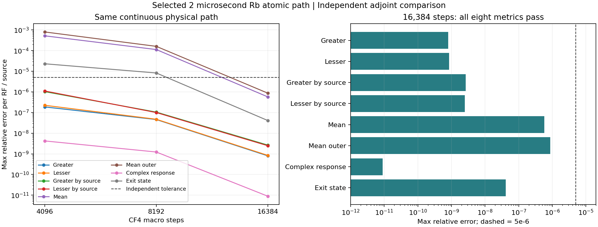

# Rb 경로: 정확한 고유모드 적분 + CF4

2026-09-14. 한국어 caveman 정리. No-fit 경로 가속.

대상: 같은 prescribed Gaussian pump, reduced four-level Rb, 실제 4개
radiative jump, 3 RF, 4 complex Nambu readout/drive. 실험 squeezing 미인증.

코드: `analysis/grand_challenge/reference/exponential_transport.py`.
검증: `analysis/grand_challenge/exponential_transport_audit.py`.
기존 smooth/adjoint/segmented 코드·immutable report 보존.
생산 Ultra scheme 변경 없음. 연구용 opt-in solver.

## 1. 바뀐 계산, 같은 유한 구간 방정식

구간마다 고정된 Hamiltonian. 원자 density와 각 잡음원 공분산:

\[
\dot r=\mathcal Lr,\qquad
\dot C_s=BC_s+C_sB^\dagger+D_s(r).
\]

\(r=\mathrm{vec}_{\rm row}\rho\).
\(B\): traceless atomic fluctuation + carrier-demodulated readout accumulator.
\(D_s\): 명시적 jump product. Density에 선형.
입사경계 공분산은 homogeneous 항; 각 radiative source는 별도 forcing.
Greater/lesser 순서·각 source 보존.

기존: Kronecker 합·모든 source forcing을 489×489 행렬에 넣고 `expm`.
신규: 16×16 density, 19×19 augmented drift 고유모드에서 적분.

\[
\mathcal L=R\operatorname{diag}(\lambda)R^{-1},\quad
B=S\operatorname{diag}(\beta)S^{-1},\quad q=R^{-1}r(0).
\]

\(R_k\)는 일반 복소 연산자. Physical density 아님.
Hermitian화·trace 정규화·PSD 투영 금지.

\[
\widetilde D_{s,abk}=
[S^{-1}D_s(R_k)S^{-\dagger}]_{ab},\qquad
\kappa_{ab}=\beta_a+\beta_b^*.
\]

\[
F(x,y;h)=\int_0^h e^{x(h-u)}e^{yu}\,du
=\begin{cases}
\dfrac{e^{yh}-e^{xh}}{y-x},&y\ne x,\\
h e^{xh},&y=x.
\end{cases}
\]

따라서 정확히:

\[
C_s(h)=e^{Bh}C_s(0)e^{B^\dagger h}
+S\left[\sum_k\widetilde D_{s,abk}
 F(\kappa_{ab},\lambda_k;h)q_k\right]_{ab}S^\dagger.
\]

근사 단열 제거·새 diffusion 계수 없음. 고정 구간의 원래 block-exponential과
수학적 항등. 반복 source별 원자 solve 복원 불필요. 코드 주석에 근거 명시.

공명 근방: \(h e^{xh}\phi_1((y-x)h)\), 작은 인수 Taylor.
큰 감쇠 차이: 두 bounded exponential 차 직접 사용. `0*inf` 회피.
Noise 자체의 음수 roundoff는 그대로 반환.

## 2. 평균·복소 응답도 같은 고유모드 재사용

\(x_k=(\psi_k,Z_k)\): drive \(V_k e^{-i\nu_kt}\)의 원자 tangent와
적분 readout. 같은 구간에서:

\[
\dot x_k=(B+i\nu_k I)x_k+G_kr,\qquad
G_k=\begin{pmatrix}
F_{\rm basis}^\dagger\{-i(V_k\otimes I-I\otimes V_k^T)\}\\0
\end{pmatrix}.
\]

\[
x_k(h)=e^{i\nu_kh}e^{Bh}x_k(0)
+S\{(S^{-1}G_kR)_{ab}F(\beta_a+i\nu_k,\lambda_b;h)\}_{ab}R^{-1}r(0).
\]

위 식의 mode 합은 행렬곱에 포함. Drive index와 density-mode index는 별개.
평균은 \(B=-i\operatorname{diag}\omega\), forcing은
\(\eta_j\mathrm{Tr}(O_j\rho)/T\)인 같은 convolution.
96×96 first-moment/response `expm` 대부분 제거.
새 continuous solve 또는 잡음의 사후 recentering 없음.

\(\eta_j=1+|\omega_j|T\): accumulator 좌표만 rescale.
마지막에 정확히 \(\eta,T\), 공통 시작점 carrier phase 복원.
Efficiency·loss parameter 아님. SI pulse mean은 s, covariance는 s².

\(\rho\)의 propagator·density eigenproblem은 RF/source 독립.
구간당 한 번 계산, 모든 RF가 같은 입사 density 사용.
동일 구간 generator/readout/drive/시간은 map 캐시 재사용.
동일성 증명 주석 유지. 다른 물리 입력의 근사 캐시 금지.

## 3. Eigenbasis 불안정 시 원래 식

조건수 \(\kappa(S),\kappa(R)\), 고유방정식 residual 검사.
기본 상한 \(10^6\); covariance 두 basis factor 반영:
\(\epsilon\kappa(S)^2\kappa(R)\le10^{-8}\).
Residual \(\le10^{-12}\), kernel finite도 요구.

실패 구간: 기존 inverse-free block exponential.
Mean/response도 원래 작은 block exponential로 복귀.
Diagonalizable이라고 강제 가정하지 않음. Jordan block·공명 별도 검사.
조건수 screen은 전역 오차 보증 아님. 경로 refinement·독립 비교 필수.

## 4. 연속 Gaussian: 전체 affine lift에 CF4

\(G(t)=G_0+f(t)G_1\): density, source covariance, mean, response 전체식.
기존 coarse midpoint의 시간 오차는 정확한 spectral 적분만으로 사라지지 않음.

\[
c_{1,2}=\tfrac12\mp\tfrac{\sqrt3}{6},\quad
a_{1,2}=\tfrac{3\mp2\sqrt3}{12},\quad a_1+a_2=\tfrac12.
\]

\[
f_A=2(a_2 f(t+c_1h)+a_1f(t+c_2h)),\quad
f_B=2(a_1 f(t+c_1h)+a_2f(t+c_2h)),
\]

\[
U_h=\exp[\tfrac h2(G_0+f_BG_1)]
     \exp[\tfrac h2(G_0+f_AG_1)].
\]

오른쪽 A 먼저, B 나중. 순서 뒤집으면 4차 조건 손실.
각 substep 시간 \(h/2>0\), jump는 동일, Hamiltonian은 실수 조합.
원자 density map은 GKSL propagator. 전체 moment lift를 optical CP channel로
해석하지 않음. 음수 \(a_1\) 이유로 envelope clipping 금지.

방법 근거: Alvermann–Fehske–Littlewood,
[Numerical time propagation of quantum systems in radiation fields](https://arxiv.org/abs/1205.1379),
NJP 14, 105008 (2012). 본 source/response convolution·검증 계약은 위 식으로 직접 유도.

CF4 내부 첫 half-step은 4차 physical midpoint 아님.
출력 history는 완료된 macro endpoint만 저장. 기본 최대17점.
모든 내부 substep의 covariance·commutator·state positivity 검사는 계속 수행.
Norm 제곱 합 streaming: 기존 stacked-history Frobenius norm과 동일.
저장량 축소가 검증점 생략으로 이어지지 않음.

## 5. 검증 계약

`segments` 세 수준. 두 successive edge: 모든 metric \(<10^{-3}\).
최종값 vs 독립 backward-observable: 모든 metric \(<5\times10^{-6}\).
Reference 자체 refinement \(<2\times10^{-6}\), 기존 immutable 증거 재사용.

각 RF·각 source별 norm. Greater, lesser, source별 두 순서,
mean, mean outer, complex retarded response, exit state 전부 포함.
Dark floor: 기존 \(128\epsilon\) SI 차원 기준 동일.
Source/hash/물리 입력 검증 후에만 기존 reference 재사용.
최종 packet digest에 evidence 연결. Response 변경 시 과거 evidence 거부.

```powershell
python -m analysis.grand_challenge.exponential_transport_audit --output NEW.json
python -m pytest -q tests/quantum/test_exponential_transport.py tests/quantum/test_exponential_transport_audit.py
```

`NEW.json` 덮어쓰기 금지. Fail도 기록. 정확한 식과 관측 수렴 구분.
선택된 2 µs 경로의 결과는 다른 thermal path에 자동 적용하지 않음.
실제 thermal integrand 수렴, 위치별 Maxwell, finite seed, full atom 후속.

## 6. 실행 결과



Immutable `exponential_transport_report_v1.json`: 전체 선언 gate 통과.
38 source hash·독립 parent report 일치. 실제 OpenBLAS 두 개 모두1 thread 확인.

| Macro 구간 수 | 실행시간 | 독립 비교 최대오차 | 최대오차 항목 |
| ---: | ---: | ---: | --- |
| 4096 | 63.15 s | 7.997e-4 | mean outer |
| 8192 | 129.60 s | 1.607e-4 | mean outer |
| 16384 | 250.31 s | 8.691e-7 | mean outer |

두 successive edge 최대: 9.419e-4, 1.614e-4. 각각1e-3 이내.
첫 edge는 기준 근방. 다른 thermal path 자동 통과 가정 금지.

| 최종 독립 비교 | RF/source별 최대 상대오차 |
| --- | ---: |
| Greater | 8.007e-10 |
| Lesser | 8.415e-10 |
| Greater by source | 2.652e-9 |
| Lesser by source | 2.480e-9 |
| Mean | 5.733e-7 |
| Mean outer | 8.691e-7 |
| Complex retarded response | 8.900e-12 |
| Exit state | 4.107e-8 |

모든 항목5e-6 이내. Complete selected-path evidence 승인.
Reference 자체 refinement 기존 최대5.562e-8 <2e-6.

동일 physical midpoint16 구간의 두 구현 직접비교:
기존14.899 s → spectral0.15558 s, **95.76배**.
8개 항목 차이 최대1.765e-11. 같은 coarse 이산화·프로세스·BLAS 조건.
이 배수는 고정 구간 계산 전용. 전체 연속 경로·열적 ensemble·Ultra 배수 아님.
과거 adaptive report는 당시 실제 BLAS thread 수 미기록. 공정한 전체 속도비 미주장.

단위·회귀·evidence 검사: **91 passed**. 독립 수식·코드검토 blocker 없음.
기존 quantum 일관성 검사·명시적 source·carrier·SI 단위 유지.

합동 전체 검사: **1487 passed, 1 failed, 338.88 s**.
신규223 = solver/evidence91 + 병렬 thermal/cache/audit132.
유일 실패: 기존 삭제된 `docs/FWM physics and analytic reconstruction/FWM_physics.tex`
참조 문서 일관성 검사. 기존 삭제 상태·검사 유지.
