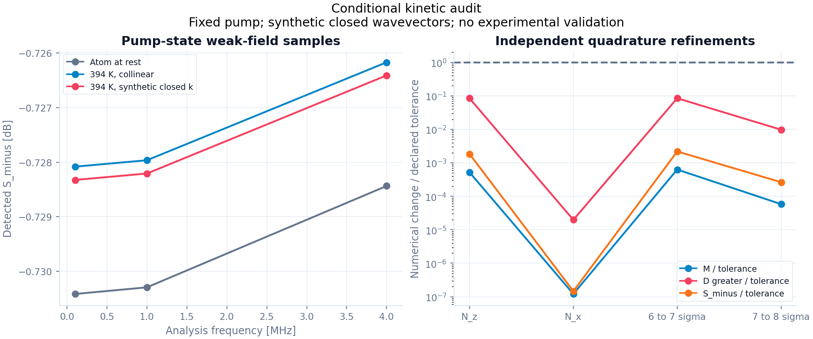

# S1 — 속도별 평균장·microscopic noise와 carrier geometry

작성일: 2026-09-11. 구현: `gabes/fwm_quantum/kinetic.py`. 독립 검산: `analysis/grand_challenge/reference/kinetic.py`. 이전 [finite-seed field](periodic_field_derivation.md)를 움직이는 원자에 연결하는 단계다.

**Finite-seed 원자의 국소 mean/M/D와, pump-state weak-field 한계의 thermal cell gain·bright S₋를 구현했다.** 현재 허용하는 carrier geometry의 조건을 식과 코드로 제한한다. 일반적인 비공선 배치, self-consistent finite-seed thermal propagation 또는 실험 −7.8 dB 예측의 완료를 뜻하지 않는다.

## 1. 실험실 광주파수와 움직이는 원자의 주파수

Pump, probe, conjugate의 실험실 carrier를 각각 (ω₀,k₀), (ωₚ,kₚ), (ω꜀,k꜀)라 하자. ωₚ=ω₀+ν, ω꜀=ω₀−ν이며 ν=−ω_hf+δ는 signed optical beat다. 원자가 r(t)=r₀+vt로 이동하면 평면파 위상에서 직접

\[
\Delta_v=\Delta-\mathbf k_0\cdot\mathbf v,\qquad
\nu_{p,v}=\nu-(\mathbf k_p-\mathbf k_0)\cdot\mathbf v,\qquad
\nu_{c,v}=-\nu-(\mathbf k_c-\mathbf k_0)\cdot\mathbf v
\]

를 얻는다. 따라서

\[
\nu_{p,v}+\nu_{c,v}=\Delta\mathbf k\cdot\mathbf v,
\qquad\Delta\mathbf k=2\mathbf k_0-\mathbf k_p-\mathbf k_c.
\]

실험실 RF Ω와 optical ω_j는 모든 velocity class에 동일하다. Code는 H₀의 one-photon detuning과 atomic harmonic beat만 바꾼다. Doppler-shifted δ를 새로운 `ReducedPowerInputs`에 넣어 lab photon energy나 field normalization까지 바꾸지 않는다. 이 분리는 직접 ω_j−k_j·v를 계산한 평면파 주파수 및 기존 `doppler.noncollinear_atomic_detunings_rad_s`와 대조했다.

## 2. 단일 space-time phase의 적용 조건

기존 periodic atom은 하나의 signed ν에 대해 H=H₀+Ve⁻ⁱᵛᵗ+V†eⁱᵛᵗ를 사용한다. Probe의 qₚ=kₚ−k₀와 conjugate의 q꜀=k꜀−k₀가 **q꜀=−qₚ**, 즉 Δk=0이면 moving atom에서도 두 drive를 νₚ,ᵥ와 −νₚ,ᵥ로 함께 표현할 수 있다. 각 harmonic에 대응하는 공간 위상도 동일한 하나의 qₚ로 표현된다.

이것은 현재 선택한 harmonic(+1,−1) 좌표가 모든 Maxwell velocity에 닫히는 조건이다. 일반 FWM에 대한 불가능 정리나 실험 optimum phase-matching 조건이 아니다. 한 특수 velocity에서 Δk·v=0이 되는 것도 전체 thermal ensemble의 closure를 보장하지 않는다.

`CarrierGeometry`는 명시한 3차원 k를 보존하고, ∥Δk∥≤10⁻¹² max∥k_j∥인지 검사한다. Pump는 +z, 모든 carrier는 전방 전파다. Collinear vacuum beams는 closure를 통과한다. 동일한 반대 각도 ±5 mrad의 vacuum beams는, 현재 fixture에서

- Δk ≈ (0.63791649, 0, 197.590726) rad/m,
- 12.5 mm의 axial mismatch phase ≈ 2.469884 rad,
- 394.15 K Maxwell 원자의 loop Doppler rms ≈ 38,817.87 rad/s,

를 남겨 거부된다. 수치는 geometry 자체의 진단이며 그 mismatch가 S₋에 미치는 효과를 계산한 것은 아니다.

일반 nonclosed geometry는 두 convective phase 또는 추가 spatial grating 좌표와 그 couplings를 유도해야 한다. ν꜀,ᵥ를 강제로 −νₚ,ᵥ로 바꾸거나 scalar phase mismatch만 추가하는 것으로 이 문제를 해결했다고 간주하지 않는다. Explicit k와 독립 scalar `phase_mismatch_rad_m`를 동시에 주는 것도 거부한다.

각도에 따른 susceptibility와 phase matching의 실험적 중요성은 [Turnbull 등, PRA 88, 033845 (2013)](https://arxiv.org/abs/1303.7187)이 다룬다. 해당 논문의 semiclassical 계산을 이번 quantum closure의 독립 증명이나 검증으로 사용하지 않는다.

## 3. 현재의 비공선 수치 fixture

각도에 따른 Raman Doppler 항을 검산하기 위해 pump/probe는 vacuum k를 사용하고, conjugate k를 **명시적으로 2k₀−kₚ로 정의한 synthetic fixture**를 별도로 만든다. 생성 위치는 audit/test 코드이며 production geometry가 입력을 자동 수정하지 않는다. 이 conjugate k의 크기는 ω꜀/c와 다르다. 보고서에 그 비율과 provenance를 저장한다.

따라서 synthetic fixture의 결과는 측정한 refractive index, self-consistent Maxwell dispersion 또는 실제 장치의 비공선 예측이 아니다. 독립 실측 geometry가 이 조건을 만족하는지와 유전체의 field energy normalization은 별도로 검증해야 한다.

Canonical β_j는 공통 z-plane 면적 A_z를 통과하는 photon flux의 제곱근이다. Vacuum energy-flux convention에서 cosθ_j=k_j,z/∥k_j∥이면 P_z=ε₀c A_z cosθ_j |E_j|²/2이며

\[
g_j={g_{j,\parallel}\over\sqrt{\cos\theta_j}},\qquad
\lambda=n A_z.
\]

Mean Hamiltonian과 field readout 모두 같은 g_j를 사용한다. 이 convention을 synthetic k에 적용한 수치 실험이며 dispersive energy density의 정규화까지 인증하지 않는다. Transverse beam profile, overlap variation와 collection modes도 아직 포함하지 않는다.

## 4. 국소 mean/M/D와 독립 class noise의 합

정규화한 velocity probabilities w_v>0, Σ_v w_v=1에 대해 λ_v=n A_z w_v다. 같은 lab RF에서 각 원자의 mean ρᵥ, atomic drift Aᵥ와 reservoir별 D_atom,ᵥ를 구한다. Finite seed이면 ρᵥ와 Dᵥ의 harmonic 성분을 모두 유지하고 [periodic field 유도](periodic_field_derivation.md)의 Bᵥ,C₀ᵥ와 resolvent Rᵥ를 사용한다.

\[
M_v=\lambda_v C_{0v}R_v B_v,\qquad
D^{>,<}_{v,r}=\lambda_v C_{0v}R_v D^{>,<}_{\mathrm{atom},v,r}R_v^\dagger C_{0v}^\dagger.
\]

여기서 R은 finite seed에서 atomic harmonic 공간의 resolvent다. 같은 phase-matched envelope 좌표에서

\[
\partial_z\beta_j=-i n A_z g_j\sum_v w_v\,
        \operatorname{Tr}(O_j\rho_{v,h_j}),\qquad
M=\sum_v M_v,\quad D^{>,<}_r=\sum_v D^{>,<}_{v,r}.
\]

각 reservoir와 velocity가 독립이라는 가정으로 covariance를 합한다. Squeezing을 조절하는 별도 coefficient는 없다. w_v는 λ_v 안에 한 번만 들어가며 w_v²를 사용하지 않는다. Noise amplitude √w_v를 먼저 더하면 서로 다른 velocity의 가짜 correlation이 생긴다.

각 class가 M_v J+J M_v†+D_v⁾−D_v⁼=0을 만족하므로 합도 같은 canonical relation을 만족한다. PSD covariance의 양수 가중 합은 PSD다. 코드는 각 class와 합산 결과를 모두 검사한다. 이 항등식은 microscopic D의 독립 유도를 대신하지 않는다.

`retain_classes=True`는 reservoir/class별 covariance를 보존한다. False는 같은 물리 reservoir의 **covariance**만 streaming 합산해 메모리를 줄인다. Test는 두 경로의 일치를 확인한다. 한 class를 동일한 두 class로 나누어 w=(0.25,0.75)를 주어도 M/D는 불변이다. 반대로 (√0.25+√0.75)²로 D를 늘린 잘못된 amplitude sum은 commutator 검사를 실패한다.

독립 reference는 production atomic A/D/elimination을 import하지 않는다. Full 16-component Liouvillian의 trace-bordered forced response로 M를, connected QRT로 D⁾와 D⁼를 구한다. Resonant/off-resonant 세 velocity fixture를 비교한다. Finite-seed 국소 평균 polarization의 방향 미분은 별도의 central difference로 계산해 M(Ω=0)의 tangent와 대조한다.

## 5. Local ballistic 근사의 한계

원자 내부의 convective carrier phase는 위의 Doppler shift에 포함한다. 느리게 변하는 optical envelope를 원자가 coherence lifetime 동안 따라가는 효과와 서로 다른 z slice를 이동하며 만드는 atomic noise correlation은 이 국소 모델에서 생략한다. 적절한 사용 조건은 해당 coherence에 대해 v·∇_slow가 relaxation/response scale보다 작은 경우이며, 장치 전체에서 그 조건의 오차 상한을 아직 계산하지 않았다.

기존 explicit radiative/internal-reset reservoirs를 class마다 사용한다. Reset은 독립 내부상태 reservoir라는 모델 가정이다. Velocity-changing collisions, transit 중 다른 slice/class로 전달되는 correlation 또는 kinetic collision kernel의 대체물이 아니다. 이 확장에는 mean과 noise를 함께 전달하는 transport equation이 필요하다.

## 6. Thermal cell에서 이번에 계산하는 양

`kinetic_local_field(..., carrier_amplitudes=...)`는 **finite-seed 국소** mean/M/D를 반환한다. 아직 그 함수를 반복 평가하는 thermal nonlinear mean trajectory와 quantum transfer를 연결하지 않았다.

`thermal_pump_cell`은 **pump-state weak-field** 한계다. Zero-seed periodic harmonic lift와 같은 응답을, 두 shifted stationary sectors Ω±νᵥ에서 정확히 계산한다. z에 균일한 prescribed pump에서 Σ_v M_v와 Σ_v D_v를 먼저 구성하고, 이 generator의 exact constant-segment propagation을 한 번 수행한다. 각 velocity의 cell transfer나 output squeezing을 평균하지 않는다.

이 한계에서는 coherent mean이 seed에 선형이므로 T(Ω=0)β_in이 올바른 output mean이다. Finite-seed nonlinear 상태에서 같은 식을 사용하는 것은 여전히 금지한다. Gain과 ±RF four-sideband channel, CP/uncertainty, bright photocurrent와 matched SQL은 기존 공통 코드를 사용한다. η=0.85는 이 fixture에서 사전 선언한 값이며 사후 fitted loss가 아니다. 이전 stationary quadratic-current correction을 자동으로 더하지 않는다.

## 7. Maxwell 적분과 재현

Coplanar x-z waves에서는 v_y 의존성이 없어 그 축을 해석적으로 적분한다. v_x,v_z는 σ=√(k_B T/m₈₅), 각각 [−aσ,+aσ]의 Gauss–Legendre grid와 Maxwell weights로 적분한다. 전체 retained square의 가중치를 1로 정규화하고 빠진 확률 1−erf(a/√2)²를 기록한다. Code는 이미 적분한 축에 k 성분을 주면 거부한다.

N_z, N_x와 cutoff a를 독립적으로 늘린다. 비교 기준은 각 RF의 Frobenius norm에 대한 M,D⁾,D⁼ 상대 변화 <10⁻⁵, gain 상대 변화 <10⁻⁷, 세 RF sample의 최대 S₋ 변화 <10⁻⁶ dB다. 확률 tail이 작아도 공명 가중 observable의 오차가 작다는 엄밀한 보장은 없다. 보고서의 refinement는 선언한 reduced model의 수치 진단이며 physics/model error나 실험 불확도가 아니다.

```powershell
python -m analysis.grand_challenge.kinetic_audit --output NEW.json --plot NEW.png
python -m pytest -q tests/quantum/test_kinetic.py
python -m pytest -q
```

Audit는 기존 결과 파일 덮어쓰기를 거부하고 입력·환경·source hashes, geometry failure, 국소 finite-seed reference, thermal pump-state 결과와 모든 refinement를 저장한다. 현재 RF는 0.1, 1, 4 MHz의 세 sample이며 linewidth나 전 대역 minimum을 찾았다는 뜻이 아니다. 후속 단계는 general spatial/convective phase closure와 그 독립 검산, finite-seed thermal propagation을 연결하는 것이다. Full Zeeman·실제 mode collection·pump depletion·독립 실측 입력과 held-out gain/S₋ 검증은 계속 남아 있다.

초기 [보고서](s1_kinetic_report.json)와 [그림](s1_kinetic.png)은 수렴 실패도 보존한다. N_z=768→1024, N_x=32, a=7에서 S₋ 변화는 2.61×10⁻⁹ dB지만 D의 최대 상대 변화는 1.10446×10⁻⁵로 선언한 10⁻⁵ 기준을 실패했다. 모든 local/global commutator와 PSD는 통과한 경우다. 내부 invariant 및 안정된 S₋만으로 D의 적분 수렴을 대신하지 않는다.

`kinetic_refinement_audit`는 parent report의 source hashes 35개를 확인하고 N_z=1536, N_x=48, a=7/8을 계산한다. 기존 transverse 32→48 및 a=6→7 비교는 N_z=1024에서 수행했다는 provenance를 유지한다. 새 종방향 비교는 1024→1536, 새 a=7→8 비교는 N_z=1536에서 수행한다. 기존 coarse comparison의 기준 case도 별도로 기록한다. 모든 축을 동시에 바꾼 오차 상한을 주장하지 않는다.

```powershell
python -m analysis.grand_challenge.kinetic_refinement_audit --parent docs/grand_challenge/s1_kinetic_report.json --output NEW.json --plot NEW.png
```

최종 [보고서](s1_kinetic_report_v2.json)와 [그림](s1_kinetic_v2.png)은 선언한 검사를 통과한다. Source hashes 36개와 parent artifact hash가 일치한다. 선택한 grid는 N_z=1536, N_x=48, cutoff=7σ다.

| 비교 | 최대 RF별 D 상대 변화 | 최대 S₋ 변화 [dB] |
|---|---:|---:|
| N_z 1024→1536, N_x=48, 7σ | 8.4203×10⁻⁷ | 1.8387×10⁻⁹ |
| N_x 32→48, N_z=1024, 7σ | 1.9748×10⁻¹⁰ | 1.4588×10⁻¹³ |
| 6→7σ, N_z=1024, N_x=48 | 8.4347×10⁻⁷ | 2.1707×10⁻⁹ |
| 7→8σ, N_z=1536, N_x=48 | 9.7244×10⁻⁸ | 2.6322×10⁻¹⁰ |

조건은 기존 600 mW pump, 530 μm waist, n=10¹⁸ m⁻³, A_z=1.2×10⁻⁷ m², L=12.5 mm, seed=8 μW, Δ/2π=0.9 GHz, δ/2π=−8 MHz, reset=2π×100 kHz, detector η=0.85를 유지한다. Kinetic T=394.15 K 및 synthetic closed k를 사용한다. 이 **조건부 pump-state 계산**의 probe gain은 **1.110091613**, conjugate gain은 **0.113166637**, S₋는 0.1/1/4 MHz에서 각각 **−0.728325262 / −0.728207393 / −0.726408844 dB**다. 실험 입력의 독립성 및 모델의 장치 적합성은 미검증이다.

선택한 grid의 최대 class commutator 상대 잔차는 3.30×10⁻¹³, 합산 local은 4.53×10⁻¹⁵, global은 2.04×10⁻¹⁵ 이하다. 최소 channel CP 고유값은 1.00765×10⁻⁴, detected uncertainty minimum은 0.0122276이다. 독립 full-Liouville/QRT 차이는 M 1.37×10⁻¹⁴, 양 ordering의 D 1.96×10⁻¹² 이하다. Finite-seed local mean tangent 차이는 1.12×10⁻⁹다.



## 8. General geometry의 다음 유도 좌표

다음 구현의 후보 좌표를 명시한다. 이는 이번에 검증한 solver가 아니다. q=qₚ, Q=qₚ+q꜀=−Δk로 두고

\[
\rho(\mathbf r,t)=\sum_{h,\ell}\rho_{h\ell}
 e^{i(h\mathbf q+\ell\mathbf Q)\cdot\mathbf r-ih\nu t}
\]

를 고려하면 probe drive는 (h,ℓ)=(1,0), conjugate drive는 (−1,1), conjugate의 adjoint는 (1,−1)에 해당한다. Convective derivative는 각 계수에

\[
-i\left[h\nu-(h\mathbf q+\ell\mathbf Q)\cdot\mathbf v\right]
\]

를 곱한다. 기존 하나의 h cutoff에 ℓ grating 좌표가 추가되는 이유가 이 항에서 드러난다. Q=0에서는 서로 같은 공간 위상을 갖는 계수를 합쳐 기존 single-phase model로 환원해야 하며, 같은 physical mode를 중복 계산하지 않아야 한다.

다음 검증 단위는 이 좌표의 mean과 microscopic diffusion, optical output projection을 함께 유도하고 직접 이동 궤적의 Liouville/QRT와 대조하는 것이다. h·ℓ cutoff, 공간 boundary와 additional optical mode selection을 별도로 검사해야 한다. Carrier phase를 포함하는 이 국소 확장만으로 slow-envelope transport나 inter-slice noise correlation까지 해결되지는 않는다.

2026-09-11 후속: [two-phase spatial 구현](spatial_derivation.md)이 국소 atomic mean/drift/diffusion과 ordered spectrum, Q=0 quotient 및 독립 trajectory/QRT 비교를 추가했다. Optical output projection과 general-geometry field M/D는 다음 단계로 남아 있으며, 위 kinetic field API의 closure guard는 유지한다.

## 9. 코드 검증

새 kinetic 검사 **10 passed (2.71 s)**. Moving plane-wave phase, zero-velocity 기존 모델 환원, stationary/zero-seed periodic parity, Maxwell moments, transverse reflection, zero density, 독립 Liouville/QRT의 양 ordering, finite-seed mean tangent, class 분할/streaming 합산 및 잘못된 geometry/normalization의 거부를 다룬다.

최종 필수 `python -m pytest -q`: **764 passed, 1 failed (261.94 s)**. 통과한 검사에는 quantum suite의 113개가 모두 포함된다. 실패는 이전부터 누락된 `docs/FWM physics and analytic reconstruction/FWM_physics.tex`를 읽는 `tests/test_docs_consistency.py::test_repository_visibility_wording_is_consistently_public`이다. 해당 삭제와 테스트를 변경하지 않았다. 별도 실행으로 기존 artifact 덮어쓰기, 변경된 parent source 및 이미 refinement한 report의 자기 재비교도 거부되는지 확인했다.
