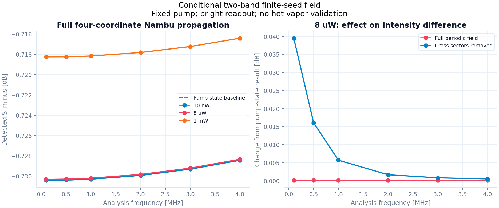

# S1 — Finite-seed microscopic field와 intensity-difference readout

2026-09-10. [청사진](blueprint.md)의 reduced-model 단계. [최종 보고서](s1_periodic_field_report_v2.json), [그림](s1_periodic_field_v2.png), [연구 기록](research_log.md).

**주기적 atomic noise를 두 optical carrier band의 full Nambu 광장에 연결하고, 비선형 probe/conjugate 평균 전파와 같은 상태에서 gain과 bright S₋를 계산했다.** Photon-flux 정규화, microscopic reservoir별 D, sector 간 상관을 유지했다. Local/global canonical commutator, four-sideband quantum channel의 complete positivity(CP), 검출 covariance uncertainty를 검사한다.

모델은 단일 velocity, uniform area, uniform-Zeeman-RMS 4준위, zero phase mismatch, 고정된 classical pump를 사용한다. 두 carrier band 밖의 optical modes, pump depletion/quantum fluctuations와 실제 hot-vapor 입력은 아직 포함하지 않는다. Atomic harmonic cutoff를 늘린 것이 physical optical-mode closure의 검증은 아니다.

## 1. Physical port와 atomic harmonic의 대응

기존 static-pump frame에서 ν=−ω_hf+δ, Fourier convention은 e^{iωt}이다. Physical carrier frequency는 pump+ν인 probe와 pump−ν인 conjugate다. Positive RF Ω에서

\[
b(\Omega)=\left(a_p(+\Omega),\ a_c(+\Omega),\
a_p^\dagger(-\Omega),\ a_c^\dagger(-\Omega)\right)^T,
\quad J=\operatorname{diag}(1,1,-1,-1).
\]

| Nambu 성분 | Atomic readout Oᵢ | Atomic harmonic hᵢ | Jᵢᵢ |
|---|---|---:|---:|
| probe annihilator | O_p, g₂로의 lowering | +1 | +1 |
| conjugate annihilator | O_c, g₁로의 lowering | −1 | +1 |
| probe creator | O_p† | −1 | −1 |
| conjugate creator | O_c† | +1 | −1 |

Atomic response frequency는 Ω+hᵢν이다. `PeriodicFieldPorts`는 각 annihilator의 unique physical label, integer h, readout operator와 positive g를 받고 conjugate 좌표를 한 번만 만든다. 둘 이상의 독립 spatial/polarization ports가 같은 carrier frequency를 가질 수 있지만, labels와 operators를 제공하는 쪽에서 그 물리적 구분을 명시해야 한다. 이 입력만으로 spatial orthogonality를 증명하지 않는다.

내부 atomic response ladder에는 −N,…,N의 모든 atomic harmonics가 있다. 이번 Rb propagation에는 위의 두 physical carrier bands만 있다. 추가 port를 별도로 선언한 generic test도 통과하지만, 그 test port를 Rb 실험의 실제 optical mode로 취급하지 않는다. Doppler/non-collinear geometry를 연결할 때 spatial phase와 grating/mode index를 추가해야 한다.

## 2. 독립 driving B와 Maxwell readout C₀

Fᵢ는 complete traceless Hermitian atomic basis다. `periodic_noise_derivation.md`의 ρ_q, A_q, D_q를 사용한다. Number density n, uniform mode area A와 photon-flux coupling은

\[
\lambda=nA,\qquad
g_j=\frac{dQ_j}{2\hbar},\qquad
Q_j=\sqrt{\frac{2\hbar\omega_j}{\epsilon_0 c A}}.
\]

b의 단위는 s⁻¹ᐟ², g는 s⁻¹ᐟ², λ는 m⁻¹이다. Classical carrier를 포함한 H(t)를 먼저 고정하고 quantum δb에 대한 density-operator source를 독립적으로 구한다:

\[
\mathbb B_{(h,a),j}
=-ig_j\operatorname{Tr}\!\left[F_a[O_j^\dagger,\rho_{h-h_j}]\right].
\]

Maxwell propagation readout은

\[
(\mathbb C_0)_{j,(h,a)}
=-iJ_{jj}g_j\operatorname{Tr}(O_jF_a)\delta_{h,h_j}.
\]

B는 K나 noise covariance에서 역산하지 않는다. D는 기존 jump Gram products에서 유도된 harmonic-correlated ordered diffusion이다. Atomic resolvent R=(−iΩI−A_lift)⁻¹로

\[
\boxed{M=\lambda\mathbb C_0\mathbb R\mathbb B},\qquad
\boxed{D^{\gtrless,r}_{\rm field}
=\lambda\mathbb C_0\mathbb R\mathbb D^{\gtrless,r}
\mathbb R^\dagger\mathbb C_0^\dagger}.
\]

둘 다 m⁻¹이고, reservoir별 greater/lesser D를 보존한다. Slice-averaged atomic noise가 D_atom/(λdz)이므로 최종 field diffusion에는 λ가 한 번 들어간다. Noise amplitude를 원자수로 먼저 더한 뒤 제곱하지 않는다.

Macroscopic phase-conjugate Langevin 모델에서 commutator 보존을 다룬 배경은 [Jiang, Mei, Du, PRA 107, 053703 (2023)](https://arxiv.org/abs/2301.11993)를 참고했다. 여기서는 microscopic D를 먼저 계산하고 commutator를 검사한다. M의 defect를 이용해 noise를 정하거나 squeezing에 맞춰 coefficient를 선택하지 않는다.

## 3. Canonical field commutator의 유도와 검증

Atomic K_q는 Trρ_q[F_a,F_b]이고 lifted K_(h,k)=K_(h−k)다. 무한 harmonic ladder에서 dynamic atomic commutator relation은

\[
\mathbb A\mathbb K+\mathbb K\mathbb A^\dagger
+\mathbb D^>-\mathbb D^<=0
\]

가 된다. 시간 미분항이 A_lift의 ihν에 포함된다. 독립적으로 유도한 B,C₀는

\[
\mathbb B J=-\mathbb K\mathbb C_0^\dagger
\]

를 만족하므로 resolvent identity를 적용하면

\[
\boxed{MJ+JM^\dagger+D^>_{\rm field}-D^<_{\rm field}=0}.
\]

이 식은 atomic K를 canonical J와 동일시해서 얻는 것이 아니다. Finite atomic ladder에서는 외부 harmonic을 자른 경계 오차가 남을 수 있다. 그래서 field generator가 직접 이 식과 per-reservoir PSD를 검사하고 실패하면 반환하지 않는다.

현재 8 μW midpoint의 response order N=1은 commutator 상대 잔차 약 6.94×10⁻⁷로 허용오차 10⁻⁸을 실패한다. D의 PSD 자체는 통과한다. 이 반례는 positivity만으로 올바른 field model을 보장할 수 없음을 보여준다. N=2,3,4는 통과하며 마지막 M/D 상대 변화는 각각 1.07×10⁻¹⁴, 5.40×10⁻¹⁴다. 기준을 바꾸거나 D를 수선하지 않았다.

## 4. 평균장 gain과 quantum tangent는 다르다

Classical probe/conjugate mean β(z)를 바꾸면 periodic mean ρ_q(β)가 바뀐다. 같은 physical coupling에서

\[
\frac{d\beta_j}{dz}=-i\lambda g_j\operatorname{Tr}
\left[O_j\rho_{h_j}(\beta(z))\right]
\]

를 적분한다. Pump는 별도의 고정 classical drive다. Seed/conjugate back-action은 이 비선형 식에 포함된다. No-atom/zero-length에서는 입력 carrier를 그대로 유지한다.

Finite-seed M(Ω=0)의 transfer는 이 **비선형 mean map의 미분**이다. 따라서 output mean을 T(0)β_in으로 계산하면 안 된다. 두 complex input의 네 real directions에 대해 중앙차분한 mean output과 DC Nambu transfer를 비교한 최대 상대 차이는 5.69×10⁻¹⁰이다. 반면 T(0)β_in을 mean output으로 잘못 쓰면 현재 8 μW에서 상대 차이 5.54×10⁻⁵가 생긴다.

각 z에서 같은 ρ_q(β(z))를 사용해 M,D를 만들고

\[
T'=MT,\quad T(0)=I,\qquad
N^{\gtrless\prime}=MN^\gtrless+N^\gtrless M^\dagger+D^\gtrless,
\quad N^\gtrless(0)=0
\]

를 적분한다. 최종 global relation \(TJT^\dagger+N^>-N^<=J\)와 N의 positivity를 검사한다. Numerical integrator의 출력에 covariance repair를 하지 않는다.

처음에는 midpoint를 고정한 exact constant-segment channel을 4/8/16개 합성했다. 8→16에서 최대 S₋ 변화가 5.19234×10⁻⁶ dB로 선언한 10⁻⁷ dB 기준을 실패했다. [초기 보고서](s1_periodic_field_report.json)와 그림을 보존했다.

최종 구현은 dense nonlinear mean trajectory에서 M(z),D(z)를 직접 계산하는 DOP853 적응형 적분이다. rtol=2×10⁻⁹→2×10⁻¹¹, atol=rtol/100 비교에서 최대 S₋ 변화가 8 μW의 4.00×10⁻¹⁵ dB, 1 mW의 2.42×10⁻¹² dB로 통과했다. Final 8 μW에 대한 midpoint 4/8/16의 오차는 2.76934×10⁻⁵ / 6.92310×10⁻⁶ / 1.73076×10⁻⁶ dB로 약 4배씩 감소한다. 두 수치 방법의 일치 방향도 확인했다. 같은 constant generator에 대한 adaptive covariance와 exact augmented-exponential reference도 검사한다.

`reduced_periodic_cell`에서 `propagation_rtol`을 주면 adaptive 경로를 사용한다. 이 경우 `segments`는 local diagnostic midpoint의 수이며 quantum propagation 정확도를 설정하지 않는다. `propagation_rtol=None`은 비교용 constant-midpoint 경로다. 최종 보고서에 두 설정을 구분해 기록했다.

## 5. Full Nambu에서 physical sidebands와 검출 spectrum으로

Positive Ω와 negative −Ω의 full transfer가 conjugation/reflection 관계를 만족하는지 먼저 검사한다. b(Ω)의 annihilator block은 p+,c+, creator block은 p−†,c−†다. 네 physical modes (p+,c+,p−,c−)의 Bogoliubov U,V를 만든 뒤 interleaved (x,p), [x,p]=i, V_vac=I/2로 변환한다. Added symmetrized noise의 normal/anomalous blocks를 모두 유지한다.

이전 main/companion을 독립 channel로 조립하는 방식은 finite seed에서 생기는 두 sector 사이의 correlation을 버린다. 새 converter는 이 항을 포함하고 X,Y의 CP 조건과 output uncertainty를 확인한다. Final detector adapter에만 기존 순서 (p+,c−,p−,c+)로 permutation한다. DC를 네 독립 sidebands로 취급하지 않는다.

Physical normalized narrowband mode의 second-moment channel을 해석하며, Gaussian 상태를 임의의 higher-order atomic noise에 대해 증명한 것은 아니다. 검출량은 bright linear photocurrent다. Carrier shot-noise level, η=0.85 losses와 detector response를 동일하게 적용하고 positive one-sided A²/Hz로 계산한다. Quadrature converter와 별도로 direct ordered Nambu current를 계산한 상대 차이는 모든 사례에서 3.87×10⁻¹⁴ 이하이다. Unequal loss, complex detector response와 balance도 별도 테스트했다.

## 6. Conditional 결과와 correlation ablation

이전과 같은 600 mW pump, 530 μm waist, n=10¹⁸ m⁻³, A=1.2×10⁻⁷ m², L=12.5 mm, Δ/2π=0.9 GHz, δ/2π=−8 MHz, reset=2π×100 kHz를 사용한다. Pump/weak coupling은 같은 uniform-Zeeman-RMS dipole이다. Detector η는 두 arm 모두 0.85, balance=1, flat response, electronics=0으로 선언했다. Fixture 값은 독립 실측 ledger로 검증된 입력이 아니다.

| Seed | Probe power gain | Conjugate power gain | S₋(1 MHz) [dB] | Pump-state 대비 0.1–4 MHz 최대 변화 [dB] |
|---|---:|---:|---:|---:|
| 10 nW | 1.1106558457 | 0.1135621916 | −0.7302942150 | 1.23715×10⁻⁷ |
| 8 μW | 1.1106391761 | 0.1135452814 | −0.7301956922 | 9.89590×10⁻⁵ |
| 1 mW | 1.1086057895 | 0.1114824450 | −0.7181562313 | 0.0121771 |

Pump-state baseline의 gain은 1.1106558666, S₋(1 MHz)는 −0.7302943383 dB다. 이는 이전 Gaussian quadratic correction을 더하기 전 bright readout과의 비교다. 주기 모델로 바뀐 현재 상태에 이전 stationary/Gaussian quadratic correction을 재사용하지 않는다. 특히 10 nW를 포함한 전체 광대역 광자 flux 대비 bright approximation은 별도로 평가해야 한다.

이전 원자층에서 특정 probe noise 성분이 약 40% 증가한 결과가 검출 S₋의 같은 변화율을 뜻하지 않았다. 8 μW에서 main/companion sector 사이의 M 및 D blocks를 동시에 제거한 진단은 0.1 MHz S₋를 **−0.73031724→−0.69092746 dB**, 약 0.03939 dB 바꾼다. 1 mW에서는 같은 진단이 0.1 MHz에서 +2.56099 dB를 준다. Full calculation은 −0.71823912 dB다.

이 ablation은 block 안의 commutator와 CP를 유지하도록 전체 cross-sector coupling/noise를 함께 제거한 별도 계산이다. 개별 atomic-noise component만 해석하거나 sector를 독립으로 조립하면 correlation의 효과를 잃을 수 있다. Ablation은 채택한 microscopic 예측이나 fitted correction이 아니다.



## 7. 독립 검산과 남은 범위

- **M:** complete atomic drift를 사용하지 않는 full-Liouville forced harmonic solve와 상대 차이 5.52×10⁻¹⁴. Harmonic별 trace-zero border를 명시했다.
- **D:** production D를 사용하지 않는 시간영역 QRT를 optical readout에 투영한 field noise와 상대 차이 4.63×10⁻¹². RF=0과 1 MHz의 4×4 전체 행렬을 비교했다.
- **Canonical commutator:** 실제 adaptive evaluation points의 최대 local 상대 잔차는 1.30×10⁻¹³, final global은 5.96×10⁻¹⁴ 이하다.
- **Positivity:** 모든 테스트 seed/RF의 최소 channel CP 고유값은 9.79×10⁻⁵ 이상, detected covariance uncertainty minimum은 0.01223 이상이다.
- **Limits:** zero-seed에서 기존 main/companion M,D와 four-sideband X,Y를 재현한다. Zero density/length, input phase, harmonic phase origin, 추가 explicit test port, 부족한 cutoff와 잘못된 port 정의의 거부를 검사한다.

구현: `gabes/quantum/periodic_field.py`, `gabes/fwm_quantum/periodic_cell.py`. 독립 reference: `analysis/grand_challenge/reference/periodic_field.py`. 재현 실행: `analysis/grand_challenge/periodic_field_audit.py`. 기존 pump-state APIs의 계산식은 유지한다. Final report의 source hashes 33개를 확인했다.

검증 결과: quantum suite **103 passed (72.34 s)**. 필수 전체 suite **754 passed, 1 failed (215.64 s)**. 실패는 이전부터 누락된 `docs/FWM physics and analytic reconstruction/FWM_physics.tex`를 읽는 `test_repository_visibility_wording_is_consistently_public`이다. 해당 삭제나 테스트는 변경하지 않았다.

```powershell
python -m analysis.grand_challenge.periodic_field_audit --output NEW.json --plot NEW.png
python -m pytest -q tests/quantum
python -m pytest -q
```

후속 [kinetic_derivation.md](kinetic_derivation.md)에서 carrier-loop closure, velocity별 finite-seed 국소 mean/M/D와 독립 noise covariance 합산을 구현했다. Thermal 전파는 현재 pump-state weak-field 한계다. 일반 비공선 geometry의 spatial/convective phases와 finite-seed thermal trajectory는 남아 있다. 추가 optical ports를 버리는 근사, full Zeeman signed CG·실제 편광, pump depletion, 실제 collection과 non-Gaussian fourth cumulants, 실측 입력 불확도 및 held-out gain/S₋ 비교도 남아 있다. 두-band finite-seed 전파 구현은 완료했지만 Grand Challenge와 milestone 1은 진행 중이며 실험 −7.8 dB 검증은 false다.
