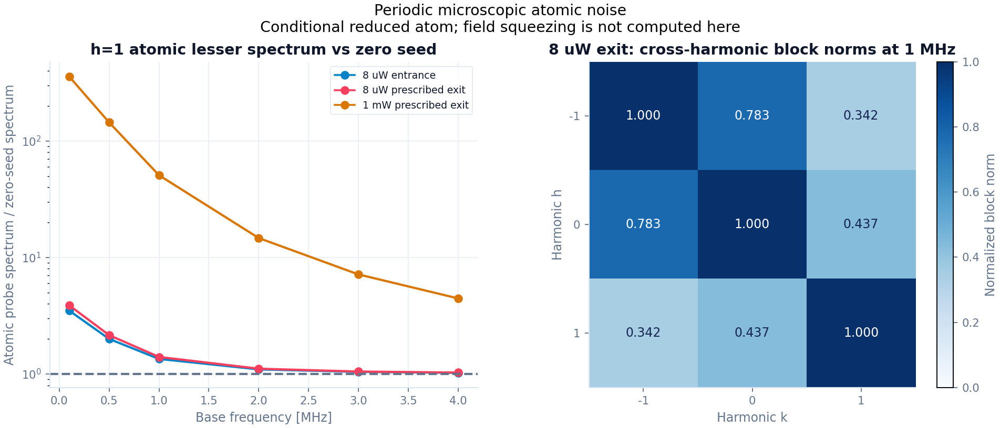

# S1 — Finite-seed periodic microscopic atomic noise

2026-09-09. [청사진](blueprint.md)의 reduced-model 단계. [재현 보고서](s1_periodic_noise_report_v2.json), [그림](s1_periodic_noise_v2.png), [검증 기록](research_log.md).

**명시한 주기 Hamiltonian과 collapse operators에서 atomic drift와 ordered diffusion을 독립적으로 유도하고, 서로 다른 Floquet harmonic 사이의 noise correlation을 유지했다.** Complete atomic basis의 connected two-time spectrum을 별도의 시간영역 quantum regression(QRT)과 비교한다. 현재 계산은 prescribed local carrier를 받는 원자층이다. Finite-seed field propagation과 검출 S₋는 아직 계산하지 않는다.

## 1. 모델과 적용 범위

\[
\dot\rho=\mathcal L(t)\rho,
\qquad H(t)/\hbar=H_0+V e^{-i\nu t}+V^\dagger e^{i\nu t},
\]
\[
\mathcal L(t)\rho=-i[H(t)/\hbar,\rho]
+\sum_r\left(L_r\rho L_r^\dagger-\tfrac12\{L_r^\dagger L_r,\rho\}\right).
\]

H₀와 V의 단위는 rad/s, Lᵣ는 √rate를 포함한다. 이번 API는 시간에 무관한 명시적 Lᵣ와 단일 sinusoidal Hamiltonian modulation을 받는다. ν의 부호를 유지하며 물리 주기는 T=2π/|ν|이다. Rb adapter에서는 ν=−ω_hf+δ이고, 기존 `seed_harmonic_hamiltonian`으로 probe/conjugate의 reciprocal coupling을 만든다.

Tr(FᵢFⱼ)=δᵢⱼ인 n²−1개 traceless Hermitian operator를 모두 유지한다. 이 완전한 원자 기저에서는 adjoint evolution이 affine-linear이므로, 아래 second-moment/QRT 식에는 atomic operator subset을 닫는 근사나 Gaussian fourth-moment 가정이 필요하지 않다. Markov Lindblad 및 QRT의 reservoir 가정은 유지한다. 광장과의 결합을 선형화하거나 fourth moments를 계산하는 것은 별도의 단계다.

Continuous connected spectrum을 계산하기 전, traceless dynamics를 한 주기 적분해 period-map spectral radius가 1보다 작은지 검사한다. 현재 수치 구현은 radius≥1−2×10⁻⁸인 비감쇠 또는 분해하지 못한 느린 모드를 거부한다. Coherent periodic mean은 빼며 elastic delta peaks를 유한 PSD로 대체하지 않는다.

Periodic open-system spectrum에 Floquet 방법을 적용하는 일반 배경은 [Navarrete-Benlloch 등, PRA 103, 023713 (2021)](https://arxiv.org/abs/2005.08249), 시간 주기 Lindblad propagator의 구조는 [Dai 등 (2015)](https://arxiv.org/abs/1512.05562)를 참고했다. 아래 jump-product derivation과 독립 reference는 이 저장소의 convention에 맞춰 구현했다.

## 2. 서로 독립적인 A와 D

\[
\rho(t)=\sum_q\rho_q e^{-iq\nu t},\quad
f_i(t)=\operatorname{Tr}(F_i\rho(t)),\quad
\delta F_i=F_i-f_i(t).
\]

Affine drift의 상수항은 centered equation에서 소거된다. Generator로부터

\[
A_{ij}(t)=\operatorname{Tr}\!\left[F_i\mathcal L(t)(F_j)\right]
=\sum_{q=-1}^{1}(A_q)_{ij}e^{-iq\nu t}
\]

를 구한다. Independently, reservoir별 jump products에서

\[
D^{>,r}_{ij}(t)
=\operatorname{Tr}\!\left[\rho(t)[L_r^\dagger,F_i][F_j,L_r]\right],
\qquad
(D^{>,r}_q)_{ij}
=\operatorname{Tr}\!\left[\rho_q[L_r^\dagger,F_i][F_j,L_r]\right]
\]

를 구한다. 이는 Gram matrix이므로 물리적인 ρ(t)에서 D^{>,r}(t)≥0이다. D를 A 또는 covariance balance의 잔차로 정의하지 않는다. q≠0인 ρ_q는 density matrix가 아니며 D_q 하나가 Hermitian/PSD일 필요도 없다. 위상별 D(t)와 전체 harmonic covariance를 검사해야 한다.

독립 reference는 jump products를 사용하지 않고 adjoint generator의 product rule

\[
D_{ij}=\left\langle\mathcal L^\dagger(F_iF_j)
-(\mathcal L^\dagger F_i)F_j-F_i(\mathcal L^\dagger F_j)\right\rangle
\]

을 계산한다. 두 표현의 차이를 보고서에 저장한다.

## 3. Dynamic Einstein relation과 atomic commutator

Ordered covariance 및 state-dependent atomic commutator는

\[
C_{ij}(t)=\langle\delta F_i\delta F_j\rangle,
\qquad K(t)=C(t)-C(t)^T
\]

이다. Time-dependent mean을 포함하면

\[
\boxed{\dot C=AC+CA^T+D^>},
\qquad
\boxed{\dot K=AK+KA^T+D^>-(D^>)^T}.
\]

Stationary identity와 달리 왼쪽 미분항을 유지해야 한다. Fourier state에서 ρ̇, ḟ, Ċ를 직접 구하고 위 식을 검사한다. Rb fixture에서는 96 phases의 trace/Hermiticity, state/C/D positivity와 두 balance residual을 저장했다. Off-grid phase에서도 독립 product rule을 확인했다.

원자 K(t)는 canonical traveling-field metric J가 아니다. Atomic commutator balance의 통과가 이후 field commutator preservation을 대신하지 않는다. PSD 검사는 roundoff에 대한 상대 허용오차를 사용하고 원래 최소 고유값과 norm 대비 최소값을 모두 남긴다. 실패한 covariance의 고유값을 잘라내지 않는다. 위상 샘플 검사는 전체 연속 시간에 대한 엄밀한 오차 상한이 아니다.

## 4. Harmonic-correlated quantum spectrum

Fourier convention은 F(ω)=∫dt e^{iωt}F(t)이다. 하나의 반열린 Floquet zone −|ν|/2≤ω<|ν|/2에서 x_h(ω)=δF(ω+hν)를 정의한다. Greater spectrum은

\[
\langle x_{h,i}(\omega)x_{k,j}^\dagger(\omega')\rangle
=2\pi\delta(\omega-\omega')S^>_{hi,kj}(\omega)
\]

의 coefficient이다. Lesser는 같은 주파수 좌표에서 두 연산자의 순서를 뒤집은 expectation이다.

\[
\mathbb A_{hk}=A_{h-k}+ih\nu I\delta_{hk},\qquad
\mathbb D^{>,r}_{hk}=D^{>,r}_{h-k},
\]
\[
\mathbb D^{<,r}_{hk}=(D^{>,r}_{h-k})^T,\qquad
\mathbb R(\omega)=(-i\omega I-\mathbb A)^{-1},
\]
\[
\boxed{\mathbb S^{\gtrless}(\omega)=\mathbb R
\left(\sum_r\mathbb D^{\gtrless,r}\right)\mathbb R^\dagger}.
\]

D의 transpose는 **atomic operator indices에만** 적용한다. 전체 lifted matrix를 그대로 transpose하면 harmonic 차이의 부호까지 바뀐다. Hermitian atomic coordinates에서는 harmonic reflection matrix P를 사용해 \(\mathbb S^<(\omega)=P\mathbb S^>(-\omega)^T P\)라는 별도 reflection test가 성립한다. 구현은 이를 직접 검사한다.

Atomic F는 무차원, A와 D는 s⁻¹, R와 S의 단위는 각각 s와 s이다. S는 atomic continuous two-sided spectrum이며 A²/Hz나 검출 SQL ratio가 아니다. RF Ω와 큰 carrier beat ν를 구분하며 lab-frequency 객체를 Floquet quasifrequency 인자로 받지 않는다.

Mean order와 response order는 서로 다른 cutoff다. 유한 response ladder h=−N,…,N에서는 retained D의 block-Toeplitz positivity와 drift stability를 검사한다. 경계에서 바깥 harmonic coupling을 자르므로 전체 유한 행렬이 무한 ladder의 covariance identity를 정확히 만족한다고 주장하지 않는다. N을 늘리면서 **같은 내부 h=−1,0,1 blocks**가 수렴하는지 검사한다. Moving outer boundary끼리 비교하지 않는다.

## 5. 독립 시간영역 QRT

`analysis/grand_challenge/reference/periodic_qrt.py`는 production의 A, D, ρ_q, Floquet solver를 가져오지 않는다. Full n²-dimensional Liouvillian을 적분해 propagator U와 periodic fixed point를 구한다.

각 시작 위상 t₀에서

\[
P_{t_0}=U(t_0+T,t_0),\qquad
Q_{t_0}(w)=\int_0^T ds\,e^{iws}U(t_0+s,t_0)
\]

를 독립적으로 계산한다. Source columns는 (Fⱼ−fⱼ(t₀))ρ(t₀)이고 trace가 0이다. 모든 양의 delay를 적분한 resolvent는 이 trace-zero 공간에서

\[
Q_{t_0}(w)\left[I-e^{iwT}P_{t_0}\right]^{-1}
\]

로 얻는다. 이는 한 주기 이후의 tail을 geometric series로 합한 것이다. RF=0과 integer-harmonic frequency에서도 trace mode가 singularity를 만들지 않도록 trace-bordered solve를 사용한다. 긴 decay tail을 임의 시간에서 잘라내지 않는다.

Positive-delay block의 시작 위상에 exp[i(h−k)νt₀]를 곱하고 w=ω+hν에서 적분한다. Negative-delay contribution은 full block adjoint로 더한다. Production과 reference는 microscopic Hamiltonian/collapse라는 물리 입력만 공유하며, reference는 D 없이 두 시간 correlation을 계산한다.

Mean order, response order, reference phase grid와 ODE tolerance를 각각 변화시킨다. Toy two-level에서는 response order 1의 오차가 실제로 존재하고 order 4에서 시간영역 QRT와 2×10⁻⁹보다 작은 상대 오차로 일치하는 test를 포함했다. Rb에서도 모든 15 atomic operators의 내부 3×3 harmonic blocks를 대조한다.

## 6. Conditional Rb 수치 결과

기존 fixture의 600 mW pump, 530 μm waist, A=1.2×10⁻⁷ m², Δ/2π=0.9 GHz, δ/2π=−8 MHz, reset rate=2π×100 kHz와 uniform-Zeeman-RMS dipoles를 사용한다. ν/2π=−3.043732439 GHz이다. Density=10¹⁸ m⁻³, L=12.5 mm는 prescribed exit carrier를 만드는 기존 weak-field mean에만 사용한다. 독립 실측 입력을 확보한 상태가 아니다.

Entrance는 8 μW probe와 zero conjugate, exit는 기존 weak-field propagation의 두 carrier를 고정한다. 1 mW case는 그 exit amplitudes를 √125배한 stress test이며 self-consistent 1 mW output이 아니다.

| 국소 조건 | 시간영역 QRT 상대 차이 | q≠0 diffusion norm / 전체 norm | D₀만 남겼을 때 내부 spectrum 상대 변화 |
|---|---:|---:|---:|
| Zero seed | 2.86×10⁻¹² | 0 | 0 |
| 8 μW entrance | 1.30×10⁻¹² | 0.008826 | 0.0002030 |
| 8 μW prescribed exit | 1.01×10⁻¹² | 0.009360 | 0.0002259 |
| 1 mW prescribed exit | 5.83×10⁻¹³ | 0.103647 | 0.024113 |

QRT 비교는 base frequency 0, 1 MHz에서 전체 내부 행렬의 Frobenius norm을 사용한다. D₀ ablation은 같은 periodic A를 유지하고 D_{q≠0}만 버린 결과를 base frequency −4,−1,0,0.1,0.5,1,2,3,4 MHz에 걸쳐 비교한다. 개별 작은 원소의 상대 오차 상한과는 다르다.

Mean order 4→5의 최대 원소 변화는 4.00×10⁻¹⁸, response order 4→5의 내부 spectrum 상대 변화는 8.16×10⁻¹⁵ 이하이다. 1 mW의 response order 1→2 변화는 3.37×10⁻⁵로, 낮은 cutoff의 실제 오차가 보인다. Zero seed에서 stationary shifted blocks와 최대 상대 차이는 3.90×10⁻¹⁵ 이하이다.

Reference phase grid 16→32 변화는 5.63×10⁻¹⁴, rtol 2×10⁻¹⁰→2×10⁻¹² 변화는 1.01×10⁻¹²이다. 독립 periodic state의 최대 원소 차이는 3.88×10⁻¹³ 이하, jump D와 adjoint product-rule 차이는 1.90×10⁻¹⁴ 이하이다. Dynamic Einstein/commutator 잔차는 각각 1.50×10⁻¹⁶, 6.34×10⁻¹⁷ 이하이며 phase-sampled state/C의 최소 고유값은 5.60×10⁻⁴보다 크다. Stability와 greater/lesser PSD 검사가 모두 통과한다.

**작은 평균 polarization 오차가 작은 noise 오차를 보장하지 않는다.** 이전 8 μW back-action 진단의 polarization 변화는 약 0.00974%였다. 이번에는 probe lowering operator를 h=1 lesser block에 투영한 connected atomic spectrum이, prescribed exit/base 1 MHz에서 6.002636×10⁻¹⁴→8.404905×10⁻¹⁴ s, 약 40.02% 증가한다. Base 0.1 MHz에서는 zero-seed 값의 약 3.88배다. Coherent periodic mean을 뺀 결과다. 이 component의 증가를 전체 광장 noise 또는 검출 S₋의 같은 비율 증가로 옮길 수는 없다.



오른쪽 heatmap은 ||S_hk||_F/√(||S_hh||_F||S_kk||_F)다. 모든 15 atomic coordinates를 포함하는 **block norm**이므로 두 optical modes의 scalar correlation coefficient가 아니다. 초기 [보고서](s1_periodic_noise_report.json)와 그림은 보존했다. v2는 입력값·상대 PSD 최소값을 보강하고 그림의 동적 범위와 annotation 대비를 개선한 실행이다.

## 7. 코드와 다음 연결점

- `gabes/quantum/periodic.py`: complete-basis A_q, reservoir별 D_q, dynamic balances, lifted ordered spectra.
- `gabes/fwm_quantum/periodic.py`: 동일한 pump/dipole/reservoir를 사용하는 reduced Rb adapter.
- `gabes/fwm_quantum/model.py`: stationary/periodic 모델의 공통 pump-system assembly. 기존 stationary 호출 결과 유지.
- `analysis/grand_challenge/reference/periodic_qrt.py`: 독립 시간영역 reference.
- `analysis/grand_challenge/periodic_noise_audit.py`: convergence, zero-seed limit, D-average ablation, immutable report와 source hashes.
- `tests/quantum/test_periodic_noise.py`: dynamic Einstein, signed beat, time-origin phase, ordering reflection, QRT/convergence, 실패 조건과 Rb artifact 보존의 10개 검사.

```powershell
python -m analysis.grand_challenge.periodic_noise_audit --output NEW.json --plot NEW.png
python -m pytest -q tests/quantum
python -m pytest -q
```

Quantum suite **93 passed**. 필수 전체 suite는 **744 passed, 1 failed (164.48 s)**이며, 실패는 이전부터 삭제되어 있는 `docs/FWM physics and analytic reconstruction/FWM_physics.tex`를 읽는 문서 일관성 테스트다. 해당 삭제나 테스트는 변경하지 않았다. 최종 보고서의 source hashes 31개가 실행 코드와 일치함을 확인했다.

다음 단계는 **periodic atom의 독립 field-drive/readout couplings를 유도해 full Nambu·harmonic 광장으로 제거하는 것**이다. Finite seed에서는 기존 main/companion 두 sector 사이와 추가 harmonics의 coupling이 생길 수 있다. 각 physical optical frequency·conjugation·spatial mode를 먼저 식별해 중복 계산을 막고, local/global canonical field commutator와 physical-mode uncertainty를 다시 검증해야 한다. 그 후 propagation과 readout을 붙여 위 atomic-noise 변화가 S₋에 미치는 영향을 계산한다.

Full Zeeman signed CG·편광, angular-Doppler와 transverse modes, 실측 input uncertainties, self-consistent pump/seed depletion, non-Gaussian fourth cumulants 및 실제 collection band는 여전히 별도 미해결이다. Milestone 1과 Grand Challenge는 진행 중이며 absolute hot-vapor prediction과 experimental validation은 false다.

**2026-09-10 후속 구현:** [두-band periodic field 단계](periodic_field_derivation.md)에서 full Nambu elimination, nonlinear seed/conjugate mean, fixed-pump adaptive quantum propagation과 bright readout을 연결했다. 8 μW의 1 MHz S₋ 변화는 약 10⁻⁴ dB이며, sector 사이 correlation을 제거하면 결과가 달라진다. 추가 physical optical bands와 pump depletion은 아직 포함하지 않는다. 본 문서의 atomic-only report와 그 당시 상태는 보존한다.
