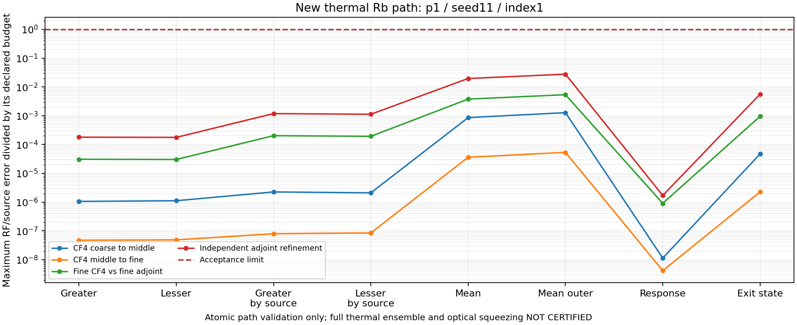

# 고정 소스 열적 캠페인

최신: [p2 세 독립 seed 검증](thermal_campaign_p2_seed811_v2.md).
P2/seed811의24/24경로 통과, 새120계산. Seed11·211·811의72고유 경로·360계산 확보.
독립 seed 여섯 방향 최대값 범위5.70–43.61%, 5% 기준 0/6방향 통과. 선언9격자 중3감사·6누락.
전체 thermal·절대 squeezing 미인증. [이전 seed211 결과](thermal_campaign_p2_seed211_v2.md)와 실패 기록 보존.
[배치·합산·중첩 비교 명령과 수학적 재사용 근거](thermal_grid_execution.md).

과거 보고서의 원시 소스 해시와 현재 checkout 불일치.
새 경로 계산까지 과거 선택 경로 보고서에 종속되던 실행 구조 분리.
과거 보고서·해시·판정은 불변. 새 계산은 새 캠페인으로 기록.

## 실행 계약

- `source_provenance.py`: 저장 위치 독립인 상대 경로·Python 소스 manifest.
- 동일성 허용: Python universal newline의 CRLF/CR → LF 변환뿐.
- 문자열·주석·공백·계수·소스 목록 변경: 다른 identity. AST 동일성으로 생략하지 않음.
- 원시 SHA-256·크기·인코딩도 별도 보존. 내부 checksum은 진위 서명 아님.
- `thermal_campaign.py`: 소스 108개를 `sources.zip`에 고정. 별도 interpreter·worker에서 실행.
- 작업 중 다른 에이전트의 앱 수정과 분리. 실행 interpreter·소스 목록·해시·환경 재검사.
- 최초 v1: 과거 다른 소스 결과 재사용 없음. 후속 v2는 동일 소스·모델·경로·solver·환경의 v1 원본만 검증해 이전.

## 경로·수치 계약

기본 선언: Sobol powers 0·1·2 × seeds 11·211·811.
9격자, 126개 경로 항목, 72개 고유 물리 경로. 전체 완료 주장은 별도.
기존 정사각 열린 경계·373 K·pump-only reduced Rb 가정 유지.
전 체류시간·signed wavevector·입사 위상·각 reservoir 유지. 경계·온도·잡음 fitting 없음.

동일 위치·속도·체류시간·모델·소스·solver 요청만 계산 재사용.
Sobol 격자 번호와 도착률은 단일 원자의 운동방정식에 없음.
따라서 중첩 격자의 같은 물리 경로는 같은 미가중 해 사용 가능.
합산 시 현재 도착률·경로 source·packet digest·오차 증거 재구성 필수.

경로마다 CF4 3해상도 + 독립 backward-observable adjoint 2해상도.
계산 요청뿐 아니라 실제 segments·order·substeps·tolerance·solver work·BLAS thread 기록 대조.
Reference 값을 primary 키에 넣기, 미계산 경로 포함하기, 한 경로로 전체 인증하기 거부.

| 비교 | 기존 허용오차 |
| --- | ---: |
| 연속 primary refinement 각각 | $10^{-3}$ |
| Finest primary vs independent | $5\times10^{-6}$ |
| Independent refinement | $2\times10^{-6}$ |

모든 RF·named source의 greater/lesser, mean, mean outer, 복소 response, exit state 별도 비교.
기존 SI dark floor 유지. 스펙트럼 clipping·허용오차 완화 없음.

## 재현

```powershell
python -m analysis.grand_challenge.thermal_campaign --create NEW_CAMPAIGN
python -m analysis.grand_challenge.thermal_campaign --run NEW_CAMPAIGN --path 1 11 1 --workers 4
```

캠페인 생성·완료 보고서 덮어쓰기 금지. 중단된 계산의 유효 캐시만 검증 후 재사용.
`--run`은 현재 앱 소스 대신 캠페인의 고정 ZIP을 실행. 임의 외부 ZIP 실행 용도 아님.

## 회귀 검사

검증 논리의 단위 테스트: 명시적 synthetic packet·임시 의존 파일·임시 보고서 사용.
실제 source/hash/physical-identity 검증 함수를 계속 호출. 손상·누락·변경 거부도 검사.
과거 실험 실행 성공을 unit test 전제에서 제거했을 뿐, 생산 CLI 검증 조건은 그대로.
`tmp/`의 임시 checkout은 pytest 중복 수집에서 제외.

- `python -m pytest -q`: **1652 passed, 3 skipped, 1 failed**, 281.50초.
- 마지막 추가한 중첩 경로 매핑 검사까지 포함한 변경 부위: **225 passed, 3 skipped**, 32.01초.
- Skip 3건: Windows symlink 생성 권한 없음.
- 유일 전체 실패: 기존 삭제된 `FWM_physics.tex`를 참조하는 문서 검사. 삭제·검사 유지.
- 독립 검토에서 axis 직렬화 누락·직접 cache 호출의 실행 경계 누락 발견. 두 수정·회귀 검사 완료.

## 실제 중첩 경로 재사용

[재사용 보고서](thermal_campaign_nested_reuse_v1.json).
첫 CF4 해상도에서 p1/seed11/path1 → p2/seed11/path1 확인.
같은 face 내부 Sobol index 유지. Face 블록의 시작 위치만 격자 크기에 따라 변경.
일반 매핑은 `face * new_face_size + offset`; 전역 index를 무조건 두 배로 만들면 다른 경로.

8개 raw metric bitwise 일치. 도착률 정확히 절반. Cache hit 2회, 새 solve 0회.
현재 source·packet digest 재검사. 이 face0 사례에서는 source 이름도 같아 digest 불변.
잘못 연결한 p2/path2는 cache miss로 거부.
이 기록은 첫 해상도의 동일 계산 재사용 증거. 독립 수렴·전체 격자 인증과 구분.

## 첫 p1 경로 결과 — 2026-09-14

[원본 판정](thermal_campaign_v1/path-p1-s11-i1.json) **PASS**.
P1/seed11/path1 사전 지정. 체류시간 $1.6770730041835807\,\mu\mathrm{s}$ 전체 유지.
CF4 segments: 13,739 / 27,478 / 54,955.
독립 adjoint: `(rtol, atol) = (1e-9, 1e-12), (3e-10, 3e-13)`.

| 비교 | 8개 metric 중 최대 상대 오차 | 기준 |
| --- | ---: | ---: |
| Primary 첫 refinement | $1.2788961\times10^{-6}$ | $10^{-3}$ |
| Primary 둘째 refinement | $5.3467865\times10^{-8}$ | $10^{-3}$ |
| Finest primary vs finest independent | $2.6857186\times10^{-8}$ | $5\times10^{-6}$ |
| Independent refinement | $5.5499931\times10^{-8}$ | $2\times10^{-6}$ |

5개 모두 새 계산. CF4 228.788 / 448.517 / 812.572초;
adjoint 318.114 / 335.848초. Workers 4, 실제 BLAS 각 1 thread.
병렬 job별 소요시간이며 합을 벽시계 시간이나 속도 향상 배수로 해석하지 않음.



Figure는 raw report의 오류/기준 비율. 원본 스펙트럼 보정 없음.
재생성: `python -m docs.grand_challenge.plot_thermal_campaign REPORT.json NEW.png`.
보고서 SHA-256: `7c55d1852f7cd79fff6bd8c3827e961282efe23be697cf1ddb6f68425bdefee3`.
캠페인·ZIP·각 native cache record의 해시도 원본 JSON에 보존.

## 다음 단계

V2 p2/seed11·211·811 검증 완료. 72고유 경로·360계산 확보, 전체1440요청 중1080미수행.
다음 p3/seed11: 기존120계산 재검증·새120계산. P3 전체 추가360계산, p4 추가720계산.
세 seed의 필수 p2→p3·p3→p4 및 독립 seed gate 후속. 과거 실패 판정 보존; 통과 보장 없음.
전체 열적 앙상블·nonlocal Maxwell·finite seed·절대 실험 squeezing: 미인증.
