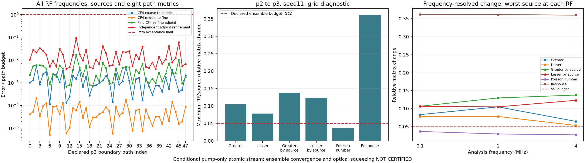
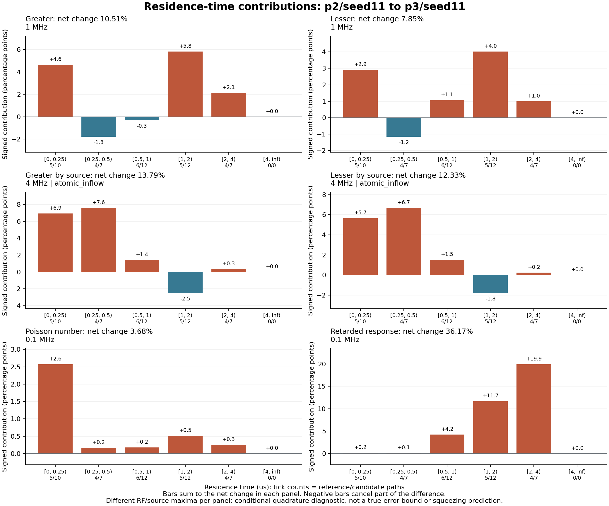
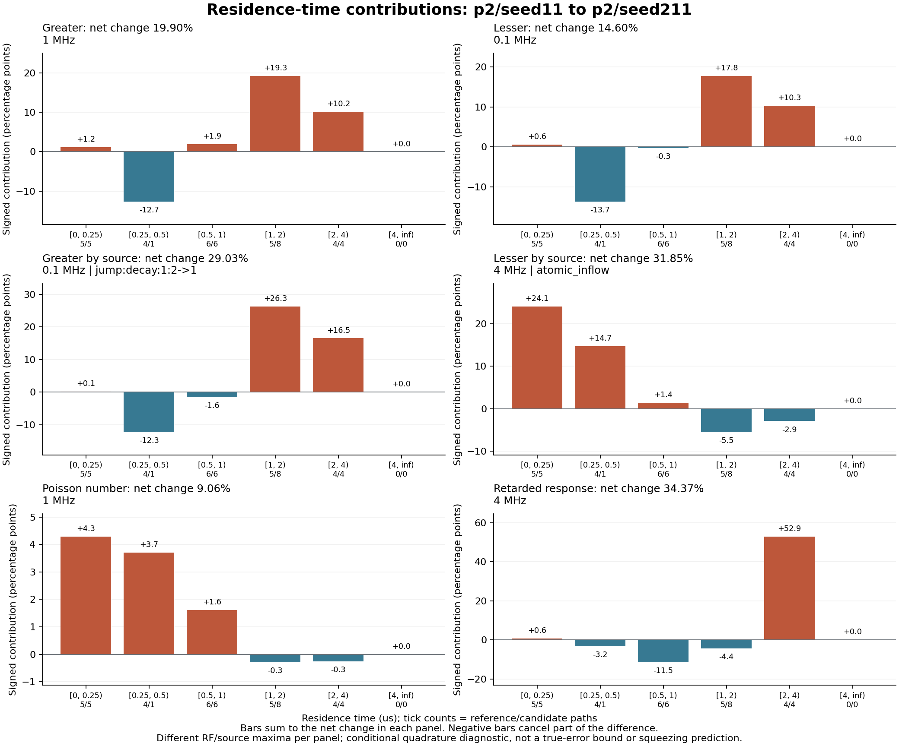

# Grand Challenge 진행 확인·후속 실행 — 2026-09-28

**P3/seed11 후속 실행 완료. 48/48경로 통과·새120계산, 누적96고유 경로·480계산. 4/9격자 원본 감사 통과.**
**P2→P3 수렴은 실패: 여섯 metric 중 다섯 개가5% 초과. 전체 thermal·optical 미인증, 공식 milestone0/4 유지.**

## 시작 시점 확인

- 공식 milestone **0/4 완료**. 09-18의 전체 20–30%는 검토자 추정; 물리 정확도·계산 수행률 아님.
- 고정 thermal v2: **72고유 경로·360원자 계산**, 선언 9격자 중 p2 세 seed의 **3격자** 검증.
- 개별 경로 수치 기준 전부 통과. 독립 seed의 여섯 방향 비교는 **0/6 통과**, 5% 기준 미달.
- Source별/RF별 metric 최대값 범위 **5.699655–43.610952%**. 참 적분 오차의 엄밀한 상계 아님.
- 전체 thermal·nonlocal Maxwell·독립 입력 절대 squeezing·실험 holdout 미완료.
- 최근 [완료 보고서](../thermal_campaign_p2_seed811_v2.md), [독립 점검](../checkpoint_2026_09_18.md), 체크리스트의 다음 작업 일치.

## 이번 실행 범위

기존 v2의 **p3/seed11**. 48경로 × 5해상도 = 240계산 요청. 기존 120계산 재검증·새 120계산.
고정 수치 소스 108개·모델·환경·오차 기준 유지. 현행 작업트리의 다른 변경은 수치 capsule에 혼입하지 않음.

```powershell
python tools/thermal_campaign_batch.py --run docs/grand_challenge/thermal_campaign_v2 --grid 3 11 --output docs/grand_challenge/thermal_campaign_v2/batch-p3-s11.json --workers 4
```

경로 통과 후 cache-only 합산, p2→p3 중첩 비교, 기존 p2 세 seed를 포함한 4격자 공동 감사 완료.
전체 9격자의 선언 유지. P3 한 격자 성공으로 thermal·optical 인증 승격 금지.
기존 674파일의 시작 hash는 [before.json](before.json), 실행 출력은 [batch 로그](batch-p3-s11.log).

[배치 원본](../thermal_campaign_v2/batch-p3-s11.json): 종료 코드0, 240계산 요청 전부 완료.
배치 내부 wall time **10,730.42초(2시간58분50초)**. 개별 경로 통과와 전체 ensemble 수렴은 별도 판정.

[봉인된 경로 기록의 별도 집계](batch-path-union-verification.json):
v2 누적 **96고유 경로·480계산**, 기존 대비24경로·120계산 증가. P3의 공통24경로는 기존 gate·5개 cache 참조와 일치.
선언의 나머지 고유 계산960개. 이 집계는 저장 기록 확인이며, 새 native 감사·ensemble 수렴 인증은 아님.

| 경로 수치 기준 | 96고유 경로·8metric의 최대 상대오차 | 허용 기준 |
|---|---:|---:|
| Primary 첫 세분화 | 5.46665188×10⁻⁶ | 10⁻³ |
| Primary 둘째 세분화 | 2.18536636×10⁻⁷ | 10⁻³ |
| Independent reference | 8.40851049×10⁻⁸ | 5×10⁻⁶ |
| Independent refinement | 1.87343815×10⁻⁷ | 2×10⁻⁶ |

최댓값 모두 `mean_outer`. 독립 비교·refinement 최악 경로는 새 p3/seed11/index14.

## P2→P3 변화 — 중첩 비교·층별 진단·공동 감사 완료

[P3 격자 원본](../thermal_campaign_v2/grid-p3-s11.json)의 48경로 native 재검증·직접 합산 감사 통과.
직접 합산 최대 상대 잔차 **3.69606571×10⁻¹⁶**. 새 원자 solve0회.
[별도 행렬 검산](independent-p2-p3-s11.json)의 p2·p3 합산 최대 잔차 **4.69037126×10⁻¹⁶**.

Reference p2/seed11 → candidate p3/seed11. RF/source별 행렬 norm의 상대 변화; 참 적분 오차 상계 아님.

| Metric | 최대 상대 변화 | 최악 RF | 최악 source | 5% 기준 |
|---|---:|---:|---|---|
| Greater | 10.514126% | 1MHz | 합계 | 초과 |
| Lesser | 7.847664% | 1MHz | 합계 | 초과 |
| Greater by source | 13.788644% | 4MHz | `atomic_inflow` | 초과 |
| Lesser by source | 12.330948% | 4MHz | `atomic_inflow` | 초과 |
| Poisson number | 3.677599% | 0.1MHz | 합계 | 통과 |
| Retarded response | 36.169445% | 0.1MHz | 합계 | 초과 |



그림·독립 행렬 검산 일치. Response는 0.1·1·4MHz 모두 약36% 변화.
[고정 source의 최종 개선판 진단](diagnostic-p2-p3-s11.json)도 동일한 여섯 값을 재현.
`audit_passed=true`, `directed_diagnostic.passed=false`, 새 solve0회.
소비한 고유 cache240개의 native 검증과 원시 byte 결합·최종 대조 통과.
[별도 재현 검산](diagnostic-p2-p3-validation.json) 통과. 모든 분할의 합산·차이 복원 최대 잔차 **9.00974961×10⁻¹⁶**.
여섯 metric·최악 RF/source·입사면 signed 기여가 독립 probe와 일치.
[정식 중첩 비교](../thermal_campaign_v2/comparison-p2-p3-s11.json)도 통과.
공통24경로·120원시 계산의 동일성, 격자별 도착률 재결합 확인.
`S_p3 = 0.5*S_p2 + 새 경로의 p3 도착률 가중합` 최대 잔차 **5.29976428×10⁻¹⁶**.
5% refinement 진단은 실패. 위 probe와의 최대 수치 차이 **6.93889390×10⁻¹⁸**; Poisson의 마지막 자리.
공동 감사·층별 진단은 candidate의 SI floor, 단독 중첩 비교는 coarse의 SI floor 사용.
이 표는 공동 감사 기준. 독립 probe·최종 진단과 여섯 값 정확히 일치.
[두 그림의 수치·byte 검증](figure-validation.json), 독립 시각 검토도 통과.

[네 격자 공동 감사](../thermal_campaign_v2/ensemble-p2-three-seeds-p3-s11.json):
제공된4격자의 경로·캐시·직접 합산·source 출처 재검증 통과, 새 solve0회.
선언9격자 중 **4검증·5누락**. 누락은 p3/seed211·811, p4/seed11·211·811.
실제로 비교한 refinement1개는 실패, 기존 p2 독립 seed 여섯 방향도0/6통과.
완전 선언 관문은 자료 미완성과 함께 false 유지. Thermal·optical 인증 없음.



- Response 0.1MHz의 **36.1694%** 변화: 2–4μs 집단 **+19.9332%p**, 1–2μs **+11.6899%p**.
- 같은 response의 횡속도 분할: 0.5–1σ 집단 **+27.4932%p**. 체류시간 기여와 합산 금지; 서로 다른 분할임.
- Lesser by source의 최악은 4MHz `atomic_inflow`, **12.3309%**. <0.25μs **+5.6676%p**, 0.25–0.5μs **+6.6920%p**. 다른 층의 음수 기여도 보존.
- 두 격자 모두 **4μs 이상 표본0개**. 해당 bin의 합계0은 물리적 tail이 없다는 증거 아님.

짧은 경로·긴 경로·상쇄를 함께 보존해야 함. 이 분해는 두 quadrature의 **차이**에 대한 기여이며,
참 적분 오차의 상계·물리적 원인 식별·독립 noise 비율이 아님.

## 별도 산술 검산

[독립 probe](independent_matrix_probe.txt)는 원자 solver를 import하지 않고 저장된 복소 행렬을 읽음.
균일 위상의 해석적 charge 선택, 실제 도착률, Poisson mean outer로 p2 두 격자 재구성.
[p2 reference11→candidate211](independent-p2-s11-s211.json)의 합산 최대 상대 잔차 **4.65890235×10⁻¹⁶**.
기존 방향별 변화 **9.0633–34.3654%** 재현. 새 ODE 계산 0회.

입사면별 변화의 signed projection도 기록. 음수는 상쇄 기여; 독립적인 양의 noise 비율 아님.
이 probe는 저장된 행렬의 별도 산술 검산이며 native solver·환경·전체 path gate의 재인증은 아님.

## 기존 p2 수렴 실패의 층별 진단

[고정 source capsule의 실제 감사](diagnostic-p2-s11-s211.json), [별도 산술·보존 검증](diagnostic-p2-validation.json).
P2 reference seed11 → candidate seed211. 모든 경로의 원시 계산·gate·직접 합산 재검증 통과.
새 원자 solve **0회**. 여섯 metric의 방향별 차이는 위 독립 probe와 정확히 일치.
집단 합산·차이 복원 최대 잔차 **6.47573703×10⁻¹⁶**, 입사면 signed projection 대조 최대차 **5.55111512×10⁻¹⁷**.

[재현 가능한 별도 검증 스크립트](validate_strata.txt)로 [다시 검증](diagnostic-p2-validation-reproduced.json).
기존 과학·출처 항목 16개 정확히 일치. 입력 251개·분할/metric 조합 24개 독립 복원.
모든 RF/source 행렬·상쇄 기여·고정 source ZIP·보존 제어 파일 확인. 원자 solve·native 재감사 0회.



- 4 MHz retarded response 차이 **34.3654%**. 체류시간 2–4 μs 집단의 signed 기여 **+52.8677%p**; 다른 집단이 일부 상쇄.
- 같은 response를 횡속도로 나누면 0.5–1σ 집단 **+65.0675%p**, 1–2σ 집단 **−23.7951%p**. σ=191.1114 m/s.
- Lesser의 source별 최악은 4 MHz `atomic_inflow`, **31.8499%**. 체류시간 <0.25 μs **+24.1266%p**, 0.25–0.5 μs **+14.7175%p**.
- **긴 경로만으로 실패 설명 불가.** Metric·RF·source별로 중요한 층이 다름. 짧은 경로·상쇄도 보존 필요.

분해한 것은 두 quadrature 결과의 **차이**. 실제 물리 오차·누락 noise의 크기·기원 인증 아님.
입사면·체류시간·종속도·횡속도는 동일 경로의 서로 다른 분할. 분할 종류 사이의 기여를 더하면 중복 계산.
그림은 각 metric의 최악 RF/source에서 signed 기여 표시. 원본에는 모든 RF/source·복소 행렬 보존.

## 병행 보강

- 반복 실패하던 문서 검사: 삭제된 `FWM_physics.tex` 고정 참조를 현행 publication manifest·실제 내용 소유 문서로 변경. 관련 검사 **11통과**.
- 입사면·체류시간·속도별 진단 도구 구현. 의미 있는 거부·상쇄·복원 검사 **45통과**, 독립 검토 통과.
- 새 도구의 초기 native 검증 유지. 마지막 중복 검증을 최초 검증된 원시 byte의 SHA-256 대조로 대체: 경로당 native 읽기 **12→7회**. 실제 가속률 미측정. 변조·누락·이름 변경·A→B→A 교체 거부 검사 포함.
- [경계 이력 검증 설계](boundary_history_plan.md): collection 영역 고정, pre-entry pump history만 변경. Markov 조건에서 입사 density가 합계 상관에 충분한 범위와 과거 noise 기원별 분해의 추가 요구 구분. **설계만 완료; 새 물리 검증 아님.**
- [캐시 읽기 profile](cache_profile.json): 기존 packet 한 개 2.756초 중 source 검사 2.441초. Raw/정규화 source의 반복 compile 432회가 1.468초. 단일 측정이며 전체 실행 가속률로 확대 불가.

첫 전체 회귀: [로그](pytest_full.log), **2,061통과·3skip·실패0**, 1,249.80초.
그 뒤 확정된 byte guard를 포함한 [최종 전체 회귀](pytest_full_final.log):
**2,077통과·3skip·실패0**, 1,156.52초. [검증 요약·코드 hash](test_summary.json).
동시 thermal 계산이 있었으므로 두 실행 시간을 가속률로 비교하지 않음.
과거 p2 감사는 실행 당시 제어 파일을 보존;
최종 개선판으로 소급 교체하지 않음. 보존된 제어 파일 3개의 byte는 별도 검증 완료.

최종 문서 검사 **11통과·실패0**, 1.51초: [로그](pytest_docs_final.log).
문서의 local 링크151개 누락 없음. [최종 보존 검사](preservation-verification.json)도 통과:
기존 v1/v2 산출물 **674개 byte 동일**, staging 내용·검증한 코드4개 hash 동일, `main` 유지.
새 캠페인 파일174개 중 새 원자 cache120개. 과거 산출물의 덮어쓰기 없음.

자동 승인 검토가 소유 임시 capsule 삭제를 `blocked by policy`로 거부. 재시도 없이
`.git/grand-challenge-runs/cache-profile-boundary-20260928` 보존. 계산·검증 결과에는 영향 없음.

## 다음 우선순위

1. **실패한 v2 선언 보존.** 고정 `[2,3,4]`는 p2→p3와 p3→p4 두 edge 모두 필수. 이미 실패한 첫 edge 때문에, 남은5격자만 채워도 이 선언은 통과 불가.
2. **더 미세한 격자 창을 별도 선언.** `[3,4,5]` 등 새 범위와 증거 재사용 계약 검토. 기존 실패·source·기준 보존. 더 미세한 적분이 수렴할 가능성은 별도 검증 대상; 통과 보장 없음.
3. **P3/seed211·811 독립 비교와 층별 진단 계속.** 선언상 남은 계산은 p3의240개·p4의720개. 짧은 경로·긴 경로·빈 tail 구간·상쇄를 함께 확인. 이번 실행에서 새 격자 선언이나 추가 seed 계산은 시작하지 않음.
4. **물리적 잔여 과제 유지.** 경계 이전 pump 이력·collection 고정 검증, nonlocal Maxwell 결합, 독립 실측 입력의 절대 squeezing, untouched holdout 검증. 경계 이력은 이번에 설계만 정리.

[체크리스트의 범위 제한 갱신 검증](checklist-update-verification.json): 과거 하위 기록과 다른 항목·milestone 상태 보존.
