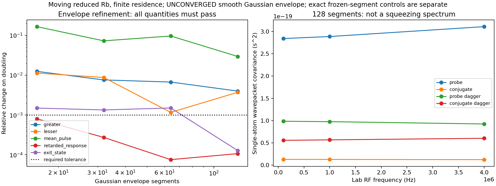

# Moving reduced Rb: finite characteristic와 열적 유입 기반

2026-09-14. **구간별로 일정한 reduced Rb 원자의 잡음·응답은 독립 검증을 통과했다. 매끄러운 Gaussian envelope 전체는 아직 UNCONVERGED다.** 열적 유입의 경계 flux 및 입사 위상 평균은 별도 병렬 과제로 구현·검증했다. 실제 열적 Rb ensemble과 nonlocal Maxwell 전파는 아직 결합하지 않았다.

결과: [immutable Rb report](rb_transport_report_v1.json), [thermal inflow report](inflow_report_v1.json), [열적 유입 유도](inflow_derivation.md), [독립 QRT 유도](segmented_qrt_reference.md). 앞 단계의 [finite characteristic](transport_derivation.md)을 이어간다. 이 보고서의 원자 wavepacket covariance는 s² 단위이며 SQL로 정규화한 광학 squeezing spectrum이 아니다.

## 이번에 연결한 물리와 입력

`gabes/fwm_quantum/transport.py`는 기존 reduced D1 pump Hamiltonian, decay-derived dipole, 네 radiative jump를 그대로 사용한다. 입력 상태는 가정한 thermal ground populations diag(5/12, 7/12, 0, 0) 또는 명시적으로 supplied boundary state다. Thermal bath로의 phenomenological transit reset은 허용하지 않는다. 실제 입사·출사 경로를 계산하면서 reset을 동시에 적용하는 중복을 막기 위해 `transit_rate_s_inverse != 0`이면 거절한다.

이 원자는 **pump-only 상태에서 약한 probe·conjugate에 대한 선형 응답**을 계산한다. `seed_power_W`와 `seed_phase_rad`는 평균 구동에 사용하지 않고 미사용 ledger에 기록한다. `number_density_m3`와 `length_m`도 단일 경로 계산의 입력으로 쓰지 않는다. 실제 경로는 `BallisticPath`가 정한다. Finite seed saturation, collision, full signed hyperfine/Zeeman, pump feedback은 포함하지 않는다. Positive RMS four-level dipoles의 기존 조건부 축약 한계도 유지한다.

| 항목 | 저장된 감사 설정 |
|---|---|
| Pump power / intensity 1/e² waist | 0.6 W / 530 µm |
| One-photon / two-photon detuning | 2π×0.9 GHz / −2π×8 MHz |
| Probe / conjugate angle | +0.006 / −0.005 rad, vacuum wavevectors |
| Entry position | (−100, 20, 0) µm |
| Velocity | (150, 10, 100) m/s |
| Residence | 2 µs, prescribed control path |
| Independent lab RF samples | 0.1, 1, 4 MHz |
| Gaussian subdivisions | 8, 16, 32, 64, 128 |

이 수치는 기존 조건부 power fixture와 새로 선언한 경로의 조합이다. 측정된 궤적 분포나 실험 검증이라고 주장하지 않는다. Optical fields는 uniform transverse polarization projection이고, pump만 constant-waist transverse Gaussian amplitude `exp(-r_perp²/w²)`를 갖는다. Pump diffraction와 longitudinal depletion은 없다.

Pump frame에서 effective detuning은 Δ_v=Δ−k₀·v다. q_j=k_j−k₀일 때 optical lowering readout의 demodulation phase는

\[
e^{i[s_j\phi-q_j\cdot r_{in}]}e^{i\nu_j a},\qquad
\nu_j=(\omega_j-\omega_0)-q_j\cdot v,
\quad (s_p,s_c)=(1,-1).
\]

Nambu ordering은 `(probe, conjugate, probe_dagger, conjugate_dagger)`이고 dagger 좌표의 phase와 ν는 반전한다. 공통 RF Ω를 더한 각 포트의 `w_j=Ω+ν_j`로 적분한다. **ν_p+ν_c=−(k_p+k_c−2k₀)·v를 그대로 유지한다.** 두 carrier frequencies를 억지로 반대값으로 만들거나 scalar mismatch로 상쇄하지 않는다. Weak drive와 readout은 같은 dipole와 forward z-plane flux factor를 사용한다. 이 normalization만으로 optical commutator 또는 Maxwell closure가 성립하는 것은 아니다.

## 빠른 진동을 버리지 않는 구간 전파

`gabes/quantum/segmented_transport.py`는 유한한 전체 traceless Hermitian basis F에서 atomic drift A와 각 jump의 microscopic diffusion을 독립 구성한다.

\[
D_{r,ij}(\rho)=\operatorname{Tr}\rho[L_r^\dagger,F_i][F_j,L_r].
\]

Jump가 일정하면 이 식은 ρ에 선형이다. 제품 `[L†,F_i][F_j,L]`만 미리 계산하며 D를 A나 commutator defect에서 역산하지 않는다. Mean state는 full Liouvillian L로 전파한다. Boundary는 입력 상태에서 직접 계산한 C_in이고, 각 internal source는 0으로 시작한다.

전체 경로 길이를 T라 하고

\[
Y_j=\int_0^T e^{iw_j a}O_j(a)\,da,
\quad Z_j(a)=e^{-iw_j a}\int_0^a e^{iw_j u}\delta O_j(u)\,du/T
\]

로 놓으면 구간 안에서

\[
\frac{d}{da}\begin{pmatrix}\delta F\\Z\end{pmatrix}
=\mathcal A\begin{pmatrix}\delta F\\Z\end{pmatrix}+\text{atomic noise},
\qquad\mathcal A=\begin{pmatrix}A&0\\C/T&-i\operatorname{diag}(w)\end{pmatrix}.
\]

Source covariance P_r는 `Pdot=𝒜P+P𝒜†+diag(D_r(ρ),0)`를 따른다. Row-major vectorization에서 K=𝒜⊗I+I⊗𝒜*이고, D_r(ρ)의 선형 map을 B_r라 하면

\[
\frac{d}{da}\begin{pmatrix}\mathrm{vec}P_r\\\mathrm{vec}\rho\end{pmatrix}
=\begin{pmatrix}K&B_r\\0&L\end{pmatrix}
\begin{pmatrix}\mathrm{vec}P_r\\\mathrm{vec}\rho\end{pmatrix}.
\]

코드는 양 ordering과 모든 source의 forcing blocks를 하나의 exponential에 넣는다. 이는 일정한 구간에 대해 정확한 homogeneous linear system이다. Singular L, zero eigenvalues, degeneracy도 허용하며 Sylvester inverse나 장시간 decay map의 역행렬이 필요 없다. 종료 시 `T² exp(i w_j T) P_YY,jk exp(-i w_k T)`로 실제 covariance를 복원한다. 중간 구간 경계에서는 P와 실제 ρ를 그대로 전달한다. RF마다 다른 원자 상태를 사용하지 않는다.

Mean pulse와 retarded response는 별도의 작은 linear lift로 계산한다. Input V_k exp(−i w_in,k a)에 대해 q_k는 `(A+i w_in,k)q_k+B_k(ρ)`를 따르고, readout accumulator에 w_out−w_in을 유지한다. 마지막에 정확한 phase와 T를 복원한다. Coherent input column과 그 conjugate는 명시적으로 분리한다.

**정확성의 적용 범위:** `expm`은 GHz carrier/internal phases를 직접 적분한다. 매끄러운 beam envelope를 midpoint 값으로 고정하는 것은 별도의 수치 근사다. 구간 exponential이 정확하다고 해서 그 envelope 근사까지 수렴한 것은 아니다.

Exactly dark ordering의 signed roundoff는 삭제하지 않는다. PSD 검사에는 `64 ε T² max_j||O_j||²`의 SI absolute roundoff floor와 상대 tolerance를 사용하고 둘 다 보고한다. 이는 covariance에 추가하는 noise가 아니다. Density trace, covariance, eigenvalue를 renormalize·clip·repair하지 않는다.

## 반복 solve를 제거한 수학적 근거

동일한 H/O/V와 정확히 같은 dt이면 augmented linear map은 **입사 상태와 무관하게 동일**하다. 따라서 같은 exponential을 현재 ρ와 현재 source covariance에 재적용할 수 있다. 실제 상태 전파는 생략하지 않는다. 일치 판정은 입력의 exact equality이고 approximate cache는 사용하지 않는다. Seven identical segments control은 14개의 exponential 대신 2개를 계산하고 12개를 재사용하며, single-segment 해와 일치한다. 해당 근거는 함수 내부 주석과 regression test에 남겼다.

Pump-only H와 ρ는 entry beat phase φ에 의존하지 않는다. 따라서 s=(1,−1,−1,1)에 대해

\[
C_{jk}(\phi)=e^{i(s_j-s_k)\phi}C_{jk}(0),\qquad
\langle C_{jk}\rangle_\phi=\delta_{s_j,s_k}C_{jk}(0).
\]

Mean과 response에도 같은 row/column phase 법칙이 성립한다. `average_pump_only_entry_phase`는 이 적분을 정확하게 수행하며 별도의 원자 solve가 필요 없다. Finite seed로 H가 φ에 의존하면 이 증명을 재사용할 수 없다. Spatial entry phase는 실제 q·r_in으로 남겨두므로 비공선 mismatch를 지우는 평균이 아니다.

Poisson ensemble에는 **평균의 outer product를 먼저 계산한 뒤 위상 평균**해야 한다. 평균 pulse 자체는 0이어도 `⟨μμ†⟩`는 0이 아닐 수 있다. Helper는 일반 wavepacket과 혼동하지 않도록 `conditional_greater`, `mean_outer_phase_average`, `raw_greater_phase_average` 등의 별도 키를 반환한다. Thermal stream에는 averaged raw moments가 필요하다. 기존 production Ultra에는 변경하지 않았다.

## 독립 검증과 음성 대조군

병렬로 작성한 [full-density QRT](segmented_qrt_reference.md)는 A, D, source covariance를 받지 않는다. Raw source O†ρ 또는 ρO†를 full Liouvillian으로 전파하여 positive-time triangle과 Hermitian partner를 합친다. 마지막에만 전체 mean outer product를 뺀다. 기존 direct-time QRT와의 비교, changing H/readout, nonzero mean, unequal port frequencies, SI 시간 변환, dark/identity/no-jump controls도 포함한다.

| 검증 | 저장된 결과 |
|---|---:|
| Constant physical Rb versus independent QRT, 최대 상대오차 | 1.19×10⁻¹¹ |
| Constant Rb 1→4 구간, 최대 상대오차 | 1.20×10⁻¹² |
| Moving Gaussian 8구간 versus independent QRT, 최대 상대오차 | 3.49×10⁻¹² |
| Entry-phase theorem versus 실제 새 phase solve | 1.33×10⁻¹³ |
| Gaussian cases의 source 합과 직접 atomic covariance | 최대 4.31×10⁻¹³ |
| Boundary 삭제: atomic exit commutator defect | 2.90×10⁻⁵ |
| Boundary 삭제: greater wavepacket norm 변화 | 18.06% |
| 구간 사이 covariance 삭제: greater norm 변화 | 333.46% |
| Common phase 대신 각 포트를 독립 위상 평균 | 26.25% norm 변화 |

Boundary 또는 cross-segment covariance를 지운 결과는 남은 noise가 PSD여도 정확한 수송 결과가 아니다. 위 비율들은 이 선언된 single-atom fixture의 matrix norm 변화다. 광학 squeezing 오차율, 실험 과잉잡음 크기 또는 fitted coefficient로 해석하지 않는다.

여러 RF rows와 여러 구간을 동시에 계산하는 독립 2-/3-level QRT regression은 각 RF row가 같은 entry ρ를 받는지도 검사한다. Atomic state buffer가 첫 RF 전파 뒤 바뀌어 다른 RF에 재사용되지 않도록 snapshot을 복사한다.

## Gaussian envelope는 아직 수렴하지 않았다

각 adjacent refinement에서 greater, lesser, mean pulse, retarded response, exit state의 상대 변화를 각각 검사한다. 기준은 10⁻³이고 최근 두 refinement가 모두 통과해야 한다. 분모는 이전 구간 수 계산의 norm이다.

| 구간 수 | greater | lesser | mean pulse | retarded response | exit state |
|---|---:|---:|---:|---:|---:|
| 16 | 1.247×10⁻² | 1.129×10⁻² | 1.657×10⁻¹ | 8.036×10⁻⁴ | 1.495×10⁻³ |
| 32 | 7.607×10⁻³ | 8.760×10⁻³ | 7.284×10⁻² | 2.742×10⁻⁴ | 1.342×10⁻³ |
| 64 | 6.726×10⁻³ | 1.165×10⁻³ | 9.635×10⁻² | 7.585×10⁻⁵ | 1.503×10⁻³ |
| 128 | 3.994×10⁻³ | 3.720×10⁻³ | 2.956×10⁻² | 1.074×10⁻⁴ | 1.283×10⁻⁴ |

따라서 report는 `exact_segment_model_controls_passed=true`, `smooth_Gaussian_envelope_converged=false`, `all_certification_gates_passed=false`다. 양자적 일관성 검사를 통과한 frozen segments를 매끄러운 Gaussian beam의 검증된 해로 승격하지 않는다. Slow envelope와 빠른 내부 coherences를 결합한 수렴 제어가 다음 우선 과제다. 관측한 비단조 변화의 원인을 아직 특정한 누락 물리로 판정하지 않았다.



## 병렬 열적 유입과 다음 연결

[Thermal inflow module](inflow_derivation.md)은 여섯 box faces에서 `n f(v)|v·normal| dA dv`를 적분한다. Normal velocity는 incoming flux의 Rayleigh measure, tangential velocity는 Maxwell Gaussian이다. 실제 첫 출구까지의 chord τ를 계산하고, 점유수를 nV에 맞추는 사후 정규화를 하지 않는다. Common RF phase와 실제 spatial entry phase를 구분하며, generic marked-Poisson helper는 raw conditional moments를 평균한다.

두 equal-volume shapes, 세 독립 scrambled-Sobol seeds, 면당 2¹⁰…2¹⁸ nodes의 감사에서 최대 nV 오차는 0.01215%, velocity/position을 포함한 dimensionless moments의 최대 오차는 0.03228%다. Identity pulse spectrum의 마지막 refinement 변화는 최대 0.8771%다. 이 수렴은 해당 모멘트와 identity pulse에 대한 것이며 Rb polarization spectrum의 적분 수렴을 대신하지 않는다.

동일한 부피라도 residence distribution이 다르면 number-noise spectrum은 다르다. 잘못된 half-normal velocity로 boundary flux를 배분하면 occupancy에 cube +14.14%, thin box +69.66% 오차가 생긴다. 이 결과 역시 실험 squeezing을 예측한 것이 아니다.

다음 순서는 다음과 같다.

1. Smooth envelope의 characteristic refinement를 통과시키고 constant/slow-envelope limit을 독립적으로 검증한다.
2. 검증된 Rb wavepacket을 flux/path quadrature에 연결하고 실제 RF polarization moments의 path·velocity·entry-phase convergence를 검사한다. Pump-only phase theorem의 재사용 범위를 유지한다.
3. Finite seed가 만드는 periodic trajectory dynamics를 추가하고 same-history causal response와 boundary/internal noise를 nonlocal Maxwell equation에 넣는다. Optical commutator·CP와 stationary spatial limit을 확인한다.
4. Full atom, collisions, mode completeness, self-consistent depletion, independent inputs와 held-out gain·S₋를 계속 진행한다.

열적 수송을 통합한 최근 선행연구는 [Yuan et al., arXiv:2608.15130](https://arxiv.org/abs/2608.15130)이다. Cs D2에서 finite-mode motion과 renewal의 noise 기여를 다룬 이 논문을 hot-Rb FWM의 no-fit spectrum 검증으로 취급하지 않는다. Rb atomic constants의 일차 자료는 [Steck Rb85 data](https://steck.us/alkalidata/rubidium85numbers.pdf)이며, 이번 코드는 repository의 기존 constants와 dipole convention을 유지했다.

## 재현과 검증 기록

```powershell
python -m analysis.grand_challenge.rb_transport_audit --output NEW.json --plot NEW.png
python -m analysis.grand_challenge.inflow_audit --output NEW.json --plot NEW.png
python -m pytest -q tests/quantum/test_segmented_transport.py tests/quantum/test_segmented_qrt.py tests/quantum/test_inflow.py
python -m pytest -q
```

Artifacts는 새 경로에만 쓴다. Rb source manifest 24개와 thermal inflow manifest 11개를 실행 전후 및 최종 파일과 대조하고, 두 PNG를 렌더링해 확인했다. 이전 transport/spatial reports는 수정하지 않았다. 전체 테스트의 최종 결과는 아래에 기록한다.

최종 `python -m pytest -q`는 **1061 passed, 1 failed (323.85 s)**다. 신규 segmented/Rb transport **17개**, 독립 QRT **31개**, thermal inflow **43개**, 총 **91개**가 모두 포함되어 통과했다. 유일한 실패는 기존에 삭제된 `docs/FWM physics and analytic reconstruction/FWM_physics.tex`를 읽는 `tests/test_docs_consistency.py::test_repository_visibility_wording_is_consistently_public`다. 해당 삭제 상태나 테스트를 변경하지 않았다.
