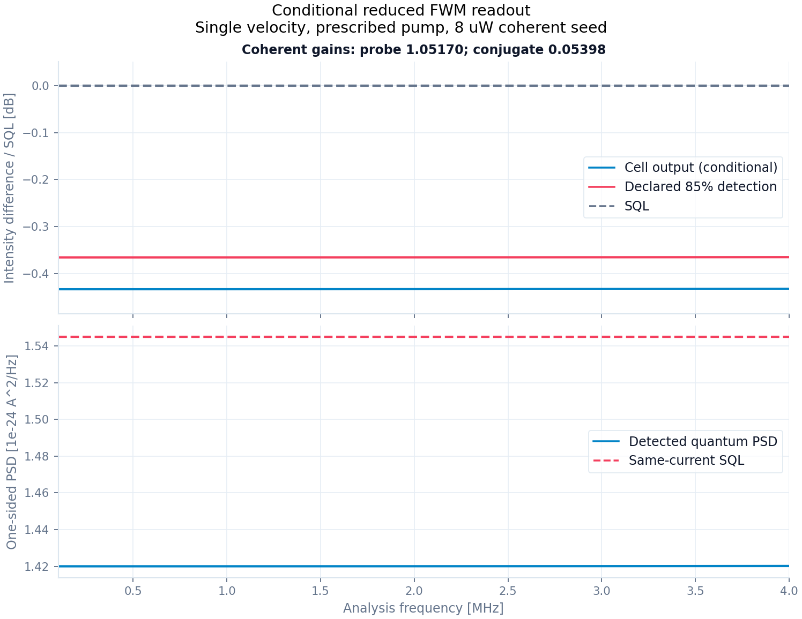

# S1: four-sideband covariance, temporal mode와 intensity-difference readout

2026-09-09. 구현: `gabes/quantum/sidebands.py`, `gabes/quantum/readout.py`, `gabes/fwm_quantum/readout.py`. 전제는 [field_derivation.md](field_derivation.md)의 conditional local M/D와 전파다. 최종 기록: [s1_readout_report_v2.json](s1_readout_report_v2.json), [spectrum 그림](s1_readout_spectrum_v2.png).

후속 [정규화 감사](normalization_derivation.md)는 이 snapshot의 pump/weak dipole 차이, sublevel 합산과 manifold 평균의 차이를 확인했다. 새로운 reciprocal variants는 별도 보고서에 보존하며, 아래 spectrum과 수치는 당시 조건부 입력의 이력이다.

후속 [seed-validity 유도](seed_validity_derivation.md)는 선언한 광학 수집 대역의 spontaneous mean/SQL과 Gaussian quadratic photocurrent를 추가하고, 별도 finite-seed Floquet mean으로 국소 back-action을 진단한다. 아래 bright-carrier 식을 유지하면서 생략 항의 크기를 비교한다. Full unfiltered fluorescence와 finite-seed quantum diffusion은 아직 닫히지 않았다.

**같은 reduced atomic model에서 coherent gain과 주파수별 linearized intensity-difference spectrum을 함께 계산하는 경로를 연결했다.** Photon-flux field noise를 real quadrature covariance로 옮겨 quantum uncertainty를 검사하고, 별도 RF=0 carrier solution으로 photocurrent와 SQL을 정규화한다. 결과는 conditional reduced prediction이다. Hot-vapor 전체 physics, 독립 계측 입력, finite-seed back-action과 pump depletion의 검증은 아직 완료되지 않았다.

**RF 한 점에 필요한 네 optical modes**

Ω>0에서 physical mode 순서는

\[
(a_{p,+},a_{c,-},a_{p,-},a_{c,+}),
\qquad r=(x_{p,+},p_{p,+},x_{c,-},p_{c,-},\ldots).
\]

각 mode에는 `[x,p]=i`, vacuum covariance I/2를 사용한다. 첫 pair `(a_p,+,a_c,-)`는 main Nambu transfer at +Ω에서 얻고, 두 번째 pair `(a_p,-,a_c,+)`는 main at −Ω에서 얻는다. 해당 companion samples가 정확히 adjoint 관계를 갖는지 독립적으로 검사한다. RF=0에서는 위·아래 sideband가 같은 mode이므로 이 four-mode adapter에 넣지 않는다. Zero RF는 coherent carrier 계산에만 사용한다.

현재 phase-selected stationary model에서는 이 두 pair 사이의 추가 moments가 없다. 이는 기존 closure의 가정이며, 추가 optical paths나 time-dependent pump가 만드는 correlations를 임의로 0으로 지워 해결했다는 뜻이 아니다. 그런 physics를 추가하면 spectral covariance contract도 확장해야 한다. Sideband-resolved fluctuations에서 covariance와 carrier-phase-dependent quadratures를 만드는 선행 접근은 [Florez의 multimode FWM 연구](https://arxiv.org/html/2512.15051v1)에도 있다. 여기서는 GABES의 vacuum I/2와 Fourier/PSD units로 유도한다.

**Nambu channel에서 real Gaussian channel로**

한 pair의 Nambu vector가 `b=(a₁,a₂†)`이고 `b_out=T b_in+f`이면 physical annihilators는 `a_out=U a_in+V a_in†+zeta`를 따른다.

\[
U=\begin{pmatrix}T_{00}&0\\0&T_{11}^*\end{pmatrix},\qquad
V=\begin{pmatrix}0&T_{01}\\T_{10}^*&0\end{pmatrix}.
\]

Interleaved quadrature transfer X는 다음 blocks를 넣어 만든다.

```text
X[x,x] = Re(U+V)        X[x,p] = -Im(U-V)
X[p,x] = Im(U+V)        X[p,p] =  Re(U-V)
```

두 ordered added-noise matrices의 평균을 `H=(N_>+N_<)/2`라 두면 real symmetric Y의 두 diagonal 2×2 blocks는 각각 H₀₀I₂와 H₁₁I₂다. Cross block은 m=H₀₁에 대해

\[
Y_{12}=\begin{pmatrix}\Re m&\Im m\\\Im m&-\Re m\end{pmatrix},
\qquad Y_{21}=Y_{12}^T.
\]

이는 quadrature anticommutator를 계산한 식이다. Ordered field spectrum 전체의 실수부를 가져와 covariance라고 선언하는 방법이 아니다. Hermiticity와 companion 관계를 먼저 검사하며, signed numerical residuals를 보존한다.

각 pair와 assembled four-mode channel은 기존 `GaussianChannel`을 사용한다. 검사식은

\[
Y+\frac{i}{2}(J-XJX^T)\succeq0,\qquad
V_{\rm out}+\frac{i}{2}J\succeq0.
\]

Y와 covariance의 고유값은 clipping하지 않는다. Report는 각 RF point의 X,Y, source covariance와 channel CP 최소 고유값을 저장한다. 이 검사는 정의된 linear Gaussian channel의 physical consistency를 뜻하며, 원자의 전체 quantum state가 Gaussian이라는 주장이 아니다.

**유한 spectral band의 normalized temporal mode**

Frequency-domain filter h는

\[
a_h=\int\frac{d\Omega}{2\pi}\,h(\Omega)^*a(\Omega),\qquad
\int\frac{d\Omega}{2\pi}|h(\Omega)|^2=1
\]

로 정규화한다. `TopHatBand`는 positive center f₀와 width B를 받아 band 안에서 `h=1/sqrt(B)`를 사용한다. B<2f₀를 요구하므로 reflected negative band와 DC에서 겹치지 않는다. 이에 대응하는 time-domain mode는 sinc envelope이며 normalized L² mode다. 유한 시간에 엄밀히 support가 제한되는 window를 구현했다고 부르지는 않는다.

Positive band와 mirrored partner에서 flat real filters를 사용하고, 대응하는 input modes 외의 모든 orthogonal spectral modes를 vacuum으로 선언한다. Gauss-Legendre weights pᵣ는 `integral df/B`를 근사하며 Σp=1이다. Spectral sample마다 real Xᵣ,Yᵣ를 얻었을 때 retained mode channel은

\[
\overline X=\sum_r p_rX_r,\qquad
Y_{\rm eff}=\sum_rp_rY_r+\frac12\sum_rp_r
(X_r-\overline X)(X_r-\overline X)^T.
\]

마지막 항은 frequency-dependent transfer가 unobserved orthogonal input modes에서 가져오는 vacuum noise다. 평균 T만 전파하면 이 noise를 빠뜨린다. 위 식은 discrete quadrature 모델에서의 projection이며 실제 continuous filter에는 quadrature convergence가 필요하다. Arbitrary complex filter phases, 서로 다른 input/output filter shapes 또는 correlated orthogonal inputs는 이 adapter의 범위 밖이다.

예를 들어 두 spectral bins에 phase rotation ±θ가 있으면 retained mode에서 `X=cos(theta)I`, `Y=sin²(theta)I/2`이다. Vacuum은 보존된다. Y를 버리면 passive channel의 CP가 실패하며, 테스트가 이 반례를 확인한다.

**Coherent mean과 gain은 RF=0에서**

Mean carrier α의 단위는 sqrt(photons/s)다. Probe만 seed할 때 `alpha_p=sqrt(P_seed/(hbar omega_p))*exp(i phase)`, `alpha_c=0`으로 놓고

\[
\begin{pmatrix}\beta_p\\\beta_c^*\end{pmatrix}
=T_{\rm main}(\Omega_{\rm RF}=0)
\begin{pmatrix}\alpha_p\\\alpha_c^*\end{pmatrix}
\]

를 계산한다. Generator-frame zero frequency나 spectrum의 첫 번째 RF sample을 carrier로 사용하지 않는다. 반드시 명시한 RF=0 row가 있어야 한다.

`P_j,out=hbar omega_j |beta_j|²`에서 두 coherent power gains를 구한다. Conjugate photon-flux gain과 power gain은 omega_c/omega_p로 다르다. 이 mean은 weak seeded transfer의 coherent mean이며 spontaneous mean photons를 포함하지 않는다. 따라서 finite-seed nonlinear mean-field result와의 parity, bright-carrier dominance 및 back-action의 크기는 별도의 검증 대상이다.

**검출과 intensity-difference PSD**

각 arm의 declared intensity transmission×quantum efficiency를 ηⱼ로 두면 carrier는 `beta_j,d=sqrt(eta_j) beta_j`, sideband covariance는 동일 η의 vacuum attenuator를 거친다. 이 두 변환이 함께 있어야 optical loss의 mean attenuation과 photodetection shot noise가 맞는다. η는 noise curve를 맞추는 coefficient로 최적화하지 않는다.

Detector의 calibrated current response를 hⱼ(Ω) [A/A], 사전 선언한 balance를 g≥0라 두면 linearized positive-frequency current는

\[
y(\Omega)=e\big[h_p(\beta_{p,d}^*a_{p,+}+\beta_{p,d}a_{p,-}^\dagger)
-g h_c(\beta_{c,d}^*a_{c,+}+\beta_{c,d}a_{c,-}^\dagger)\big]
=\ell r.
\]

Four-sideband representation에서 `ell (iJ) ell†=0`이다. 그래서 ordered current contraction과 symmetrized covariance contraction이 일치하며,

\[
S_{I,\rm two-sided}(\Omega)=\ell V_d\ell^\dagger,
\]

\[
S_{\rm SQL,two-sided}(\Omega)=e^2\left(
|h_p|^2\eta_p|\beta_p|^2+g^2|h_c|^2\eta_c|\beta_c|^2\right).
\]

SQL은 같은 mean currents, balancing과 electronic response를 사용한 두 independent coherent beams의 shot-noise 기준이다. `DetectorResponse`는 별도의 positive RF axis, 두 η, 주파수별 complex h, g, additive difference-electronics PSD 및 source description을 요구한다. Source covariance와 detector RF axes가 다르거나 어느 점에서 SQL=0이면 거부한다.

Fourier inverse가 `integral dOmega/(2pi)`이므로 two-sided Hz PSD는 `S_Hz(f)=S_omega(2pi f)`이다. Ω=2πf 변환에 더해 또 2π를 곱하지 않는다. f>0의 **one-sided PSD는 두 배**이며, coherent limit에서

\[
S_{\rm SQL,one-sided}(f)=2e\left(|h_p|^2I_p+g^2|h_c|^2I_c\right)
\]

가 된다. 출력 단위는 A²/Hz, ratio는 dimensionless, dB는 `10 log10(ratio)`다. Supplied additive electronics는 같은 one-sided A²/Hz로 기록하고 quantum PSD에 더한 total ratio를 별도로 반환한다. 전자잡음을 암묵적으로 빼지 않는다.

Flat h와 같은 means를 사용하는 top-hat example에서 normalized-mode 결과는 band-average PSD다. Unit-gain real bandpass의 photocurrent variance를 원하면 이 one-sided 평균 PSD에 bandwidth B를 곱한다. 실제 spectrum analyzer의 RBW/VBW나 averaging response를 재현하는 일반 장치 모델은 아직 아니다.

**독립 검증과 해석적 한계**

`analysis/grand_challenge/reference/direct_readout.py`는 GaussianChannel이나 quadrature conversion을 import하지 않는다. Nambu greater covariance at +Ω와 lesser covariance at −Ω를 직접 current weights로 수축한다. Companion 처리, complex carrier phase, losses, g, response phase와 one-sided factor를 이 별도 경로와 비교한다.

Coherent input과 임의의 unequal losses·balance·complex current response에서는 quantum/SQL=1이어야 한다. 이상적 phase-insensitive two-mode amplifier에 bright probe만 seed하고 g=1일 때는

\[
S_-^{\rm ideal}=\frac{1}{2G-1},\qquad
S_-^{\rm equal\ loss}=1-\eta+\eta S_-^{\rm ideal}.
\]

Gain 1, 1.7, 4, 15와 여러 η에서 이 절대 normalization을 확인한다. Unequal η·g·complex response에 대한 해석적 식도 비교한다. Missing reflected RF, 잘못된 companion phase, quantum uncertainty 위반, 잘못된 detector axis와 zero SQL은 모두 실패하도록 검사한다.

**고정된 조건부 예제의 결과**

Field 단계의 고정 입력 n=10¹⁸ m⁻³, uniform A=1.2×10⁻⁷ m², ℓ=12.5 mm, Δ/2π=0.9 GHz, δ/2π=−8 MHz, Δk=0를 유지했다. Seed는 8 μW이며 pump-on은 기존 600 mW/530 μm helper의 Rabi를 조건부 입력으로 사용한다. d_eff=d/sqrt(12), reset 및 optical carrier 규약의 physical provenance는 앞 단계의 제한을 유지한다. Detector η=0.85, g=1, h=1, electronics=0도 declared fixtures다.

| 모델 | Coherent probe power gain | Conjugate power gain | Source S₋, 0.1–4 MHz | Declared 85% detection |
|---|---:|---:|---:|---:|
| Pump off + reset | 0.996670 | 0 | 0 dB (roundoff 이내) | 0 dB (roundoff 이내) |
| Pump on, radiation only | 1.070851 | 0.072467 | −0.58270…−0.58184 dB | −0.49015…−0.48944 dB |
| Pump on + reset | 1.051703 | 0.053980 | −0.43374…−0.43310 dB | −0.36585…−0.36532 dB |

이 숫자는 실험의 gain≈15 또는 −7.8 dB를 재현했다고 주장하는 결과가 아니다. 동일 atomic model의 mean/noise/readout을 닫은 기준 계산이며, 알려진 squeezing 값으로 계수를 조정하지 않았다.

전체 예제에서 direct Nambu PSD와의 최대 상대 차이는 3.35×10⁻¹⁵이고, equal-loss ratio identity의 최대 차이는 4.45×10⁻¹⁶이다. Pumped/reset case의 최소 Gaussian-channel CP eigenvalue는 약 3.90×10⁻⁵, source covariance uncertainty 최소값은 약 7.56×10⁻⁴다. Pump-off semidefinite limit의 ~10⁻¹⁶ 음의 고유값은 signed roundoff로 보관한다.

0.8–1.2 MHz top-hat을 orders 4,8,16에서 적분했다. Direct weighted PSD와 normalized-mode PSD의 상대 차이는 최대 2.59×10⁻¹⁶이고, order 8→16의 ratio 변화는 1.12×10⁻¹⁶이다. 이 smooth fixture의 수렴이며 모든 spectral features에 대한 보증은 아니다.

Report의 sampled-band spontaneous flux는 0.1–4 MHz만 적분한 부분 진단이다. Pumped/reset에서 각 beam은 약 4.3×10⁵ photons/s 수준이다. 이는 seed/carrier flux보다 작지만, 대역 밖 fluorescence를 포함한 총 spontaneous mean과 quadratic photocurrent noise를 bound하지는 않는다. Bright-carrier approximation의 전체 검증을 이 값만으로 승인하지 않는다.



**재현과 남은 작업**

```powershell
python -m pytest -q tests/quantum
python -m analysis.grand_challenge.readout_audit --output NEW_READOUT.json --plot NEW_READOUT.png
python -m pytest -q
```

기존 report/plot 경로를 덮어쓰지 않는다. 첫 그림의 범례 색을 확인해 plotting code를 수정한 최종본은 `_v2`이며 초기 snapshot도 유지했다. Final report에는 source hashes와 numerical arrays가 들어 있다.

현재 남은 핵심은 pump-power/weak-field dipole/optical carrier의 단일 physical input ledger, bright/weak-seed validity, angular-Doppler·transverse mode·full atom, self-consistent depletion과 independently measured detector/SQL이다. 그 뒤 held-out gain/spectrum 검증을 수행한다. Grand Challenge와 reduced milestone은 계속 진행 중이며 conditional S₋ 구현을 experimental no-fit 완료로 표시하지 않는다.
