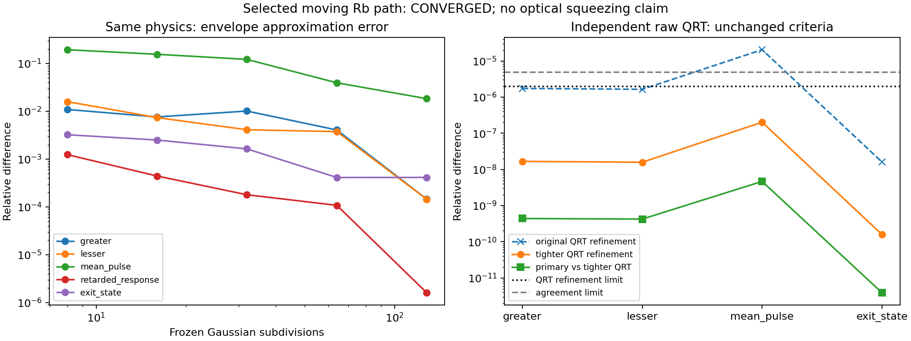

# Continuous Gaussian Rb characteristic

2026-09-14. 앞 단계의 [Rb finite segments](rb_transport_derivation.md)에서 남은 Gaussian envelope 수렴 문제를 다룬다. **Hamiltonian·dipole·radiative jumps·경로·carrier geometry를 유지하고, pump amplitude를 연속 함수로 직접 적분**하는 별도 검증 경로를 추가했다. No-fit 조건과 pump-only reduced atom의 한계는 그대로다.

구현은 `gabes/quantum/smooth_transport.py`, Rb adapter는 `gabes/fwm_quantum/smooth_transport.py`다. 독립 [smooth QRT reference](smooth_qrt_reference.md)는 별도 full-density raw moments를 사용한다. 기존 frozen-segment solver와 과거 report는 보존한다. Production Ultra에는 적용하지 않는다.

## 연속 envelope와 이전 구간 근사의 차이

Prescribed ballistic path r(a)=r_in+va, constant-waist pump에서

\[
H(a)=H_0+f(a)H_1,\qquad
f(a)=\exp\left[-\frac{(x_{in}+v_xa-x_c)^2+(y_{in}+v_ya-y_c)^2}{w^2}\right].
\]

H₀는 Doppler-shifted pump-off Hamiltonian이고 H₁은 peak pump coupling이다. H₁은 새로운 phenomenological coefficient가 아니며 기존 power-to-Rabi mapping으로 정한다. 네 radiative jump는 고정이다. 따라서 full Liouvillian은 L(a)=L₀+f(a)L₁이고 L₁은 Hamiltonian commutator만 포함한다. Dissipator는 한 번만 적용한다.

입사 상태, 실제 q_j·r_in과 q_j·v, ν_p+ν_c의 nonzero loop mismatch, independent lab RF Ω, reciprocal weak Nambu readout/drive는 이전 adapter와 같다. Pump의 transverse 위치만 실수 scalar 연산으로 평가하는 것은 r(a)의 정확한 재표현이다. 속도·위상·envelope를 평균하는 shortcut이 아니다. Nonzero phenomenological transit reset과 scalar mismatch의 기존 거절 조건도 유지한다.

이전 midpoint 방법은 구간마다 일정한 H의 해를 정확히 구하지만 H가 경계에서 바뀐다. 연속 방식은 이 불연속 근사를 제거한다. 같은 입력에서 두 결과가 다르다는 사실만으로 새 physics가 필요하다고 판정하지 않는다. 연속해의 수렴과 독립 reference를 먼저 확인한다.

## Microscopic diffusion을 유지한 sparse moment equations

전체 traceless Hermitian basis F의 drift A(a)=A₀+f(a)A₁와 각 jump의 diffusion

\[
D_{r,ij}(\rho)=\operatorname{Tr}\rho[L_r^\dagger,F_i][F_j,L_r]
\]

를 독립 구성한다. 제품 `[L†,F_i][F_j,L]`는 고정이고 ρ에 선형이다. Boundary source의 C₀(0)는 entry density에서 직접 계산하고, radiative source는 0에서 시작한다.

\[
\dot\rho=L(a)\rho,\qquad
\dot C_r=A(a)C_r+C_rA(a)^T+D_r(\rho).
\]

Boundary에는 D₀=0이다. 같은 시간의 atomic C_r는 RF readout 주파수와 무관하므로 **각 source마다 한 번만 적분한다**. Hermitian basis의 다른 ordering은 정확히 C_rᵀ다. 이 동등성은 주석과 frequency-batch/source-transpose regression으로 고정했다. 다른 RF나 ordering마다 같은 atomic covariance solve를 되살릴 필요가 없다.

Y_j=∫₀ᵀ exp(iw_ja)O_j da, w_j=Ω+ν_j에 대해

\[
Z_j(a)=\eta_j e^{-iw_ja}\int_0^a e^{iw_ju}\delta O_j(u)\,du/T,
\qquad \eta_j=1+|w_j|T.
\]

Readout matrix를 C, R=diag(η)C/T, W=diag(w)라고 쓰면 각 source의 cross blocks X_r=⟨δF Z†⟩, Y_r=⟨Z δFᵀ⟩와 ZZ block Q_r는

\[
\dot X_r=A X_r+iX_rW+C_rR^\dagger,
\quad\dot Y_r=Y_rA^T-iWY_r+RC_r,
\]
\[
\dot Q_r=-iWQ_r+iQ_rW+RX_r+Y_rR^\dagger.
\]

Lesser ordering은 위 forcing의 C_r를 C_rᵀ로 바꾼다. 초기 cross/ZZ blocks는 0이다. Cross blocks를 전 경로에 걸쳐 전파하므로 서로 다른 위치나 시간 사이의 상관을 지우지 않는다. 종료 시 T² exp(iw_jT)Q_jk exp(−iw_kT)/(η_jη_k)로 물리적 covariance를 복원한다.

η는 **정확한 수치 좌표의 단위 변환**이다. GHz-demodulated pulse가 매우 작아 adaptive ODE의 absolute tolerance에 가려지는 것을 줄이며, 결과에서 정확히 나눈다. Optical coupling, loss, efficiency 또는 noise strength를 바꾸지 않는다. SI seconds와 rescaled-time controls로 검증한다.

Mean과 infinitesimal drive에 대한 retarded response도 함께 적분한다. 모든 방정식은 u=a/T에서

\[
\frac{dy}{du}=[G_0+f(Tu)G_1]y
\]

형태다. G₀/G₁을 sparse matrices로 한 번 구성하고, DOP853의 각 RHS evaluation에서는 sparse products와 Gaussian scalar만 계산한다. [SciPy의 DOP853/solve_ivp](https://docs.scipy.org/doc/scipy/reference/generated/scipy.integrate.solve_ivp.html)는 complex state와 tolerance control을 지원한다. 실제 installed version과 tolerances는 결과 report에 기록한다.

Four-level/four-port/three-RF/five-source 문제에서 단순히 모든 full covariance block을 RF·ordering마다 복제하면 11,086개 complex variables가 필요하다. RF-independent C_r와 transpose identity를 공유한 구현은 **5,461개**를 사용한다. 이는 정확한 중복 제거이며 variable count가 줄어든 비율을 실행시간의 speedup으로 주장하지 않는다.

내부/carrier oscillations를 적분에서 없애거나 rotating-wave 근사를 추가하지 않았다. 따라서 여전히 계산이 비싸며, 이 경로는 이후 빠른 approximation을 검증할 기준 해로 사용할 수 있다. 새로운 가속법은 boundary/internal source covariance와 RF observables를 같은 허용오차에서 재현해야 한다.

## 독립성, 수렴, 물리적 일관성의 구분

Main method는 jump-product D와 complete-basis covariance propagation을 사용한다. Independent `reference/smooth_qrt.py`는 D, A, propagated covariance를 받지 않고 raw O†ρ 또는 ρO†를 full Liouvillian으로 전파하여 positive-time triangle을 적분한다. Hermitian partner를 합친 뒤 global mean outer product를 뺀다. Mean과 noise의 physics는 같지만 계산하는 방정식과 variables는 다르다.

Quantum consistency 검사에는 source sum versus 직접 density moments, atomic commutator identity, density positivity, 양 ordering의 source PSD가 포함된다. Signed floating-point residual을 보고하며 clipping, trace repair, fitted loss 또는 excess-noise coefficient를 사용하지 않는다. **Atomic quantum consistency는 연속 envelope의 수치 수렴이나 canonical optical field 검증을 대신하지 않는다.**

선언한 selected-path audit는 이전과 같은 P=.6 W, w=530 µm, Δ=2π×.9 GHz, δ=−2π×8 MHz, angles .006/−.005 rad, entry(−100,20,0) µm, v=(150,10,100) m/s, T=2 µs, RF .1/1/4 MHz다. Density/cell length/finite seed power는 이 single-path solve에 사용하지 않는다.

Primary `(rtol,atol)`은 `(3e-9,3e-12)`, `(1e-9,1e-12)`, `(3e-10,3e-13)`으로 비교한다. Greater, lesser, mean pulse, retarded response, exit state의 두 successive relative changes가 모두 10⁻³보다 작아야 한다. Independent raw QRT의 최초 두 tolerances는 `(2e-10,2e-14)`, `(2e-11,2e-15)`이고 자체 refinement 2×10⁻⁶, main과의 일치 5×10⁻⁶를 요구한다. 이는 관측한 numerical checks이며 전체 입력 domain에 대한 엄밀한 global error bound가 아니다.

최초 [v1 report](smooth_transport_report_v1.json)는 QRT 자체 mean-pulse refinement가 2.0363×10⁻⁵여서 **실패**했다. Acceptance criteria를 바꾸지 않고 QRT만 `(2e-12,2e-16)`, `(2e-13,2e-17)`로 더 정밀하게 계산한다. `smooth_transport_qrt_refinement.py`는 v1의 모든 source/test hash와 primary tolerances를 확인한 뒤 같은 primary 해를 재사용한다. 하나라도 바뀌면 전체 primary audit를 다시 요구한다. 같은 방정식·입력·수치 설정의 중복 solve는 새 독립 증거가 아니며, 이 재사용 근거도 코드 주석에 명시했다. 새 report는 parent report의 SHA-256와 원래 실패한 QRT 결과까지 보존한다.

Independent raw QRT는 **총 ordered covariance와 mean/state**를 비교한다. 개별 jump source의 분해와 retarded response는 general 2-/3-level direct-time controls와 primary refinement로 검사하며, 이 물리적 2 µs Rb path의 별도 full-density source-resolved/response reference까지 제공한 것은 아니다. 이후 ensemble certificate가 더 강한 coverage를 요구하면 이 audit만으로 충족했다고 표시하지 않는다.

Tests는 smooth 2-/3-level direct-time QRT, source decomposition versus 기존 characteristic integrator, constant exact exponential, frequency-batch invariance, seconds rescaling, identity/no-jump limit, physical short-Rb phase theorem, invalid contracts와 immutable output refusal을 포함한다.

## 병렬 ensemble 연결

별도 [pump-only transport ensemble](transport_ensemble_derivation.md)은 thermal boundary rates와 per-path Rb packet을 연결하는 검증 가능한 adapter다. 각 경로는 한 번 계산하고, common entry phase는 s=(1,−1,−1,1)의 exact mask로 평균한다. Conditional mean을 먼저 지우지 않고 mean outer product를 rate 합에 포함한다.

Common lab RF, Nambu ordering, readout/drive units, coupling, density, 실제 entry phase와 Doppler offsets를 확인한다. Packet digest에 맞는 path refinement 및 independent-reference evidence가 없거나 실패하면 전체 spectrum을 인증하지 않는다. 실패한 경로를 빼고 남은 rate를 재정규화하지 않는다. Ensemble 수준에서도 **실제 polarization spectrum**의 path/velocity refinement와 independent scramble evidence가 따로 필요하다. nV 수렴만으로 통과하지 않는다.

Rate-weighted retarded response는 선언한 경로 적분 응답이며 Maxwell M(Ω)가 아니다. 실제 nonlocal Maxwell 문제에는 위치별 driving과 readout을 연결하는 causal kernel이 필요하다. 이 단계는 thermal Rb 전체 spectrum, finite seed, full atom, self-consistent propagation/depletion 또는 실험 −7.8 dB 검증을 완료하지 않는다.

## 재현

```powershell
python -m analysis.grand_challenge.smooth_transport_audit --output NEW.json --plot NEW.png --workers 3
python -m analysis.grand_challenge.smooth_transport_qrt_refinement --parent NEW.json --output REFINED.json --plot REFINED.png
python -m analysis.grand_challenge.transport_ensemble_audit --output NEW.json --plot NEW.png
python -m pytest -q tests/quantum/test_smooth_transport.py tests/quantum/test_smooth_qrt.py tests/quantum/test_transport_ensemble.py
python -m pytest -q
```

Report/plot은 새로운 경로에만 쓴다. 이전 `rb_transport_report_v1.json`은 immutable historical comparison으로 연결하며, 해당 frozen-envelope gate를 소급해서 통과로 고치지 않는다. Current source manifests와 실행 전후 안정성, report의 실제 수치, 최종 전체 테스트는 아래 결과 절에 기록한다.

## Selected-path 결과

최종 [v2 report](smooth_transport_report_v2.json)와 [figure](smooth_transport_v2.png)의 `quantum_controls_passed`, `continuous_Gaussian_selected_path_converged`, `all_declared_controls_passed`는 모두 true다. 실행 전후 source 안정성과 현재 **28개 source/test/runner SHA-256**, parent v1 report SHA-256를 확인했다. 최초 실패 기록은 그대로 보존했다.

| 측정량 | Primary 0→1 상대 변화 | Primary 1→2 상대 변화 | Finest primary vs independent QRT |
| --- | ---: | ---: | ---: |
| Greater covariance | 9.427e-9 | 3.274e-9 | 4.364e-10 |
| Lesser covariance | 8.878e-9 | 3.084e-9 | 4.213e-10 |
| Mean pulse | 1.185e-7 | 4.136e-8 | 4.640e-9 |
| Retarded response | 6.554e-11 | 2.277e-11 | 이 Rb reference의 범위 밖 |
| Exit state | 9.162e-11 | 3.198e-11 | 3.873e-12 |

Tighter QRT 자체 refinement의 최대 상대 변화는 mean pulse의 **2.013e-7**이며 기존 2e-6 기준을 통과한다. Primary finest의 직접 density covariance 대비 source sum residual은 **2.446e-10**, atomic commutator residual은 **7.931e-15**다. Greater/lesser 및 source PSD 검사도 통과했다. 이 수치는 atomic moments에 관한 것이며 optical canonical commutator나 SQL의 검증값이 아니다.

기존 128 frozen segments를 연속해와 비교하면 greater/lesser 상대 차이는 각각 1.457e-4/1.448e-4, mean pulse는 **1.8371%**, retarded response는 1.604e-6, exit state는 4.137e-4다. 따라서 그 구간 근사의 joint criterion을 막던 평균 pulse 차이를 같은 물리의 연속 적분으로 분리했다. Density, loss, diffusion strength를 변경하여 결과를 맞추지 않았다.

Three primary runs는 각각 349.13/407.37/465.35 s, tighter independent QRT는 119.78/159.39 s가 걸렸다. 병렬 작업이 함께 실행된 환경의 개별 wall time이며, 기존 solver에 대한 통제된 speedup benchmark는 아니다. Primary finest는 1,770,761 RHS evaluations를 사용한다. 이 비용은 실제 thermal path 적분을 확대하기 전, 검증된 오차를 유지하는 가속이 필요한 이유다.



신규 tests는 continuous transport 18개, 독립 QRT 40개, 병렬 ensemble adapter 66개로 총 **124개**다. 전체 테스트의 최종 실행 결과와 병렬 audit 수치는 [research log](research_log.md)에 기록한다. Source별 physical-Rb reference, actual thermal spectrum 수렴 및 Maxwell closure가 다음 작업이다.
