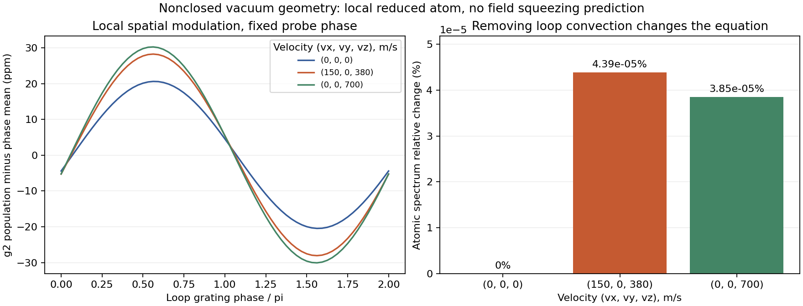

# S1 — 비공선 공간 위상을 보존하는 국소 원자 mean / noise

2026-09-11. [구현](../../gabes/quantum/spatial.py), [Rb adapter](../../gabes/fwm_quantum/spatial.py), [독립 검산](../../analysis/grand_challenge/reference/torus_qrt.py), [보고서](s1_spatial_report.json).

기존 kinetic 단계에서 거부하던 Δk≠0 geometry를 **국소 원자의 두 위상 평균 상태와 microscopic ordered noise**에 연결했다. 일반 geometry의 optical field M/D, gain, S₋까지 구현한 것은 아니다. 이전 single-phase field API의 geometry guard는 유지한다.

## 좌표와 운동 방정식

Pump-frame signed beat를 ν=−ω_hf+δ, q=kp−k0, Q=kp+kc−2k0=−Δk로 둔다. 두 좌표는

\[
\theta_1=\nu t-\mathbf q\cdot\mathbf r,\qquad
\theta_2=-\mathbf Q\cdot\mathbf r.
\]

원자 궤적 r=r0+vt에서 θ̇=(ν−q·v, −Q·v)≡ωv다. Probe와 conjugate의 drive labels는 a_p=(1,0), a_c=(−1,1)이고

\[
H/\hbar=H_0(\Delta-\mathbf k_0\cdot\mathbf v)
+V_p e^{-i\theta_1}+V_c e^{-i(-\theta_1+\theta_2)}+\mathrm{h.c.}
\]

따라서 conjugate의 원자 beat는 −ωv,1+ωv,2이며 probe beat의 단순 음수와 다를 수 있다. Lab carrier photon energy, canonical flux와 분석 주파수를 이 atomic frequency로 바꾸지 않는다. V_j=g_j β_j O_j†는 이전 kinetic 경로와 같은 z-plane flux convention, reciprocal RMS dipoles와 각도 인자를 쓴다. Envelopes와 pump는 국소적으로 일정하다고 가정한다.

ρ=Σ_a ρ_a exp(−ia·θ)를 convective master equation에 대입하면

\[
0=\sum_b\mathcal L_{a-b}\rho_b+i(a\cdot\boldsymbol\omega_v)\rho_a,
\qquad \mathrm{Tr}\rho_a=\delta_{a,0}.
\]

구현은 trace-zero Hermitian basis B로 ρ_a=B x_a+δ_a0 I/n를 쓰고, 같은 식의 affine forcing을 포함해 푼다. Mean rectangle과 response rectangle의 h,ℓ cutoff는 서로 독립이다. Tone ratio를 가까운 유리수로 바꾸거나 장주기 하나를 만들어 풀지 않는다.

**Q=0과 Q·v=0은 다르다.** Q=0이면 실제 θ2=0이므로 같은 h를 갖는 모든 ℓ 계수는 같은 위상이다. Hamiltonian에서 먼저 V=Vp+Vc†로 합쳐 기존 periodic solver로 환원한다. 두 항의 coherent cross terms를 남기는 정확한 quotient다. 이 경우 ℓ 복사본들의 잡음을 독립 mode처럼 합산하거나 θ2를 평균하면 다른 문제를 푼다. 코드에는 이 수학적 이유를 주석으로 남겼다.

Rb adapter의 기하학적 영점 판정은 기존 `CarrierGeometry`의 명시된 floating-point closure tolerance를 따른다. 수학적 quotient의 가정은 Q=0이다. 반면 Q≠0인 정지 원자는 ωv,2=0이어도 위치에 따른 θ2가 남으므로 two-phase 경로를 사용한다. 그때도 각 위치의 Hamiltonian을 먼저 합친 periodic reference와 비교할 수 있다.

## Microscopic drift, diffusion과 원자 commutator

이전 complete traceless operator basis F_i를 사용한다. A_a는 Liouvillian의 basis projection으로, reservoir r의 ordered diffusion은 별도로

\[
D^{(r)}_{a,ij}=\mathrm{Tr}\rho_a[L_r^\dagger,F_i][F_j,L_r]
\]

에서 계산한다. Explicit jumps는 상수이며, 회전 좌표에서 rank-one radiative/reset jump의 전체 위상은 dissipator에서 상쇄된다. Drift의 결함이나 원하는 squeezing으로 D를 정하지 않는다.

각 sampled phase에서 C_ij=⟨F_iF_j⟩−⟨F_i⟩⟨F_j⟩와 K=C−Cᵀ를 만들어

\[
(\boldsymbol\omega_v\cdot\nabla_\theta)C=AC+CA^T+D,
\]
\[
(\boldsymbol\omega_v\cdot\nabla_\theta)K=AK+KA^T+D-D^T
\]

를 검사한다. 여기의 K는 state-dependent atomic commutator이다. Canonical optical J의 보존을 검증한 것으로 바꾸어 부르지 않는다. Finite atom의 complete-basis second moments이며 Gaussian fourth-moment closure를 도입하지 않았다.

Phase-coordinate lift는

\[
\mathbb A_{ab}=A_{a-b}+i(a\cdot\omega_v)\delta_{ab},\qquad
\mathbb D^>_{ab}=D_{a-b},\qquad
\mathbb D^<_{ab}=(D_{a-b})^T.
\]

Lesser의 transpose는 atomic indices에만 적용한다. R=(−iΩ−𝔄)⁻¹와 S=R𝔇R†에서 요청한 output labels의 blocks만 반환하고 reservoir별 두 ordering도 남긴다. `A.T X=E.T`로 필요한 resolvent rows `E A^-1`만 정확히 구한다. 내부 harmonic이나 noise source를 줄이는 근사가 아니므로 이 최적화에도 대수적 근거를 주석으로 기록했다.

각 reservoir의 finite Toeplitz diffusion, 반환한 ordered spectrum의 Hermiticity/PSD와 finite drift stability를 검사한다. Phase별 density positivity와 dynamic identities도 검사하며, 개별 nonzero Fourier coefficient의 PSD는 요구하지 않는다. 작은 음의 고유값을 원래 부호와 상대 scale로 보고하고 clipping하지 않는다. 충분하지 않은 mean cutoff의 반례는 반환을 거부한다. 이 검사들은 별도의 cutoff 수렴을 대신하지 않는다.

## 독립적인 시간영역 검산

[Navarrete-Benlloch 등, PRA 103, 023713](https://arxiv.org/abs/2005.08249)은 시간 주기계의 correlation과 spectra를 Floquet 방법으로 계산하는 배경 자료다. 이번 두 위상 convective extension의 유도와 검증은 위 식과 아래의 별도 계산에 근거한다. 해당 논문이 이 hot-vapor geometry나 현재의 absolute spectrum을 검증했다고 주장하지 않는다.

첫 reference는 두 위상의 작은 2준위 원자에서 **full density matrix**를 직접 적분한다. 과거 t=−T에서 mixed state로 시작해 현재의 ρ(θ)를 얻고, connected QRT source `(F_j−⟨F_j⟩)ρ`를 앞으로 적분한다. A, D와 mean lattice 계수를 reference에 넘기지 않는다. 양의 지연 적분을 physical shifted frequency Ω+a·ωv에 대해 계산한 뒤 exp[i(a−b)·θ]로 phase projection하고 Hermitian partner를 더한다.

ωv=(2.3,√0.5) rad/s를 사용해 공통 주기를 가정하지 않는다. Reference의 phase grid 8²→12², history/delay 28→36 s, rtol 2×10⁻¹⁰→2×10⁻¹²를 각각 바꾼다. Reset rate=1 s⁻¹인 이 fixture에서는 다른 GKSL evolution의 trace-norm contraction과 reset의 exp(−t) 감쇠가 과거 초기 상태의 영향을 제한한다. Endpoint norm 하나를 일반적인 tail bound로 해석하지 않는다.

두 번째 reference는 ⁸⁵Rb, v=0, Q≠0에서 독립적인 공간 위상마다 periodic full-Liouville QRT를 계산한다. 이전 geometric-period resolvent로 무한 시간 tail을 합하고, 그 결과를 θ2에 Fourier project한다. Spatial/temporal phase grids 4×16→8×16→8×24를 비교한다. 이는 Rb의 zero loop convection reference이며, 움직이는 모든 Rb velocity에 직접 장시간 QRT를 실행한 결과는 아니다.

## 저장한 결과

모든 사전 선언한 controls가 통과했다. 주요 수치는 다음과 같다.

| 검산 | 오차 또는 마지막 변화 |
|---|---:|
| 2준위 직접 궤적 mean, 최대 원소 | 3.281×10⁻¹⁰ |
| 2준위 direct QRT spectrum, 상대 norm | 6.686×10⁻¹³ |
| 2준위 mean cutoffs (5,5)→(6,6), 최대 원소 | 3.271×10⁻¹⁰ |
| 2준위 response h: (3,3)→(4,3), 양 ordering 최대 | 3.103×10⁻⁹ |
| 2준위 response ℓ: (4,3)→(4,4), 양 ordering 최대 | 4.679×10⁻¹⁰ |
| Reference phase/history/ODE refinement 최대 | 1.249×10⁻¹¹ |
| Rb static-grating QRT spectrum, 상대 norm | 8.097×10⁻¹³ |
| Rb static-grating reference mean, 최대 원소 | 5.689×10⁻¹³ |
| Rb reference phase-grid refinement 최대 | 4.265×10⁻¹³ |

Rb는 기존 600 mW/530 μm, Δ/2π=0.9 GHz, δ/2π=−8 MHz, uniform-Zeeman-RMS reduced atom과 explicit reset을 쓴다. Probe carrier는 8 μW에 대응하고 conjugate는 `βc=0.25i βp`로 **국소 입력을 지정**했다. 이는 nonlinear propagation으로 구한 출구장이 아니다.

Geometry는 vacuum probe/conjugate 각도 +5/−5 mrad이며 kc를 closure에 맞춰 움직이지 않는다. Δk=(0.63791649,0,197.590726) rad/m, 12.5 mm의 axial phase=2.469884 rad다. 다음은 동일 phase-coordinate kernel에서 loop convection을 0으로 바꾼 뒤 state/A/D까지 재계산한 비교다.

| v=(vx,vy,vz) [m/s] | ωv,2 [rad/s] | Ordered spectrum 상대 변화, 양 ordering 최대 |
|---|---:|---:|
| (0,0,0) | 0 | 0 |
| (150,0,380) | 75,180.163 | 4.625×10⁻⁷ |
| (0,0,700) | 138,313.508 | 4.738×10⁻⁷ |

두 moving case의 mean-state 최대 원소 차이는 각각 1.945×10⁻⁸, 1.469×10⁻⁸이다. 현재 선택한 atomic blocks의 작은 norm 변화이며, 특정 optical component나 S₋ 변화의 상한이 아니다. 이 결과만으로 loop convection을 모든 조건에서 생략하지 않는다.

세 Rb case의 mean (3,3)→(4,4) 변화는 2.03×10⁻¹⁵ 이하, response h와 ℓ를 각각 늘린 마지막 비교는 1.03×10⁻¹⁴ 이하이다. Atomic labels는 (0,0),(1,0),(−1,1), base offsets는 0과 2π×1 MHz다. Spectrum 범위 전체나 Maxwell quadrature의 수렴을 주장하지 않는다.



## 다음 경계: atomic labels에서 실제 optical ports로

General irrational frequencies에는 단일 finite Floquet zone이 없다. 여러 (h,ℓ)가 조밀한 shifted frequencies를 만들거나 ωv,2=0에서 같은 시간 주파수를 가질 수 있다. 이 auxiliary lattice를 독립 photon modes로 선언하면 noise를 중복 계산한다. 따라서 이번 API는 `LocalNambuGenerator` 또는 physical Gaussian channel을 반환하지 않는다.

다음 단계는 optical spatial envelopes와 projection을 명시해 같은 lab RF에서 physical ports의 mean, driving B, readout C 및 공간에 따른 noise covariance를 유도하는 것이다. Q→0에서 coherent quotient와 기존 field 결과로 환원되어야 하고, physical-mode truncation은 atomic harmonic cutoff와 별도로 검사해야 한다. 그 뒤 canonical commutator/uncertainty, thermal finite-seed propagation 및 detected S₋를 검증한다. 기존 closed-geometry field guard를 단순히 삭제해서 연결하지 않는다.

Slow-envelope atomic transport/inter-slice correlations, velocity-changing collisions, full Zeeman와 실제 편광, transverse collection, pump depletion, higher-order photocurrent, 독립 실측 입력과 held-out 검증은 계속 남아 있다. Grand Challenge와 reduced hot-vapor milestone은 진행 중이다.

## 재현

```powershell
python -m analysis.grand_challenge.spatial_audit --output NEW.json --plot NEW.png
python -m pytest -q tests/quantum/test_spatial.py
python -m pytest -q
```

보고서와 그림은 새 경로에만 생성한다. 보고서에 inputs, prescribed carriers, 실제 wavevectors, atom별 cutoffs, 양 ordering spectra, phase-dependent state, independent-reference refinements와 source hashes 36개를 저장했다. 이전 kinetic v2 보고서는 historical predecessor의 hash로만 연결하며, 이번 코드와 source parity가 확인된 새 계산으로 재사용하지 않는다.

최종 `python -m pytest -q`는 **791 passed, 1 failed (199.08 s)**다. 신규 spatial 13개와 quantum 126개, 기존 Ultra 가속 검사도 포함되어 통과했다. 유일한 실패는 이전부터 누락된 `docs/FWM physics and analytic reconstruction/FWM_physics.tex`를 읽는 `tests/test_docs_consistency.py::test_repository_visibility_wording_is_consistently_public`이다. 해당 문서 삭제와 테스트를 변경하지 않았다.

신규 검사는 독립 adjoint product-rule diffusion, 직접 trajectory/QRT, stationary shifted-frequency limit, 두 좌표 reflection, 독립 phase-origin rotation, static grating의 coherent quotient와 잘못된 평균 반례, 부족한 cutoff/좌표/비감쇠 상태 거부, 실제 nonclosed Rb 주파수와 lab event 변환, 기존 closed Rb 경로와의 정확한 일치, Rb의 독립 periodic-QRT projection 및 artifact 덮어쓰기 거부를 다룬다.
