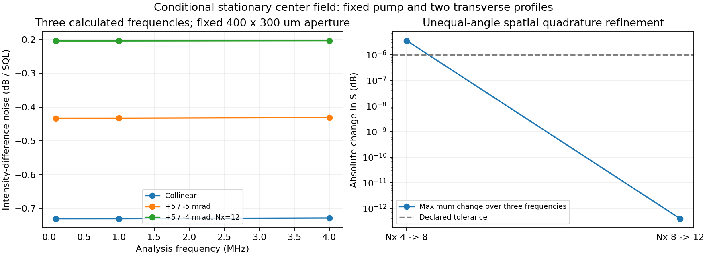

# S1 — 유한 면적의 실제 광학 모드에 연결한 microscopic field

2026-09-11. [모드 정규화](../../gabes/quantum/spatial_modes.py), [Rb field adapter](../../gabes/fwm_quantum/spatial_cell.py), [독립 검산](../../analysis/grand_challenge/reference/spatial_field.py), [최종 보고서](s1_spatial_field_report_v2.json).

이전 [두 위상 원자 모델](spatial_derivation.md)을 **정지 원자 중심, 고정 classical pump, 두 개의 고정된 transverse profiles**에서 nonlinear mean, canonical field M/D와 검출 S₋에 연결했다. Vacuum wavevectors의 비공선 mismatch를 그대로 사용한다. 움직이는 열 원자의 공간 수송까지 닫은 모델은 아니며, 기존 single-phase kinetic field의 closure guard도 유지한다.

## 정규화와 같은 광학 결합의 사용

Probe와 conjugate는 서로 다른 optical carrier band다. 각 횡방향 함수의 정규화는

\[
\int_{\mathcal A}|u_j(x,y)|^2\,dA=1,\qquad [u_j]=\mathrm{m}^{-1}.
\]

두 carrier가 다르므로 공간 함수끼리 직교할 필요는 없다. `TransverseModeGrid`에는 실제 위치, 양의 면적 quadrature weights, 두 complex mode 함수와 출처를 함께 준다. 위 정규화를 만족하지 않으면 거부하며 자동 rescaling하지 않는다. Uniform top-hat rectangle은 조건을 명시한 검산용 mode choice다. 실제 Gaussian collection의 측정값을 대신하지 않는다.

Photon-flux coupling은 이전 convention을 유지한다. 임의의 기준 면적 A₀에서 정의한 g_j∝(A₀ cosθ_j)⁻¹ᐟ²와 η_j=√A₀ u_j를 함께 사용하면 g_jη_j에서 A₀가 정확히 소거된다. 실제 mode 면적은 u와 dA에 들어 있다. A₀만 7배 바꾸었을 때 mean/M/양 ordering D가 보존되는 검사도 있다. A₀를 overlap fitting coefficient로 쓰지 않는다.

원래 공간 위상을 포함하는 계수는 χ_j=√A₀u_j exp[i(k_j−k₀)·r]다. Hamiltonian에는 χ_jβ_j가, Maxwell polarization에는 χ_j*가 들어가야 한다. 원자 구동에서 profile을 생략하고 출력 noise에만 efficiency를 곱하면 같은 물리적 결합이 아니다.

## 정확한 위상 quotient와 중복 solve 제거

q=k_p−k₀, Q=k_p+k_c−2k₀로 둔다. 정지 원자의 한 위치에서 probe/conjugate의 공통 periodic time origin을 θ₁=νt−q·r로 바꾸면

\[
\eta_p=\sqrt{A_0}u_p,\qquad
\eta_c=\sqrt{A_0}u_c e^{i\mathbf Q\cdot\mathbf r},
\]
\[
H/\hbar=H_0+V e^{-i\theta_1}+V^\dagger e^{i\theta_1},\qquad
V=g_p\eta_p\beta_p O_p^\dagger+g_c(\eta_c\beta_c)^*O_c.
\]

Atomic coefficients, field drive와 readout을 **함께** 변환하므로 빠른 q·r 위상별로 다시 풀 필요가 없다. Loop phase Q·r는 남는다. 독립 reference는 quotient를 사용하지 않고 χ_j의 원래 두 위상을 직접 넣어 같은 mean/M/D를 얻는지 검사한다. 코드 주석은 이 제거가 정확한 time-origin covariance임을 기록한다.

같은 η 행을 갖는 quadrature points는 H, atomic state, B, C, D가 모두 같다. 해당 dA를 먼저 더한 뒤 한 번만 푸는 것도 정확히 같은 합이다. 근사적인 위상 binning이나 `allclose`를 통한 묶음은 사용하지 않는다. Zero-density에서는 모든 원자 source가 정확히 0이므로 원자 solve 없이 vacuum channel을 반환한다. 이 최적화들의 수학적 근거도 주석에 남겼다.

## 독립적으로 유도한 M와 D의 투영

Full field 순서는 b=(p,c,p†,c†), J=diag(1,1,−1,−1)이다. 위치별 state는 위의 ηβ로 구동한다. 이전 periodic atomic elimination에서 driving B는 Hamiltonian commutator, readout C는 Maxwell equation, D_atom은 explicit jump product로 각각 얻는다.

\[
M_s=n\,dA_s\,C_0R B,\qquad
D_s^{>,<}=n\,dA_s\,C_0R D_{\rm atom}^{>,<}R^\dagger C_0^\dagger.
\]

여기서 B,C₀의 profile 외부 계수를 E=diag(η_p,η_c,η_p*,η_c*)에 모으면 실제 mode의 generator는

\[
M=\sum_s E_s^\dagger M_s E_s,\qquad
D^{>,<}=\sum_s E_s^\dagger D_s^{>,<}E_s.
\]

n dA는 한 번만 곱한다. 같은 fixed position의 independent reservoir/atom noise를 covariance로 더하며, 다른 면적의 noise amplitude를 coherent하게 더하지 않는다. Reservoir 이름별 합을 보존한다. 같은 면적 항을 둘로 나누고 weight만 절반으로 만든 결과도 정확히 일치한다.

E는 J와 가환하므로

\[
MJ+JM^\dagger+D^>-D^<
=\sum_s E_s^\dagger(M_sJ+JM_s^\dagger+D_s^>-D_s^<)E_s=0.
\]

Congruence와 양의 면적 합은 D의 PSD도 보존한다. E 자체를 lossy Gaussian channel로 해석하지 않는다. D를 commutator defect에서 역산하거나 최소 noise로 수선하지 않는다. 원자 elimination, profile projection, 공간 합과 최종 전파에서 commutator/PSD를 각각 검사한다.

## 같은 상태를 사용하는 평균장과 quantum 전파

두 carrier의 평균은

\[
\partial_z\beta_j=-i\sum_s n\,dA_s\,g_j\eta_{sj}^*
\mathrm{Tr}(O_j\rho_{h_j}),\qquad(h_p,h_c)=(1,-1)
\]

로 적분한다. 각 z의 β(z)에 대해 local periodic atom을 다시 구하므로 seed/conjugate saturation을 반영한다. Pump는 정해진 값으로 고정한다. `pump_waist_m`는 기존 convention의 pump peak Rabi를 결정하며, 현재 구현은 그 세기를 aperture 전체에 균일하게 적용한다.

Dense nonlinear trajectory 위에서 T와 양 ordering N을 DOP853으로 적분한다. RF 축은 동일한 laboratory Ω이며, 각도에 따라 optical photon energy나 detector axis를 다시 정의하지 않는다. ±Ω와 DC를 함께 계산하여 physical four-sideband channel, CP 및 covariance uncertainty를 검사한다. Bright intensity-difference readout에는 실제 출력 β를 사용한다. T(0)는 nonlinear mean map의 미분이며 T(0)β_in을 평균 출력으로 쓰지 않는다. Local/DC transfer를 mean의 독립 finite difference와 비교한다.

Q→0 극한은 **같은 물리적 aperture를 유지한 채** 확인한다. Q가 작아질 때 항상 공간 한 주기를 적분하면 적분 영역 자체가 무한대로 달라져 이 극한을 검사하지 못한다. 정확한 collinear 결과는 기존 periodic mean/M/D로 환원된다. 비공선 wavevectors에 독립 scalar mismatch를 더하는 입력은 중복 계상으로 거부한다.

## 움직이는 격자 위상을 고정하는 실패 사례

Moving atom의 commutator에는

\[
(\omega_1\partial_{\theta_1}+\omega_2\partial_{\theta_2})K
=AK+KA^T+D-D^T
\]

가 성립한다. 두 위상 문제를 푼 뒤 θ₂만 고정하고 local single-periodic elimination에 넣으면 ω₂∂θ₂K 항을 잃는다. 현재 spatial field API는 nonzero velocity를 명시적으로 거부한다. Q·v가 작아 보인다는 이유만으로 transport나 boundary noise를 지우지 않는다.

Analysis-only negative control은 +5/−4 mrad, v=(150,0,380) m/s, θ₂=0.7, β=√125×(5×10⁶,0.5i×10⁶) s⁻¹ᐟ²를 사용한다. 이는 propagation으로 얻은 출력이 아닌 강한 국소 구동 fixture다. λ=1 m⁻¹에서 norm 상대 잔차를 비교한다. ω₂=−1.123879×10⁶ rad/s이며 **양 ordering D는 PSD를 통과하지만 field commutator는 상대 잔차 2.96091344×10⁻⁵로 실패**한다. Mean lattice (4,4)→(5,5), response 3→4로 바꿔도 잔차의 절대 변화는 약 4.14×10⁻¹⁵다. 이 invalid generator는 production 결과로 반환하거나 noise를 더해 보정하지 않는다.

이 반례는 현재의 위상 고정 reduction이 잘못됨을 보여 준다. 모든 가능한 moving-medium Markov approximation을 불가능하다고 증명하는 것은 아니다. 다음 단계에서는 원자 궤적을 따라 envelope와 coupling이 변하는 식, aperture 입출구 상태 및 동일 원자가 여러 z slice에 기여하는 noise correlations를 함께 유도해야 한다.

## 조건부 수치와 검산

600 mW/530 µm pump, n=10¹⁸ m⁻³, L=12.5 mm, seed=8 µW, Δ/2π=0.9 GHz, δ/2π=−8 MHz, detector η_p=η_c=0.85를 선언했다. `transit_rate_s_inverse=2π×100 kHz`는 기존 explicit population-reset jump의 조건부 rate이며, 정지 원자 fixture에서는 실제 beam transit을 계산한 값이 아니다. 두 mode는 같은 400×300 µm rectangle의 normalized top-hat이다.

| Vacuum probe/conjugate 각도 | Probe power gain | Conjugate power gain | S₋(1 MHz) [dB] |
|---|---:|---:|---:|
| 0 / 0 mrad | 1.1106391761 | 0.1135452814 | −0.7301956922 |
| +5 / −5 mrad | 1.0620337919 | 0.0650877602 | −0.4328093597 |
| +5 / −4 mrad, Nx=12 | 1.0277727399 | 0.0306514955 | −0.2040641891 |

RF는 0.1, 1, 4 MHz 세 점을 계산했다. 이 사이의 전체 spectrum이나 intrinsic bandwidth 수렴을 주장하지 않는다. Angle 변화는 두 fixed-profile model의 조건부 비교이며, 실제 장치의 최적 각도나 측정 squeezing에 대한 설명으로 해석하지 않는다.

| 독립 검산 또는 refinement | 상대 오차 / 절대 변화 |
|---|---:|
| Raw optical phases의 독립 M reference | 1.58×10⁻¹³ |
| Time-domain QRT의 양 ordering D reference, 최대 | 3.86×10⁻¹² |
| Reference temporal phase samples 16→24, 최대 | 3.46×10⁻¹² |
| 독립 dense mean reference | 1.80×10⁻¹³ |
| Atomic mean/response (4,3)→(5,3)→(5,4), 최대 | 4.83×10⁻¹⁴ |
| Local spatial quadrature Nx=8→12, M/D 최대 | 1.12×10⁻¹¹ |
| Cell spatial quadrature Nx=4→8, S 최대 | 3.5784×10⁻⁶ dB — 10⁻⁶ dB 기준 실패 |
| Cell spatial quadrature Nx=8→12, S 최대 | 3.93×10⁻¹³ dB |
| Quantum ODE rtol 2×10⁻⁹→2×10⁻¹¹, Nx=8 | 9.84×10⁻¹² dB |
| Mean ODE rtol 2×10⁻¹⁰→2×10⁻¹², 17개 z 표본 | 7.30×10⁻¹² |
| Nonlinear cell mean map의 DC tangent | 5.77×10⁻¹⁰ |

Nx=4→8의 gain 절대 변화도 5.19×10⁻⁷로 선언한 10⁻⁷ 기준을 넘는다. 첫 비교를 숨기지 않고 Nx=8→12에서 두 기준을 만족함을 기록한다. Y 방향은 coplanar carriers와 uniform top-hat에서 상수이므로 1점으로 정확히 적분된다. 독립 local reference에는 complex/unequal profiles를 별도로 사용한다.

위 cell들의 최대 local commutator 상대 잔차는 7.62×10⁻¹⁴, 전파 후 잔차는 1.38×10⁻¹¹ 이하이고 channel CP와 physical covariance uncertainty가 통과했다. 독립 ordered-current PSD와 readout 차이는 1.38×10⁻¹² 이하이다. 이 수치들은 numerical consistency이며 실험 검증을 뜻하지 않는다.



[초기 보고서](s1_spatial_field_report.json)와 그림도 보존했다. V2는 moving-grating cutoff refinement, 실제 소비한 scalar/derived input ledger 및 실행 전후 source stability 검사를 추가한 재실행이다. 초기 보고서도 해당 버전의 선언한 controls를 통과했으며 현재 코드의 최종 source snapshot은 v2다.

## 검산 범위와 남은 문제

독립 reference는 original optical phases와 complex/unequal normalized profiles를 사용한다. Full-density dense Floquet mean과 forced-Liouville response로 M를 계산하고, time-domain QRT 및 geometric infinite-time tail로 양 ordering noise를 구한다. Production의 profile quotient나 M/D projection helper를 재사용하지 않는다. Reference phase sampling, atomic mean/response cutoff, 횡방향 quadrature 및 propagation ODE tolerance를 각각 바꿔 검사한다.

두 fixed transverse mode에 대한 Galerkin truncation이다. Spatial quadrature 수렴은 버린 optical modes의 중요성을 제한하지 않는다. Diffraction, transverse walkoff, 추가 optical bands/profiles, moving thermal atoms, velocity-changing collisions, full signed hyperfine/Zeeman·편광, self-consistent pump depletion, higher-order photocurrent 및 실측 inputs/holdout validation은 남아 있다. −7.8 dB의 절대 예측이나 Grand Challenge 완료로 승격하지 않는다.

재현 명령은 다음과 같다. 보고서와 그림은 새 경로에만 생성한다.

```powershell
python -m analysis.grand_challenge.spatial_field_audit --output NEW.json --plot NEW.png
python -m pytest -q tests/quantum/test_spatial_field.py
python -m pytest -q
```

최종 보고서의 모든 선언한 controls와 실행 전후 source stability가 통과했으며 source SHA-256 **41개**를 재확인했다. 이전 atomic 보고서의 hash와 Ultra 가속 검증 manifest도 그대로다. 그림을 렌더링하여 확인했다.

신규 spatial-field 검사 **15개 통과**. 최종 전체 검사는 **856 passed, 1 failed (231.76 s)**이며 별도 downstream 신규50개도 포함한다. 유일한 실패는 이전부터 누락된 `docs/FWM physics and analytic reconstruction/FWM_physics.tex`를 읽는 `tests/test_docs_consistency.py::test_repository_visibility_wording_is_consistently_public`이다. 이 문서 삭제 상태나 검사를 바꾸지 않았다.
