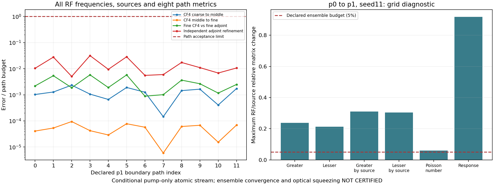

# Thermal Rb: p1/seed11 전체 경로 검증

2026-09-16. 같은 고정 캠페인에서 **12/12 경로 통과**.
새 계산 55개 + 기존 검증 계산 5개. CF4 3해상도·독립 adjoint 2해상도 유지.
실행·재개·합산·재사용 증명: [실행 계약](thermal_grid_execution.md).

## 원자 경로 결과

[배치 원본](thermal_campaign_v1/batch-p1-s11.json).
각 경로 원본: `thermal_campaign_v1/path-p1-s11-i0.json`부터 `i11.json`.
기존 `i1` 보고서와 5개 cache byte 보존. 과거 다른 캠페인의 p0 결과 재인증 없음.

| 비교 | 12경로·모든 RF/source/metric 중 최대 상대 오차 | 기존 기준 |
| --- | ---: | ---: |
| CF4 첫 refinement | 2.3432343998×10⁻⁶ | 10⁻³ |
| CF4 둘째 refinement | 9.4625991282×10⁻⁸ | 10⁻³ |
| Finest CF4 vs finest adjoint | 2.9056474397×10⁻⁸ | 5×10⁻⁶ |
| Adjoint 자체 refinement | 6.3306149866×10⁻⁸ | 2×10⁻⁶ |

물리 경로·전체 체류시간·파라미터·오차 기준 불변. 범위 0.194352–2.093448 μs.
RF 0.1 / 1 / 4 MHz. 8개 metric, named source별 비교. Dark floor 불변; clipping 없음.
Workers 4, 실제 BLAS 각 1 thread. 배치 내부 벽시계 3142.304초(52.37분).
이 시간은 해당 배치 측정값. 다른 실행 대비 가속률로 해석하지 않음.

## 전체 격자 합산

[P0 원본](thermal_campaign_v1/grid-p0-s11.json), [p1 원본](thermal_campaign_v1/grid-p1-s11.json).
전체 경로·5개 실제 계산의 오차를 재검증한 뒤 현재 경계 도착률로 합산.
두 격자 모두 네 위상 직접 가중합 검사 통과. 이 단계의 새 원자 solve **0회**.
보강한 [전체 cache 재검사](thermal_campaign_v1/batch-p1-s11-recheck.json)도 통과.
60 cache hit·새 solve 0회. 기존 경로 보고서 12개 모두 byte 보존.

| Seed11 격자 | 경로 | 경로 검증 cache hit | 독립 합산 최대 상대 오차 | Occupancy/$nV$ |
| --- | ---: | ---: | ---: | ---: |
| p0 | 6 | 30 | 1.9985759×10⁻¹⁶ | 0.6176750449 |
| p1 | 12 | 60 | 2.5656899×10⁻¹⁶ | 0.9454339913 |

독립 합산 검사는 finest cache를 경로마다 한 번 더 읽음. 새 solve로 세지 않음.
기존 source별 항·Poisson number·복소 응답 보존. Density는 도착률에 한 번만 포함.

## 실제 중첩 재사용·합산 항등식

[독립 비교 원본](thermal_campaign_v1/comparison-p0-p1-s11.json) **감사 통과**.
두 격자의 원본 cache와 경로 gate를 다시 계산해 보고서 내용과 대조. 새 solve 0회.

- 공통 6경로 × 5해상도 = **30개 동일 계산**. 8개 raw metric 모두 bitwise 동일.
- 도착률 정확히 절반. 5경로는 source 이름·target digest 변경; 첫 face의 index0은 동일.
- $S_{p1}=\frac12S_{p0}+S_{\rm new}$의 6개 stream metric 최대 상대 잔차 **2.9226954×10⁻¹⁶**.
- 반복 solve 생략의 수학적 조건, phase 평균과 Poisson 항 조건을 코드 주석·실행 계약에 보존.
- 비교 record SHA: `b0e2ec2adce3ff8fb6756880d5760dc26fe458e0a9bbc7f1ce13de7ce1fe5909`.

합산 항등식 통과와 아래의 격자 수렴 실패는 양립. 서로 다른 검사.

## p0→p1: 열적 수렴 미달

| Atomic stream metric | 최대 RF/source 상대 변화 | 5% 기준 |
| --- | ---: | --- |
| Greater | 23.7689333% | 미달 |
| Lesser | 21.3445228% | 미달 |
| Greater by source | 31.0898730% | 미달 |
| Lesser by source | 30.3483452% | 미달 |
| Poisson number | 6.0331180% | 미달 |
| Retarded response | 91.8609802% | 미달 |

개별 경로의 ODE 오차는 충분히 작음. 실제 열적 quadrature 변화는 아직 큼.
Occupancy/$nV$가 1에 가까워졌다는 이유로 spectrum 수렴을 선언할 수 없음.
누락 경로·도착률·density를 사후 재정규화하지 않음. 위 실패도 원본 결과로 보존.
두 격자·한 scramble뿐이므로 전체 ensemble gate의 자료 조건도 미충족.

왼쪽: 각 경로의 8metric 최대 오류/기준. 오른쪽: 두 전체 격자의 실제 변화.
재현: `python -m docs.grand_challenge.plot_thermal_grid P0.json P1.json NEW.png`.

## 소스·증거

- [고정 선언](thermal_campaign_v1/plan.json): record SHA `76e8da20c905cde8f64e4f2e7a704e194a58934e193692996c93cd7c6ab16bea`.
- [소스 ZIP](thermal_campaign_v1/sources.zip): SHA `db9e039c85ba7757d9402d76e4632a039e9a016253d105af7d24fc83da8b4f80`.
- Source identity: `a95cd29442281ca89733f5aaa38a449d2e7367b458a9a08e4aa789bbfdb7f6e0`.
- 배치 record SHA: `19e38fee55b341db76ece613e7ced0d0d873cc080dafdd1e3a2f08a016fc5f73`.
- 실행 제어 파일은 `thermal_campaign_v1/controllers/`에 원시 hash별 보존.
  긴 계산을 시작한 버전과 이후 보강한 재검사 버전 구분. 수치 소스는 동일 ZIP.

## 범위·후속

조건부 열린 경계·Gaussian pump-only reduced Rb의 원자 계산.
최종 gain·intensity-difference SQL·절대 실험 squeezing 예측 아님.
Fitted gain/noise 계수 도입 없음. 실험 −7.8 dB 재현 주장 없음.

다음: p2/seed11의 신규 12경로(60계산), 독립 seed211·811, 실제 전체 격자 수렴.
선언된 72고유 경로·360계산 중 현재 12경로·60계산 확보. 나머지 300계산 미수행.
현재 p0→p1 edge가 이미 실패. 선언된 p0·p1·p2만 채워도 마지막 두 refinement가 모두 통과할 수는 없음.
P2 이후 더 미세한 격자 확장이 필요. 별도 선언·증거 추가; 기존 plan·실패 보고서 불변.

코드: 새 검사 93개 통과. 최종 전체 **1816 passed / 3 skipped / 기존 문서 누락 1 failed**.
병렬 에이전트: 합산·중첩 비교 구현, 실행 제어 검토. 주 에이전트: 실제 계산·통합·최종 검사.
사용자 문서 한국어 caveman, AI 간 지시·검토 영어 유지.
