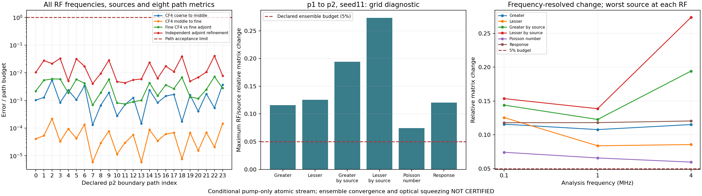

# Thermal Rb: p2/seed11·세 격자 감사

2026-09-17. 동일 고정 캠페인에서 **24/24 경로 통과**.
새 원자 계산 60개 + 기존 60개 재사용. 물리 입력·108개 수치 소스·오차 기준 불변.
[이전 p1 결과](thermal_campaign_grid_v1.md), [실행·재사용 계약](thermal_grid_execution.md).

## 경로 수치 결과

[배치 원본](thermal_campaign_v1/batch-p2-s11.json).
각 경로 원본: `thermal_campaign_v1/path-p2-s11-i0.json`부터 `i23.json`.
CF4 3해상도·독립 adjoint 2해상도, 8metric·모든 RF/source 비교.

| 비교 | 24경로 전체 최대 상대 오차 | 기존 기준 |
| --- | ---: | ---: |
| CF4 첫 refinement | 5.4666518800×10⁻⁶ | 10⁻³ |
| CF4 둘째 refinement | 2.1853663633×10⁻⁷ | 10⁻³ |
| Finest CF4 vs finest adjoint | 3.6110637229×10⁻⁸ | 5×10⁻⁶ |
| Adjoint 자체 refinement | 8.1742239425×10⁻⁸ | 2×10⁻⁶ |

전체 체류시간 0.064480–3.456680 μs. 경로 자르기·transit reset·허용오차 완화 없음.
Workers 4, 실제 native BLAS 각 1 thread. 배치 벽시계 5200.845초(86.68분).
동시 코드 검사 포함한 해당 실행 시간. P1과 작업·경로가 달라 가속률 비교 불가.

## 전체 격자 합산

모든 경로의 실제 cache·오차를 재검증한 뒤 현재 경계 도착률로 합산.
네 위상 직접 합산으로 source별 두 ordering·Poisson number·복소 response 재검사.
이 단계 새 원자 solve **0회**. Density 중복 적용·occupancy 재정규화 없음.

| Seed11 격자 | 경로 | 경로 검증 cache hit | 독립 합산 최대 상대 오차 | Occupancy/$nV$ |
| --- | ---: | ---: | ---: | ---: |
| [p0](thermal_campaign_v1/grid-p0-s11.json) | 6 | 30 | 1.9985759×10⁻¹⁶ | 0.6176750449 |
| [p1](thermal_campaign_v1/grid-p1-s11.json) | 12 | 60 | 2.5656899×10⁻¹⁶ | 0.9454339913 |
| [p2](thermal_campaign_v1/grid-p2-s11.json) | 24 | 120 | 3.6322346×10⁻¹⁶ | 0.8302268543 |

독립 합산 검사에서 finest cache를 경로마다 한 번 더 읽음. 새 solve로 세지 않음.

## 실제 격자 변화: 5% 기준 미달

| Atomic stream metric | p0→p1 최대 변화 | p1→p2 최대 변화 |
| --- | ---: | ---: |
| Greater | 23.7689333% | 11.5770001% |
| Lesser | 21.3445228% | 12.5557081% |
| Greater by source | 31.0898730% | 19.4164718% |
| Lesser by source | 30.3483452% | 27.3446495% |
| Poisson number | 6.0331180% | 7.4258737% |
| Retarded response | 91.8609802% | 12.0523494% |

P1→p2의 여섯 항목 모두 5% 초과. RF별 값도 0.1·1·4 MHz에서 기준 초과.
가장 큰 변화는 4 MHz의 source별 lesser 항, 27.3446495%.
작은 경로 수치 오차와 큰 격자 변화가 함께 존재. 현재 결과는 열적 quadrature 미수렴.
위 비율은 reference 격자에 대한 변화. 연속 열적 적분의 참오차 상계 아님.
Occupancy가 1에 가까운 격자만 선택하거나 가중치를 보정하지 않음.

각 RF에서 source 최대값 유지. Source 평균으로 실패를 숨기지 않음.
재현: `python -m docs.grand_challenge.plot_thermal_grid P1.json P2.json NEW.png`.

## 중첩 재사용·선언 전체 감사

[세 격자 감사 원본](thermal_campaign_v1/ensemble-seed11-p0-p2.json): **audit 통과**.
세 보고서의 cache·경로 오차·독립 합산을 재구성. 새 solve 0회.

- 선언 9격자 중 3격자 검증. Seed211·811의 p0·p1·p2, 총 6격자 누락.
- 실제 전체 gate는 독립 seed 미충족으로 false. 미수행 scramble 비교를 만들어 넣지 않음.
- 별도 실제 refinement 진단은 2/2 실패. 자료 부족과 실제 5% 초과를 함께 기록.
- `thermal_ensemble_converged=false`, `physical_optical_prediction=false`.
- 실행 제어·두 helper 원시 byte 보존. 고정 수치 모듈 62개의 실제 import 출처 확인.
- 감사 record SHA: `3e83c70b420dc41dad949ce14768a8b5d076371ec01fca5e82708a9da422c0a9`.

[중첩 비교 원본](thermal_campaign_v1/comparison-p1-p2-s11.json)도 **audit 통과**.
공통 12경로 × 5해상도 = 60계산의 8개 raw metric 모두 bitwise 동일.
현재 격자에서 source 이름·target digest 10경로 재결합. 도착률은 정확히 절반.

$$S_{p2}=\tfrac12S_{p1}+S_{\rm new}$$

6개 stream metric의 최대 상대 잔차 **3.5153255×10⁻¹⁶** < 독립 합산 기준 $10^{-10}$.
재사용·가중합 일관성 검사 통과. 위 열적 수렴 실패와 모순 없음. 새 solve 0회.
동일 미가중 방정식의 반복 solve 생략 근거는 실행 코드 주석·계약에 유지.
비교 record SHA: `73fb112cbaec12f17a013eb1650ec207f1d5a7cafc48e07399a59704c4540b22`.

## 범위·후속

조건부 열린 정사각 기둥·Gaussian pump-only·reduced Rb 원자 stream.
실제 cell 형상·입사 pump history, finite seed, nonlocal Maxwell, full atom, 검출 SQL은 후속.
Gain·절대 intensity-difference squeezing·실험 −7.8 dB 재현은 **미인증**.
Fitted gain/noise 계수 도입 없음. 초기 plan·ZIP·기존 보고서·cache 79파일 byte 보존.

선언된 72고유 경로·360계산 중 24경로·120계산 검증. Seed211·811의 240계산 남음.
P0→p1과 p1→p2 모두 실패. P3만 추가해도 마지막 두 edge 중 p1→p2가 남으므로 통과 불가.
더 미세한 두 edge(p2→p3, p3→p4 등)와 독립 scramble을 별도 선언·실행해야 함.
이 격자들도 통과를 보장하지 않음. 기존 plan·실패 보고서 불변.

후속 성능 후보: 경로별 refinement 사다리, 상수 대수 사전 계산.
[이미 적용된 최적화·검증 의무](thermal_grid_execution.md) 구분. 구현·가속률 실측 전.

## 코드 검사

새 선언 전체 감사 전용 **37검사 통과**. 독립 검토 후 subprocess 실패 원인 검사를 보강하고 재통과.
전체 `python -m pytest -q`: **1853 passed / 3 skipped / 1 failed**, 486.90초.
유일 실패: 기존 삭제된 `FWM_physics.tex` 참조. Skip: Windows symlink 권한 3건.
병렬 에이전트: 감사 구현·독립 검토·후속 수치 개선 검토. 사용자 MD 한국어 caveman 유지.
