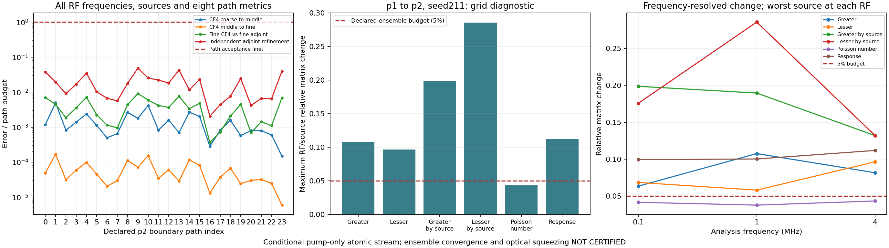
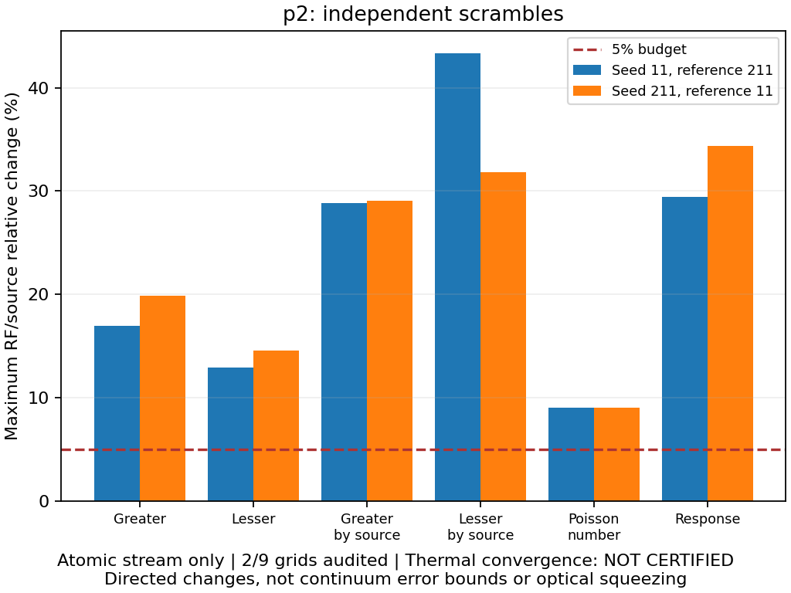

# Thermal Rb: p2 독립 seed211 검증

2026-09-18. **24/24 경로 통과**, 새 원자 계산60개·기존60개 재사용.
[이전 seed211·격자 확장](thermal_campaign_seed211_v1.md), [실행 계약](thermal_grid_execution.md).
새 선언 v2에서 두 p2 격자 확보. 전체 열적 수렴·절대 squeezing **미인증**.

## 실제 경로 계산·합산

[배치](thermal_campaign_v2/batch-p2-s211.json), [p2 합산](thermal_campaign_v2/grid-p2-s211.json).
같은 소스108개·모델·CF4 세 해상도·독립 adjoint 두 해상도·기존 예산 유지.
모든 RF/source·8metric 검사. Workers4·실제 BLAS1. 배치 5406.050초(90.10분).
동시 코드 검사 포함한 실측시간. 다른 경로 배치 대비 가속률 아님.

| 비교 | 새12경로 최대 상대 오차 | 전체24경로 최대 | 기준 |
| --- | ---: | ---: | ---: |
| CF4 첫 refinement | 4.129467737e-06 | 4.930357867e-06 | 10⁻³ |
| CF4 둘째 refinement | 1.528458736e-07 | 1.688445265e-07 | 10⁻³ |
| Finest CF4 vs finest adjoint | 3.399725003e-08 | 4.536967564e-08 | 5×10⁻⁶ |
| Adjoint 자체 refinement | 7.838115532e-08 | 9.61860556e-08 | 2×10⁻⁶ |

체류시간 0.021481–2.674432 μs, RF0.1·1·4 MHz. 전체 경로 유지.
합산: 120cache hit·0miss, 새 solve0회. 네 위상 직접 가중합 최대 상대 잔차 3.136425967e-16 <10⁻¹⁰.
독립 합산은 finest packet을 경로마다 한 번 더 읽음.
Occupancy/nV: p1 1.3845462923 → p2 1.1102815979.
Density·occupancy 재정규화 없음.

## 격자 변화·독립 seed

[p1→p2 선언 간 비교](thermal_campaign_v2/comparison-v1-p1-v2-p2-s211.json),
[v2 두 격자 공동 감사](thermal_campaign_v2/ensemble-p2-seeds11-211.json). 모두 audit 통과, 새 solve0회.
표는 RF/source 최대 상대 변화. `평가/기준` 두 방향 유지.

| Metric | seed211 p1→p2 | p2: 211/11 | p2: 11/211 |
| --- | ---: | ---: | ---: |
| Greater | 10.7568598% | 19.9038374% | 16.9536975% |
| Lesser | 9.6425067% | 14.5994559% | 12.8928026% |
| Greater by source | 19.8743195% | 29.0302228% | 28.8134244% |
| Lesser by source | 28.5824261% | 31.8499195% | 43.3337078% |
| Poisson number | 4.3315760% | 9.0633142% | 9.0633142% |
| Retarded response | 11.1799309% | 34.3654332% | 29.4280754% |

P1→p2: 6항목 중 5항목 최대값이5% 초과.
독립 seed 양방향 판정: 0/2통과.
상대 변화는 참 열적 적분 오차 상계 아님. 독립 Sobol seed는 실험 Δ·δ·T·pump power out-of-sample 검증 아님.
분모: `max(기준 행렬의 Frobenius norm, 128 ε × SI scale)`.
SI scale은 refinement에서 coarse 격자, scramble에서 평가 격자 값 사용.
Source 평균으로 실패를 숨기지 않음. RF별 값은 그림 보존.

공동 감사는 선언9격자 중2검증·7누락. V2 내부에서 검증된 refinement edge는 아직 없음.
V1 p1→v2 p2 진단을 v2의 필수 p2→p3·p3→p4 검증으로 세지 않음.
전체 gate false. 기존 v1 선언·실패 기록 유지.

## 선언 간 정확한 재사용

새 `tools/thermal_campaign_cross_compare.py`: 부모·자식 각각 자기 ZIP·선언·marker에서 원본 재검증.
직접 확장 관계, 동일 source·모델·환경·solver·예산 확인. 양쪽 저장소 별도 읽기.
같은 ODE의 반복 solve 불필요하다는 수학적 판정은 코드 주석에 유지.
현재 경로 source·digest·도착률·경로 gate·가중합 재구성. 과거 pass label 복사 없음.

공통 12경로×5해상도=60계산: key·record SHA·payload digest·raw8metric 동일.
Source/digest 10경로 재결합. 도착률 정확히 절반.
`S_p2 = 0.5*S_p1 + 신규 경로 기여`: 최대 상대 잔차 4.714798084e-16 <10⁻¹⁰.
입력·cache·ZIP·소스·제어 파일 변경 및 기존 출력 덮어쓰기 거부.
그림도 두 원본의 raw hash·record SHA·선언·선택 격자와 감사 연결 검사. 과학적 판정 새로 부여하지 않음.

## 남은 범위·검사

V2: 48고유 물리 경로·240원자 계산 확보. 전체1440요청 중1200미수행.
다음 p2/seed811: 24경로·120계산. 이후 p3 추가360계산, p4 추가720계산.
P4에서도 수렴 보장 없음. 허용오차·실패 기록 유지.

조건부 열린 정사각 기둥·Gaussian pump-only·reduced Rb 원자 stream.
실제 cell·입사 pump history, finite seed, nonlocal Maxwell, full atom, 검출 SQL 후속.
Gain·절대 S₋(Ω)·실험 −7.8 dB 예측 미인증. Fitted coefficient 미도입.

선언 간 비교 전용 52검사 포함. Synthetic 검사와 실제 native 원본 감사 구분.
전체 `python -m pytest -q`: **1942 passed / 3 skipped / 1 failed, 1079.41초**.
기존 삭제 `FWM_physics.tex` 참조 실패. Windows symlink 권한 skip3건.
병렬 구현·독립 검토. AI 간 영어, 사용자 MD 한국어 caveman 유지.

최종 무결성: 봉인 JSON515개·제어 파일10개·내장 제어4개·두 ZIP의 각108소스 검사 통과.
기존 증거436파일 byte·스테이징 보존. 문서 변경 범위·새 링크8개·체크리스트 경로9개 확인.
부모·자식 실제 import 수치모듈 각각62개 확인. 임시 source capsule 정리 완료.
