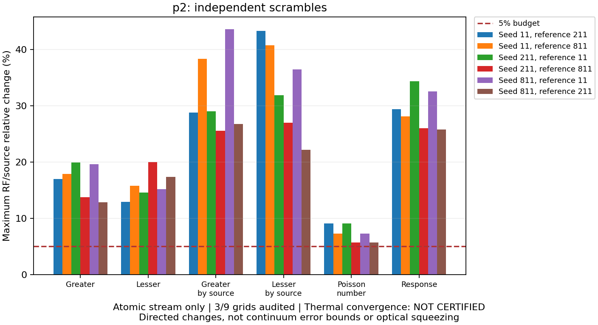

# Thermal Rb: p2 세 독립 seed 검증

2026-09-18. **Seed811 24/24경로 통과**, 새 원자 계산120개.
[이전 seed211](thermal_campaign_p2_seed211_v2.md), [실행 계약](thermal_grid_execution.md).
P2의 세 seed 확보. 전체 열적 수렴·절대 squeezing **미인증**.

## 실제 경로 계산·합산

[배치](thermal_campaign_v2/batch-p2-s811.json), [p2 합산](thermal_campaign_v2/grid-p2-s811.json).
같은 소스108개·모델·CF4 세 해상도·독립 adjoint 두 해상도·오차 예산 유지.
24경로 모두 신규. 모든 RF/source·8metric 검사. Workers4·실제 BLAS1.
배치 7905.752초(131.76분). 동시 회귀 검사 포함한 실측시간; 가속률 아님.
체류시간 0.038039–2.699118 μs, RF0.1·1·4 MHz. 전체 경로 유지.

| 비교 | 24경로 최대 상대 오차 | 기준 |
| --- | ---: | ---: |
| CF4 첫 refinement | 5.347181278e-06 | 10⁻³ |
| CF4 둘째 refinement | 2.134578321e-07 | 10⁻³ |
| Finest CF4 vs finest adjoint | 6.080018905e-08 | 5×10⁻⁶ |
| Adjoint 자체 refinement | 1.384995198e-07 | 2×10⁻⁶ |

합산: 120cache hit·0miss, 새 solve0회.
네 위상 직접 가중합 최대 상대 잔차 4.528539686e-16 <10⁻¹⁰.
Finest packet은 독립 합산에서 경로마다 추가 읽기. Density·occupancy 재정규화 없음.
Occupancy/nV: seed11 0.8302268543, seed211 1.1102815979, seed811 0.8561468387.

## 세 seed 공동 감사

[공동 감사 원본](thermal_campaign_v2/ensemble-p2-three-seeds.json).
각 격자의 실제 cache·경로 gate·직접 합산 재검증. 새 solve0회.
세 seed의 여섯 방향 모두 보존. 표 열 `평가 seed/기준 seed`, 값은 RF/source 최대 상대 행렬 변화.

| Metric | 11/211 | 11/811 | 211/11 | 211/811 | 811/11 | 811/211 |
| --- | ---: | ---: | ---: | ---: | ---: | ---: |
| Greater | 16.953697% | 17.922663% | 19.903837% | 13.766748% | 19.648388% | 12.855334% |
| Lesser | 12.892803% | 15.798537% | 14.599456% | 19.964448% | 15.160312% | 17.365769% |
| Greater by source | 28.813424% | 38.316474% | 29.030223% | 25.564178% | 43.610952% | 26.797728% |
| Lesser by source | 43.333708% | 40.764204% | 31.849920% | 26.957206% | 36.472024% | 22.167302% |
| Poisson number | 9.063314% | 7.273966% | 9.063314% | 5.699655% | 7.273966% | 5.699655% |
| Retarded response | 29.428075% | 28.085533% | 34.365433% | 25.978400% | 32.560675% | 25.784111% |

5% 기준: **0/6방향 통과**. Metric 최대값 범위 5.699655–43.610952%.
각 방향은 여섯 metric 모두 기준 이하여야 통과. 일부 RF의 통과와 방향 전체 통과 구분.
분모 `max(기준 행렬의 Frobenius norm, 128 ε × 평가 격자 SI scale)`.
RF별 source 최대값 유지; source 평균·seed 평균으로 실패를 숨기지 않음.
원본 복소 행렬에서 여섯 방향×여섯 metric을 독립 재계산, 공동 감사 값과 정확히 일치.

선언9격자 중3검증·6누락. P3·p4의 세 seed가 각각 남음.
V2 내부에서 검증된 refinement edge는 아직0개. 전체 gate false.
P2 독립 seed 검증만으로 필수 p2→p3·p3→p4 검사 대체 불가.
상대 변화는 참 열적 적분 오차 상계 아님. 독립 Sobol seed는 실험 Δ·δ·T·pump power out-of-sample 검증 아님.
현재 차이만으로 누락 physics를 확정하지 않음; 열적 quadrature 수렴 검증 계속.

## 정확한 재사용·남은 범위

같은 source·모델·물리 경로·solver·환경의 미가중 ODE 해만 재사용.
Sobol 번호·도착률은 단일 원자 방정식 밖. 현재 도착률·source·digest·오차 gate·합산은 재검증.
Pump-only 네 위상 평균의 정확성 및 반복 solve 생략 근거는 기존 코드 주석 유지.
이번 합산·공동 감사에서 원자 ODE 반복 solve 없음.

V2: 72고유 경로·360원자 계산 확보. 전체1440요청 중1080미수행.
다음 p3/seed11: 48경로, 기존120계산 재검증·신규120계산.
P3 전체 추가360계산, p4 전체 추가720계산. 더 미세한 격자도 수렴 보장 없음.
V1 선언·캐시·실패/누락 기록, v2의 과거 증거 보존.

조건부 열린 정사각 기둥·Gaussian pump-only·reduced Rb 원자 stream.
실제 cell·입사 pump history, finite seed, nonlocal Maxwell, full atom, 검출 SQL 후속.
Gain·절대 S₋(Ω)·실험 −7.8 dB 예측 미인증. Fitted coefficient 미도입.

## 코드·검사

병렬 작업: 비교 그림의 여섯 방향 범례를 그림 밖 배치, 패널 폭 확대.
표시 배치만 변경. 수치 소스·검증 조건 불변. 기존 두 방향 그림 배치 유지.
Synthetic 그림·값·거부 조건·독점 출력 검사와 실제 세 seed 그림 확인 구분.
전체 `python -m pytest -q`: **1942 passed / 3 skipped / 1 failed, 946.00초**.
유일 실패: 기존 삭제 `FWM_physics.tex` 참조. Windows symlink 권한 skip3건.
AI 간 영어·사용자 MD 한국어 caveman 유지. Commit·push 없음.

최종 무결성: 기존 증거527파일 byte·스테이징 보존. 봉인 JSON662개·제어 파일10개·내장 제어4개 검증.
두 ZIP의 각108소스·새 문서 링크6개 확인. 실제 import 수치모듈62개 확인, 임시 source capsule 정리 완료.
