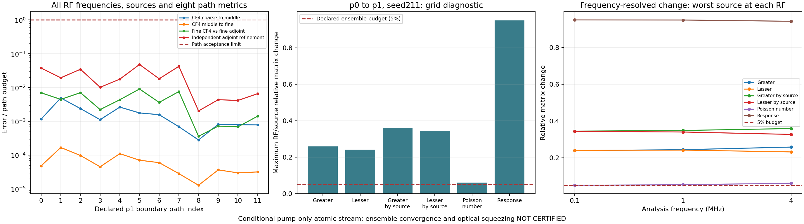
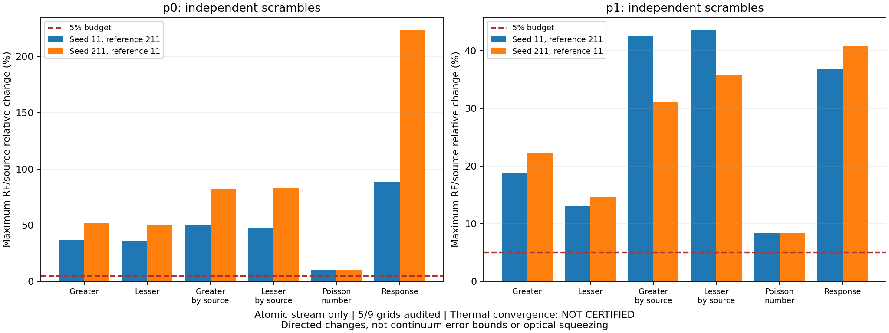

# Thermal Rb: 독립 seed211·격자 확장

2026-09-17. **12/12 경로 통과**, 새 원자 계산 60개 완료.
P0·p1 합산 및 seed11과의 공동 감사 완료. 열적 수렴은 **미달**.
[이전 p2/seed11](thermal_campaign_grid_v2.md), [실행·수학적 재사용 계약](thermal_grid_execution.md).

## 실제 경로 검증

[배치 원본](thermal_campaign_v1/batch-p1-s211.json). 기존 소스 108개·모델·오차 기준 유지.
CF4 3해상도·독립 adjoint 2해상도, 8metric·모든 RF/source 비교.

| 비교 | 12경로 최대 상대 오차 | 기준 |
| --- | ---: | ---: |
| CF4 첫 refinement | 4.930357867e-06 | 10⁻³ |
| CF4 둘째 refinement | 1.688445265e-07 | 10⁻³ |
| Finest CF4 vs finest adjoint | 4.536967564e-08 | 5×10⁻⁶ |
| Adjoint 자체 refinement | 9.61860556e-08 | 2×10⁻⁶ |

체류시간 0.021481–2.674432 μs. RF 0.1·1·4 MHz. 전체 경로 유지.
Workers4·실제 BLAS1. 배치 5200.417초(86.67분).
동시 코드 검사 포함. 다른 경로 배치와의 가속률 비교 아님.

## 두 격자 합산·refinement

[P0](thermal_campaign_v1/grid-p0-s211.json), [p1](thermal_campaign_v1/grid-p1-s211.json).
모든 cache·경로 gate 재검사, 네 위상 직접 가중합 대조. 새 solve 0회.

| 격자 | 경로 | 경로 검증 cache hit | 독립 합산 최대 상대 오차 | Occupancy/nV |
| --- | ---: | ---: | ---: | ---: |
| p0 | 6 | 30 | 1.747217496e-16 | 1.3794886415 |
| p1 | 12 | 60 | 2.136374517e-16 | 1.3845462923 |

독립 합산에서 finest cache를 경로마다 한 번 더 읽음. Density·occupancy 재정규화 없음.

| Atomic stream metric | p0→p1 최대 변화 |
| --- | ---: |
| Greater | 25.7886789% |
| Lesser | 24.1358287% |
| Greater by source | 35.8861405% |
| Lesser by source | 34.3729010% |
| Poisson number | 6.0708157% |
| Retarded response | 95.0857300% |

여섯 항목의 RF/source 최대값 모두 5% 초과. Occupancy 변화는 약 0.367%여도 spectrum 수렴 아님.
RF별 값은 그림 유지. Poisson 0.1 MHz의 약 4.958% 통과만으로 전체 통과 처리하지 않음.
상대 격자 변화는 참 열적 적분 오차의 상계 아님.

[중첩 비교 원본](thermal_campaign_v1/comparison-p0-p1-s211.json): audit 통과.
공통 6경로×5해상도=30계산 재사용. Raw 8metric 동일, source/digest 5경로 재결합.
`S_p1 = 0.5*S_p0 + 신규 경로 기여`: 최대 상대 잔차 3.247550639e-16 < 10⁻¹⁰.
새 solve 0회. 재사용 일관성 통과와 격자 수렴 실패는 별도 판정.

## 독립 seed 비교

[다섯 격자 공동 감사](thermal_campaign_v1/ensemble-seeds11-211-five-grids.json): **audit 통과**.
원본 cache·오차·가중합 재구성, 새 solve 0회. 선언 9격자 중 5검증·4누락.
누락: p2/seed211, p0·p1·p2/seed811. 전체 gate false 유지.
실제 refinement 3개와 양방향 scramble 4개도 모두 5% 기준 초과.

`평가/기준`: 기준 행렬 norm과 기존 SI dark floor를 분모로 사용. Floor scale은 평가 격자.
양방향 모두 기록. Source 평균으로 실패를 숨기지 않음.

| Metric | p0: 211/11 | p0: 11/211 | p1: 211/11 | p1: 11/211 |
| --- | ---: | ---: | ---: | ---: |
| Greater | 51.7501073% | 36.7038104% | 22.2304774% | 18.8222618% |
| Lesser | 50.5551615% | 36.3863572% | 14.5819886% | 13.1871700% |
| Greater by source | 81.9325919% | 49.7078534% | 31.1768950% | 42.6683905% |
| Lesser by source | 83.1138500% | 47.5772101% | 35.9109786% | 43.6298751% |
| Poisson number | 9.8758080% | 9.8758080% | 8.3435827% | 8.3435827% |
| Retarded response | 223.6997939% | 88.5902401% | 40.7932567% | 36.8226240% |

P1에서도 8.34–43.63%. 독립 seed는 열적 quadrature 검사; 다른 Δ·δ·T·pump power 실험의 out-of-sample 검증 아님.

## 새 p2·p3·p4 선언·실제 이전

[새 계획](thermal_campaign_v2/plan.json), [이전 원본](thermal_campaign_v2/transfer.json).
기존 세 seed 유지. 9격자·504경로 항목·288고유 경로·1440고유 계산 요청.
V1의 기존 180원자 계산을 **원본 byte 그대로 이전**. 추가 원자 solve **0회**.
복사본을 새 계산으로 중복 집계하지 않음. 누락 1260요청 명시. 수렴 통과 보장 없음.

부모 ZIP의 실제 코드로 선언 생성. 새 선언에 묶인 두 번째 capsule에서 재검증.
소스 ZIP·모델·환경·solver·예산 동일. 현재 앱 코드 혼입·과거 path/grid 통과 판정 이전 없음.
새 폴더 검증 후 독점 공개. 반복 solve 생략의 수학적 근거는 제어 코드 주석에 명시.

[새 선언의 p2/seed11 감사](thermal_campaign_v2/grid-p2-s11.json): 24경로·120 cache hit·0miss, 전체 통과.
현재 경로 gate·가중합 새로 구성. 이전 p2의 8개 spectrum과 canonical JSON byte 동일.
공통 120계산의 key·record SHA·payload digest도 동일. 새 solve 0회.
Spectrum canonical SHA: `42739582c12010f480ae9181277d948f9221f262b519bb60c44c4539a664b7e5`.

계획 SHA: `381a3ef851045003c35222f2d26ab793b876aa94c7b936e790e146872191ee52`.
이전 SHA: `4fe30264e505035280822f5089bc6ac7607003f858e23f953f47720d852b324f`.
새 grid SHA: `47820de8ad900b5bd76a592c80bd8e7f7bf7c0e479fcdeb36531fe49c778e8b2`.

실제 DriveFS 이전에서 `st_nlink=0` 발견. 초기 검사는 정상 파일 거부, 새 대상 공개 전 중단.
링크 수 미지원 0과 정상 1 허용; 다중 링크·symlink·비정규 파일 거부 유지.
독립 새 파일 복사·원시 byte·native 계산 증거·capsule 검증 유지. 관련 6회귀 검사 통과.

## 범위·후속·검사

조건부 열린 정사각 기둥·Gaussian pump-only·reduced Rb 원자 stream.
실제 cell 형상·입사 pump history, finite seed, nonlocal Maxwell, full atom, 검출 SQL은 후속.
Gain·절대 intensity-difference squeezing·실험 −7.8 dB 재현 **미인증**. Fitted 계수 도입 없음.

V1: 36고유 경로·180계산 검증, 선언상 180요청 미수행. 기존 실패·누락 기록 유지.
후속 계산은 v2에서 수행 가능: p2/seed211 잔여 60요청, p2/seed811 120요청.
그 뒤 p3 추가 360요청·p4 추가 720요청 및 독립 seed 수렴 검사. 기준 변경 없음.

확장 도구 전용 37검사 포함. Synthetic unit test와 실제 180개 native 이전 검증 구분.
전체 `python -m pytest -q`: **1890 passed / 3 skipped / 1 failed**, 858.11초.
유일 실패: 기존 삭제 `FWM_physics.tex` 참조. Skip: Windows symlink 권한 3건.
병렬 에이전트 구현·독립 검토, main 실제 계산·이전·공동 감사 수행. 사용자 MD 한국어 caveman 유지.

최종 무결성: 봉인 JSON427개·제어 파일7개·두 source ZIP 검사 통과.
기존173파일 byte·스테이징 보존. 임시 source capsule·이전 staging 폴더 정리 완료.
