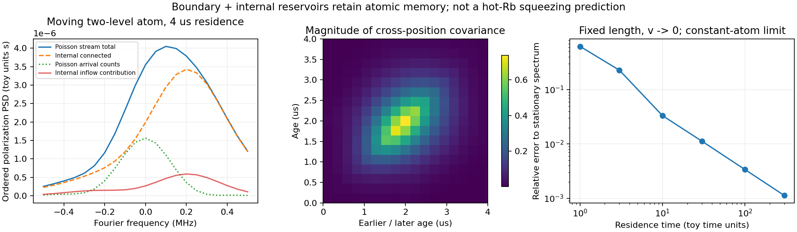

# S1 — 원자 characteristic 수송과 경계·구간 간 잡음

2026-09-11. [공통 모듈](../../gabes/quantum/transport.py), [독립 full-density QRT](../../analysis/grand_challenge/reference/transport_qrt.py), [최종 보고서](s1_transport_report_v2.json), [별도 passive optical 검산](ballistic_linear_channel.md).

이전 stationary-center field에서 생략할 수 없다고 확인한 **원자 이동, 유입 상태의 잡음, 서로 다른 위치의 상관**을 유한 궤적에서 함께 계산한다. 현재 구현은 prescribed path/drive의 finite-dimensional atom과 별도의 정확한 passive oscillator 광장 예제다. Moving Rb double-Λ와 self-consistent Maxwell propagation을 닫은 계산은 아직 아니다. 기존 stationary-center/kinetic guard는 유지한다.

## 범위와 최근 문헌

2026년 8월 Yuan 등의 [Liouville–transport 논문](https://arxiv.org/html/2608.15130v1)은 finite-mode ballistic motion, 내부 상태와 boundary renewal을 함께 다루고 Cs D2 noise와 비교한다. 논문은 공통 scale factor를 사용한 비교와 longitudinal propagation의 생략을 명시한다. 이 문헌을 hot-Rb FWM의 no-fit quantum squeezing 검증으로 간주하지 않는다. 수송 자체가 선행 연구에 없다는 주장도 하지 않는다.

[Jiang·Mei·Du의 Langevin 이론](https://arxiv.org/abs/2301.11993)은 phase-conjugated fields의 commutator 보존을 다루는 배경이다. 아래에서는 atomic noise를 explicit jump products에서, boundary noise를 실제 유입 density matrix에서 각각 계산한다. Commutator의 결함을 noise coefficient로 바꾸지 않는다. 두 논문이 이번 구현이나 수치를 검증한 것은 아니다.

## 하나의 원자가 여러 구간을 통과한다

Age a∈[0,τ]와 실제 궤적

\[
\mathbf r(a)=\mathbf r_{\rm in}+\mathbf v a
\]

를 선언한다. `BallisticPath`는 entry position, velocity, residence time과 출처를 요구한다. Hamiltonian callback은 age와 위치를 모두 받아 spatial profile·phase를 따라 달라질 수 있다. Jumps는 현재 구현에서 상수이며 명시적인 Lindblad operators다. Zero velocity도 유한 관측 시간의 대조군으로 허용한다.

\[
\frac{d\rho}{da}=\mathcal L(a)\rho,\qquad\rho(0)=\rho_{\rm in}.
\]

ρ_in은 Hermitian, trace-one, PSD여야 한다. 궤적을 수치 구간으로 나누어도 상태를 다시 준비하지 않는다. `transit/reset` jump가 있다면 별도로 정한 내부 bath다. 실제 경계 통과를 이미 모델링하면서 같은 통과를 또 하나의 phenomenological reset rate로 넣지 않는다.

Complete traceless Hermitian basis F_i의 평균 μ_i와 ordered connected covariance는

\[
C_{ij}(a)=\mathrm{Tr}[F_iF_j\rho(a)]-\mu_i(a)\mu_j(a),\qquad
K=C-C^T.
\]

Liouvillian에서 homogeneous drift A(a)를 독립적으로 투영하고, 각 reservoir r의 noise는

\[
D^{(r)}_{ij}(a)=\mathrm{Tr}\{\rho(a)[L_r^\dagger,F_i][F_j,L_r]\}
\]

로 구한다. 이 완전 basis의 two-point equations는

\[
\dot C=AC+CA^T+\sum_rD^{(r)},\qquad
\dot K=AK+KA^T+\sum_r(D^{(r)}-D^{(r)T}).
\]

Finite atom을 Gaussian boson으로 선언하지 않는다. 가정한 GKSL/Markov regression의 second moments를 계산하며 higher-order cumulants를 닫지 않는다.

## 유입 상태와 내부 jumps의 분해

R(a,s)는 ∂_aR=A(a)R, R(s,s)=I를 만족한다. 같은 원자의 two-time covariance는 a≥b에서

\[
\begin{split}
C(a,b)={}&R(a,0)C_{\rm in}R(b,0)^T\\
&+\sum_r\int_0^{b} R(a,s)D^{(r)}(s)R(b,s)^T\,ds.
\end{split}
\]

첫 항은 boundary state의 내부 불확도다. 두 번째 항은 두 위치가 공유하는 과거 jump history다. 따라서 microscopic increments f(a)는 white여도, 그 원자가 다른 위치에서 만드는 polarization은 독립이 아니다. a<b인 반대 순서는 Hermitian partner로 얻는다. Lesser ordering은 C_in와 D의 atomic-index transpose를 쓰며 모든 profile의 complex conjugation을 유지한다.

구현은 각 구간의 R을 따로 구하고 순서대로 곱한다. `R(a,0) @ inv(R(b,0))`처럼 오래 감쇠한 행렬을 역산하지 않는다. 이 semigroup composition은 정확한 항등식이다. Constant jumps의 product matrices도 한 번 계산해 재사용한다. 두 최적화 모두 수학적 이유를 주석으로 남겼다.

`covariance_by_source`의 첫 항은 inflow, 나머지는 reservoir별 기여다. 각 source는 0 또는 초기 C_in에서 출발하여 같은 homogeneous equation을 따른다. 그 합이 density matrix에서 직접 구한 C(a), K(a)와 맞는지 검사한다. `two_time_covariance`는 실제 readout operator를 투영한 cross-position matrix를 반환한다.

## 지연 응답 kernel

작은 구동 δH/ℏ=V_j(a)ε_j exp(−iΩa)에 대해

\[
B_{ij}(a)=-i\,\mathrm{Tr}\{F_i[V_j(a),\rho(a)]\}.
\]

Readout operator O_p(a)의 fluctuation coefficient를 C_out,pi=Tr[O_pF_i]라 쓰면

\[
\mathcal R_{pj}(a,b)=\Theta(a-b)\,C_{{\rm out},p}(a)R(a,b)B_j(b).
\]

`retarded_kernel`은 이 sampled causal kernel을 반환한다. 이는 atomic polarization response이며 field의 local M(z,Ω)가 아니다. a=b 값은 right limit이고 연속 적분에서 단일 대각선은 zero measure다. 이후 Maxwell 연결에서는 해당 궤적의 위치와 실제 optical coupling으로 공간 kernel을 조립해야 한다.

주파수별 적분 응답은 q=e^{iΩa}δF에서

\[
\dot q=(A+i\Omega I)q+B,\quad q(0)=0,\qquad
\chi(\Omega)=\int_0^\tau C_{\rm out}(a)q(a)\,da
\]

로 얻는다. M이나 D를 fitted response에 맞추지 않는다. DC에서는 실제 nonlinear mean pulse를 외부 구동으로 ±ε 변형한 독립 finite difference와 비교한다.

## 전체 two-time 적분을 보존하는 readout

한 원자의 유한 wavepacket은

\[
Y_p(\Omega)=\int_0^\tau e^{i\Omega a}O_p(a)\,da.
\]

Connected covariance의 double integral을 diagonal a=b만 남겨 근사하지 않는다. 대신 X=(δF,Y/τ)를 augmented variable로 두고

\[
\mathcal A_\Omega(a)=
\begin{pmatrix}A(a)&0\\e^{i\Omega a}C_{\rm out}(a)/\tau&0\end{pmatrix},\qquad
\mathcal D_r=\begin{pmatrix}D_r&0\\0&0\end{pmatrix}
\]

에 대해 Ṗ_r=𝒜P_r+P_r𝒜†+𝒟_r를 적분한다. Boundary의 초기 upper block만 C_in이고 모든 Y block은 0이다. 마지막 YY block에 τ²를 곱하면 전체 양 ordering wavepacket covariance가 된다. q와 평균도 같은 trajectory에서 적분한다.

Y 대신 Y/τ를 적분하는 것은 정확한 단위 변환이다. Microsecond pulse의 실제 covariance가 10⁻¹² s² 정도일 때 dimensionless absolute ODE tolerance가 그 항을 무시하지 않게 한다. Seconds와 rescaled unit-time 문제를 독립적으로 다시 풀어 τ 및 τ² 환산이 일치하는 검사도 있다.

Readout O에는 identity 성분도 허용된다. 이는 한 원자의 connected internal noise에는 기여하지 않지만, 원자 수가 변하는 stream에서는 중요하다. Trace-free basis로 noise를 계산한다고 O의 identity mean을 삭제하지 않는다.

## Poisson 유입과 원자 수 잡음

동일한 age protocol을 겪는 원자들이 rate J로 독립 Poisson 유입한다고 **명시적으로 가정**하면 Campbell spectrum은

\[
S^{>,<}_{\rm beam}(\Omega)=J\left[\mathcal C^{>,<}_{Y}(\Omega)
+\bar Y(\Omega)\bar Y(\Omega)^\dagger\right],\qquad\bar N=J\tau.
\]

추가 항은 Poisson arrival statistics에서 정해지며 arbitrary excess-noise 계수가 아니다. 양 ordering에 똑같이 들어가므로 commutator에는 기여하지 않는다. `poisson_beam_spectrum`은 내부 기여와 number 기여를 별도로 반환한다. J, path distribution 또는 boundary state를 target squeezing으로 정하지 않는다. 실제 density/velocity/geometry에서 이를 정하는 후속 작업이 필요하다.

이때 protocol의 stationarity가 중요하다. Lab time에 주기적으로 구동되는 double-Λ에 모든 원자가 같은 입사 위상으로 들어온다고 가정할 수 없다. 그 경우 entry-phase average와 flux-weighted velocity/path ensemble을 먼저 구성해야 한다. 현재 Poisson helper를 그대로 적용해 CW thermal FWM 결과라고 부르지 않는다.

O=I이면 internal covariance는 정확히 0이지만 finite rectangular atom pulse의 Poisson number spectrum은 J|∫exp(iΩa)da|²다. 이 대조군으로 내부 상태 잡음과 원자 수 잡음을 구분한다. PSD는 two-sided Fourier convention S(Ω)=∫dτ exp(iΩτ)C(τ)이며 optical SQL, one-sided detector PSD나 squeezing dB로 환산하지 않는다.

## 독립 reference와 수렴 결과

Full-density reference는 production의 A,D, propagated covariance를 받지 않는다. 실제 ρ(a)를 별도로 적분하고, a≥b의 QRT source `(O_k†−⟨O_k†⟩)ρ` 또는 그 reversed product를 Liouvillian으로 전파한다. Positive-time triangle의 적분에 Hermitian partner를 더한다. 구동 응답도 full density commutator에서 직접 계산한다.

Main fixture는 entry r=(−300,0,0) µm, v=(150,0,100) m/s, τ=4 µs의 synthetic 2준위 원자다. Decay/reset rates는 각각 2π×120/20 kHz, detuning은 2π×170 kHz, peak Rabi는 2π×220 kHz다. Gaussian envelope와 spatial phase가 궤적상에서 달라지며 두 complex readout profiles도 서로 다르다. 이 수치들은 Rb constants나 측정 장치가 아니다. 내부 reset bath와 boundary renewal을 구분한다.

| 검증 | 결과 |
|---|---:|
| Density에서 직접 구한 C와 source 합 | 1.25×10⁻¹⁴ 상대 오차 |
| 같은 방식의 atomic K | 3.80×10⁻¹⁶ 상대 오차 |
| 독립 QRT greater/lesser | 최대 1.77×10⁻¹³ |
| 독립 driven response | 3.42×10⁻¹⁴ |
| Reference ODE refinement 최대 | 2.01×10⁻¹¹ |
| Characteristic 구간 16→32의 wavepacket/응답 변화 최대 | 3.89×10⁻¹³ |
| DC mean-response finite difference, ε=5×10⁻⁵ | 4.03×10⁻¹⁰ |
| 34×34 joint readout covariance 최소 고유값 | 3.18×10⁻⁶ |

Wavepacket은 −0.5…+0.5 MHz의 21개 Fourier samples를 계산하고, reference는 −0.3/0/+0.3 MHz에서 비교한다. 이는 해당 fixture의 sampled finite-residence spectrum이며 모든 주파수/입력 domain의 오차 보증이 아니다. 별도 3준위 transient test도 full-density QRT와 10⁻⁹ 기준으로 일치한다. Stationary mixing state가 없어도 유한 궤적의 boundary problem은 계산할 수 있다.

Sampled double integral을 직접 적분한 결과와 ODE accumulator를 별도로 비교한다.

| Age samples | Full kernel 적분 상대 오차 | 잘못된 diagonal-only 적분 / 올바른 covariance norm |
|---:|---:|---:|
| 17 | 5.931×10⁻³ | .25479 |
| 33 | 1.472×10⁻³ | .12743 |
| 65 | 3.672×10⁻⁴ | .06372 |
| 129 | 9.176×10⁻⁵ | .03186 |

Full kernel의 trapezoid 오차는 약 4배씩 줄고 선언한 5×10⁻⁴ 기준을 통과한다. Cross-position entries를 지운 결과는 grid를 늘릴수록 0으로 간다. 이 sampled covariance를 서로 독립인 slices로 해석하면 다른 문제를 풀게 된다.

Boundary covariance를 제거해도 나머지 wavepacket noise는 PSD지만 atomic commutator 상대 defect는 **0.20196**, spectrum norm 변화는 **14.59%**다. 이는 해당 atomic fixture의 반례 수치이며 hot-Rb squeezing 오차율이 아니다.

## v→0 검증의 정확한 의미

Constant two-level ground-state atom, lowering readout, decay=1, detuning=.7에서

\[
\mathcal C_Y(\Omega)=2\,\Re\frac{e^{s\tau}-1-s\tau}{s^2},\qquad
s=-\tfrac12+i(\Omega-.7).
\]

유한 τ=3,30의 실제 ODE 계산은 이 해석식과 각각 4.96×10⁻¹⁶, 1.37×10⁻¹⁰ 상대 오차로 일치한다. Fixed length에서 v=1/τ, fixed occupancy에서 J=N/τ를 쓰면 S_beam/N=𝒞_Y/τ가 기존 stationary atomic spectrum에 접근한다. τ=30/100/300에서 상대 차이는 1.13×10⁻² / 3.39×10⁻³ / 1.13×10⁻³다.

이것은 constant atom의 finite-residence limit 검증이다. 이전 nonlinear stationary spatial FWM 전체로의 환원을 증명한 것은 아니다. Nonzero mean의 Poisson transit peak는 v→0에서 delta distribution을 만들 수 있으므로 일반적인 DC pointwise limit도 주장하지 않는다.

## Canonical optical port의 독립 검증

병렬 검증의 [passive two-oscillator transport](ballistic_linear_channel.md)는 optical inflow b, atomic inflow a, distributed atomic reservoir를 모두 포함한다. Independent Gramian을 적분하고 atomic **output**을 trace out하면

\[
|T_{bb}|^2+|T_{ba}|^2+W_{bb}=1
\]

이 성립한다. Noise를 이 식의 차이에서 만들지 않는다. 예제에서 세 항은 .2945585873, .3979254850, .3075159276이며 full commutator error는 **2.23×10⁻¹⁶**다. Vacuum output variance는 1/2이고 Gaussian CP를 통과한다.

Atomic inflow를 지우면 commutator deficit는 .3979254850, CP minimum은 −.1989627425다. Remaining noise는 여전히 PSD다. 전파된 reservoir의 cross-z entries만 지우는 별도 대조군도 deficit 약 .30568을 만든다. Nonconstant coupling의 ordered segment composition은 independent continuous ODE와 refinement했다. 이 예제는 passive oscillator이므로 FWM gain 또는 squeezing 예측을 제공하지 않는다.



## 다음 연결과 재현

다음은 entry-phase 및 flux-weighted path/velocity ensemble을 정의하고, periodic Rb의 빠른 내부 dynamics와 느린 envelope 변화를 함께 계산하는 것이다. 그 뒤 같은 atomic characteristics의 causal response와 boundary/internal noise를 nonlocal Maxwell equation에 넣어 optical commutator와 covariance를 검사한다. 임의로 z-white noise를 선언하거나 finite atom의 K를 canonical J로 바꾸는 shortcut은 허용하지 않는다.

Full signed hyperfine/Zeeman·편광, transverse walkoff/diffraction/additional modes, collisions, self-consistent pump depletion 및 independently measured inputs/held-out gain·S₋는 후속 과제다. Grand Challenge의 no-fit absolute hot-vapor validation은 계속 미완료다.

```powershell
python -m analysis.grand_challenge.transport_audit --output NEW.json --plot NEW.png
python -m pytest -q tests/quantum/test_transport.py tests/quantum/test_ballistic_linear_channel.py
python -m pytest -q
```

Artifact는 새 경로에만 생성한다. 초기 `s1_transport_report.json`과 그림도 보존했다. V2는 SI 시간 변환과 3준위 reference 검사를 추가한 최종 test source snapshot으로 다시 실행한 결과다. Source stability와 SHA-256 manifest를 확인하며 이전 stationary field report는 immutable historical evidence로만 연결한다.

최종 transport 보고서의 모든 controls 및 실행 전후 source stability가 통과했다. Source hashes **12개**와 predecessor artifact hash를 재확인했고 그림을 렌더링하여 확인했다. 신규 atomic transport **16개**, 별도 passive bridge **24개** 검사가 통과했다. 병렬 [stationary spatial 불확도 작업](spatial_uncertainty_derivation.md)의 신규 **33개**도 전체 검사에 포함된다.

필수 `python -m pytest -q`는 **961 passed, 1 failed (216.03 s)**다. 유일한 실패는 이전부터 누락된 `docs/FWM physics and analytic reconstruction/FWM_physics.tex`를 읽는 문서 consistency 검사다. 해당 삭제 상태와 테스트를 수정하지 않았다. 이번 작업은 production Ultra 코드나 기존 spatial/kinetic solver를 변경하지 않았다.
